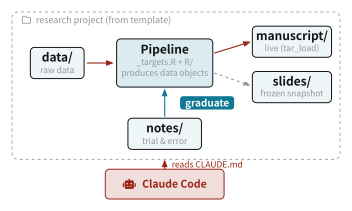
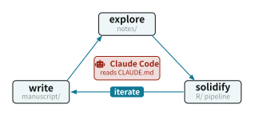

# 13  AIと研究する

Code

## 13.1 文献調査

文献調査では, AI に手元の文献ライブラリを直接参照させると便利です. ここでは, [文献と引用](../lesson/literature.llms.md) の章で使った Zotero を, MCP (Model Context Protocol) 経由で Claude につなぎます. これにより, 「このテーマの論文をライブラリから探して」「この論文の要点をまとめて」といった依頼を, Claude が実際の Zotero ライブラリを検索しながら答えられるようになります. MCP の仕組みそのものについては [sec-mcp](#sec-mcp) を参照してください.

### Zotero MCP Server

ここで使うのは, [`kujenga/zotero-mcp`](https://github.com/kujenga/zotero-mcp) というオープンソースの MCP サーバーです. このサーバーは, Claude に対して次の3つのツールを提供します.

- `zotero_search_items`: ライブラリを検索する
- `zotero_item_metadata`: 文献の書誌情報を取得する
- `zotero_item_fulltext`: 文献の全文を取得する

Claude は, ユーザーの依頼に応じてこれらのツールを自分で選んで呼び出します.

#### 事前準備

このサーバーは, 手元で動いている Zotero に接続します (ローカル API). そのため次の2つを用意します.

1.  Zotero 7 以降のデスクトップアプリをインストールし, 起動しておきます.
2.  Zotero の「設定」→「詳細」で, 「この PC 上の他のアプリケーションが Zotero と通信することを許可する」にチェックを入れます (英語表記では Preferences → Advanced → “Allow other applications on this computer to communicate with Zotero”).

サーバー自体は Python 製で, [`uv`](https://docs.astral.sh/uv/) の `uvx` コマンドで起動します. `uv` が入っていなければ, 先にインストールしておいてください (公式サイトの手順に従います). `uvx` はパッケージを自動でダウンロードして実行するので, `zotero-mcp` を手動でインストールする必要はありません.

#### Claude Desktop での設定

Claude Desktop の設定ファイル `claude_desktop_config.json` に, サーバーを1つ追加します. このファイルの場所は, macOS では `~/Library/Application Support/Claude/`, Windows では `%APPDATA%\Claude\` です.

``` json
{
  "mcpServers": {
    "zotero": {
      "command": "uvx",
      "args": ["--upgrade", "zotero-mcp"],
      "env": {
        "ZOTERO_LOCAL": "true"
      }
    }
  }
}
```

`ZOTERO_LOCAL` を `true` にすると, 上で有効にしたローカル API 経由で手元の Zotero に接続します. 設定を保存して Claude Desktop を再起動すると, サーバーが読み込まれます.

#### Claude Code での設定

ターミナルで動く Claude Code なら, 設定ファイルを直接編集せずに, `claude mcp add` コマンドで追加できます.

``` sh
claude mcp add zotero --env ZOTERO_LOCAL=true -- uvx --upgrade zotero-mcp
```

`--` (ダッシュ2つ) は, Claude Code 自身のオプションと, サーバーを起動するコマンドの境目を表します. `--` の後ろ (`uvx --upgrade zotero-mcp`) が, サーバーを起動するコマンドとしてそのまま実行されます.

#### 使ってみる

設定できたら, Claude に自然な日本語で依頼するだけです. 例えば次のように頼むと, Claude は `zotero_search_items` でライブラリを検索し, 見つかった論文を一覧して答えます.

> Zotero のライブラリから, 最低賃金の雇用効果に関する論文を探して, それぞれ一行で要約して.

さらに特定の論文について「この論文の識別戦略を説明して」と頼めば, `zotero_item_fulltext` で全文を取得したうえで答えます. 手元のライブラリに基づいて答えるので, 存在しない論文をでっち上げる (ハルシネーション) 危険が減るのが利点です.

#### 注意点

- Zotero が起動していないと, ローカル API に接続できず, ツールが失敗します. 使うときは Zotero を開いたままにしておきます.
- 全文取得 (`zotero_item_fulltext`) はローカル API では新しめの Zotero でのみ対応しています. うまくいかない場合や, Zotero を起動せずに使いたい場合は, ローカル API の代わりに Zotero の Web API を使う方法もあります. その場合は <https://www.zotero.org/settings/keys> で API キーとライブラリ ID を取得し, `ZOTERO_LOCAL` を `false` にして `ZOTERO_API_KEY` と `ZOTERO_LIBRARY_ID` を設定します. API キーはコードやリポジトリに直接書かず, [API](../lesson/api.llms.md) の章の e-Stat の例と同じように, 秘密情報として扱ってください.

## 13.2 ワークフロー

研究を始めるたびにディレクトリ構成や設定を一から作るのは無駄が多く, AI に手伝ってもらうにも「どこに何を置くか」が定まっていないと指示がぶれます. そこで, [targets による再現性](../lesson/targets.llms.md) の章で紹介した Quarto + `{targets}` のワークフローを, そのまま使えるテンプレートにまとめたものが [`kazuyanagimoto/template-research`](https://github.com/kazuyanagimoto/template-research) です. GitHub の「Use this template」から自分のリポジトリを作れば, 研究プロジェクトの骨格がすぐに手に入ります.

[](https://github.com/kazuyanagimoto/template-research)

kazuyanagimoto/template-research

Template for empirical research projects: targets pipeline, rig + rv, Quarto notes/slides/manuscript (Typst)

 GitHub Lua

### テンプレートの構成

テンプレートをクローンすると, 次のようなフォルダ構成になっています. [targets による再現性](../lesson/targets.llms.md) の章で説明したワークフローが, そのままディレクトリの形になっています.

``` default
template-research/
├── _targets.R        # pipeline composition
├── R/                # pipeline code: tar_data.R, tar_fact.R, ...
├── data/             # raw data (gitignored)
├── notes/            # exploratory Quarto notes (NN-name/)
├── slides/           # presentation decks
├── manuscript/       # paper: Quarto Book + Typst
├── references.bib    # bibliography
├── rproject.toml     # R version + packages (managed by rv)
└── CLAUDE.md         # project conventions for the AI assistant
```

各ディレクトリの役割は次のとおりです.

- `_targets.R` と `R/tar_*.R`: パイプラインの定義. パイプラインはデータオブジェクトだけを生成し, 図はファイルに保存せず, Quarto の中で `tar_read()` を使ってその場で描きます.
- `data/`: 生データ (gitignore の対象).
- `notes/NN-name/`: 試行錯誤のノート. 1フォルダが1ラウンドの試行錯誤にあたり, ここでの計算はここに閉じておき, 固まったものだけをパイプラインに昇格させます.
- `slides/`: 発表スライド. パイプラインから切り離した「凍結スナップショット」で, 必要なデータを自分で持ち, `tar_load()` を呼びません ([スライド](../lesson/slides.llms.md) の章の考え方です).
- `manuscript/`: 論文. `tar_load()` でパイプラインの結果を読み込み, 常に最新のデータを反映します. Quarto Book として書き, Typst で PDF にします.

パッケージは `install.packages()` ではなく `rv` で, R のバージョンは `rproject.toml` で固定し, コードの整形は `air` に任せます (この本のリポジトリも同じ構成です).

これらのフォルダがどう連携するかを図にすると, [Figure fig-research-workflow](#fig-research-workflow) のようになります. 生データがパイプラインを通ってデータオブジェクトになり, それを論文とスライドが受け取る, という流れです. `notes/` で固まった分析はパイプラインに昇格し, ルートの `CLAUDE.md` を読んだ AI がこのプロジェクト全体の作業を手伝います.

[](../static/cetz/research-workflow.svg "Figure 13.1: 研究プロジェクトの構成とデータの流れ")

Figure 13.1: 研究プロジェクトの構成とデータの流れ

### CLAUDE.md で AI にプロジェクトの規約を教える

このテンプレートの肝は, ルートに置かれた `CLAUDE.md` です. これは, Claude Code のような AI アシスタントが起動時に読み込む指示書で, このプロジェクトの規約を AI に伝えます. これがあると, AI は「このプロジェクトのやり方」に沿って作業します. 逆に, `CLAUDE.md` が無ければ, AI は一般的な, しばしばプロジェクトの流儀と食い違うやり方でコードを書いてしまいます.

テンプレートの `CLAUDE.md` には, 例えば次のような規約が書かれています.

- パイプラインはデータオブジェクトだけを生成し, 図はファイルに保存せず Quarto 内で `tar_read()` を使って描く.
- パッケージは `install.packages()` ではなく `rv` で管理する.
- ノート内だけの計算はノートに閉じ, 固まってからパイプラインに移す.
- スライドは凍結スナップショットとして, `tar_load()` を呼ばず自分でデータを持つ.
- 表は `knitr::kable()` ではなく `tinytable` で作り, 回帰は `fixest` を使う.
- 実証結果の数値を本文やキャプションに直接書かず, 計算した値をインラインコードで埋め込む.

これらは, この本のこれまでの章で推奨してきたルールとほぼ同じです. 大事なのは, こうした自分の流儀を `CLAUDE.md` に明文化しておくと, AI がそれを前提に働いてくれる, という点です. 新しいルールを決めるたびに `CLAUDE.md` に書き足していくことで, AI との共同作業は少しずつ自分のやり方に馴染んでいきます.

### 始め方

GitHub でテンプレートから自分のリポジトリを作り, クローンしたら, ツールチェインを用意します. R のバージョンは [`rig`](https://github.com/r-lib/rig) で, パッケージは [`rv`](https://github.com/a2-ai/rv) で管理します.

``` sh
rig add 4.6                 # install the pinned R version
brew install rv             # package manager (macOS; see repo for other OSes)
brew install air            # optional: R formatter

rv sync                     # restore the package library
R -e 'targets::tar_make()'  # run the pipeline
```

最後に, `.Renviron.example` を `.Renviron` にコピーして, API キーなどの秘密情報を書き込めば ([API](../lesson/api.llms.md) の章を参照), 準備は完了です.

### AI と進める

研究は, ノートで試し, 固まったものをパイプラインに移し, 論文にまとめる, というサイクルの繰り返しです ([Figure fig-research-cycle](#fig-research-cycle)). 具体的な流れは [targets による再現性](../lesson/targets.llms.md) の章と同じですが, AI を使うと各段階が次のように楽になります.

[](../static/cetz/research-cycle.svg "Figure 13.2: AI と回す研究のサイクル")

Figure 13.2: AI と回す研究のサイクル

- ノートでの試行錯誤: 「このデータで最低賃金の雇用効果を回帰して図にして」と頼めば, `notes/` の中にコードを書いてくれます.
- パイプラインへの昇格: 固まった分析を `R/tar_*.R` に移す作業を任せます.
- 論文執筆: `manuscript/` でパイプラインの結果を読み込み, 文章の下書きや相互参照の整理を手伝わせます.

いずれの段階でも, `CLAUDE.md` があるおかげで, AI はプロジェクトの規約 (パイプラインはデータオブジェクトだけ, 図は `tar_read()` で描く, など) を守ったコードを書きます. AI に任せきりにするのではなく, 規約を明文化して土台を整え, その上で AI に働いてもらう, というのがこのワークフローの考え方です.
