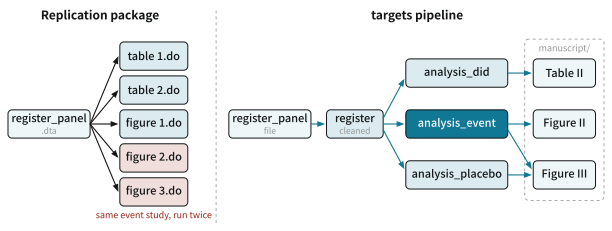
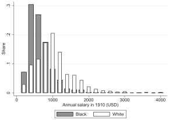
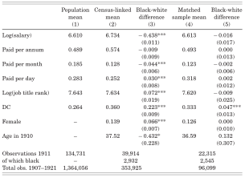
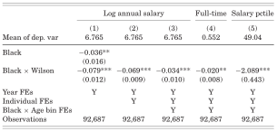
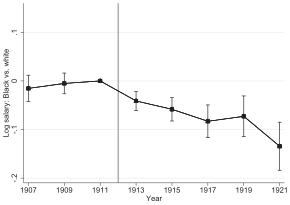
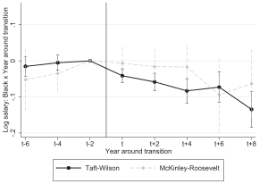
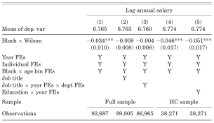
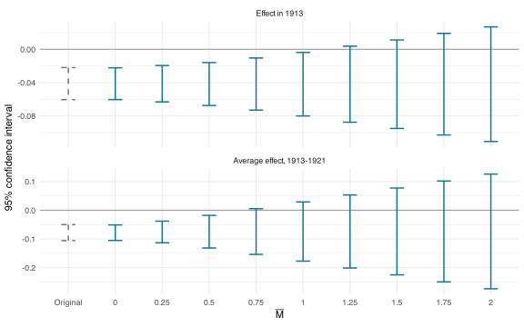
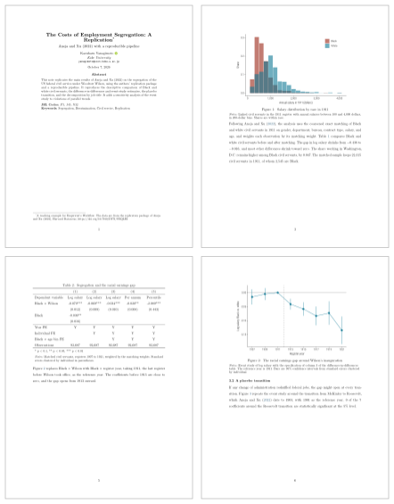
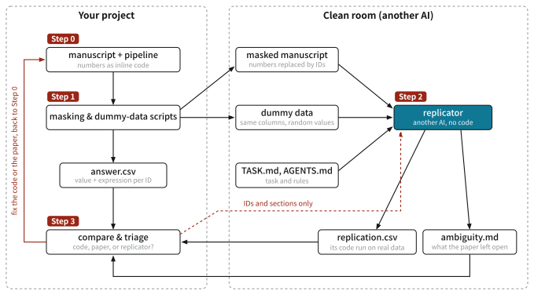

# 12  AIと研究する

コード

最後の章では, ここまでの章で学んだ道具を1つの研究の中でつなげます. 題材にするのは Aneja と Xu ([2022年](#ref-aneja2022)) です. この論文は, 1913 年に発足した Wilson 政権が連邦政府の公務員を人種で分離したことで, 黒人公務員の賃金がどう変わったかを調べています. 著者たちは 1907 年から 1921 年までの連邦政府の職員名簿 (Official Register) をデジタル化し, 1910 年のセンサスと接続して人種を特定したうえで, 黒人と白人の公務員の賃金差が政権交代の前後でどう変わったかを推定しました.

この章では, もし著者たちがこの本のワークフローで研究していたら, という想定で, その研究をたどります. この論文を選んだのは, replication package が [Harvard Dataverse](https://doi.org/10.7910/DVN/SNQLEI) で公開されており (CC0), 主要な分析を手元で再現できるからです. パッケージには, 名簿のデジタル化, センサスとの接続, そして後で説明するマッチングまで済んだパネルデータ (`register_panel.dta`) が入っています. この章ではこれを出発点にします. 本来の研究では, デジタル化やセンサスとの接続もパイプラインの上流のターゲットになるはずですが, そこは省略します. また, 持ち家や子どもの教育を扱う後半の分析 (Table IV, V と Figure VII) は利用が制限された完全版のセンサスを使うため, 対象外とします. 推定はすべて [sec-regression](#sec-regression) の `fixest` で書けます.

## 12.1 AI時代の研究を支える4つの道具

AI を使うと, コードを書くコストは大きく下がります. 数百行の分析コードも数分で書き上がり, 仕様の変更も一言頼むだけで済みます. 一方で, そのコードが正しいかを確かめるコストはあまり下がっていません. 推定式が意図どおりか, サンプルの絞り込みが正しいか, 図の数字が最新のコードから出ているかを判断するのは研究者です. AI が速く書くほど, 確かめる仕事の比重が増していきます.

そのため, AI 時代の研究の道具は, 書く速さではなく確かめやすさで選ぶべきです. この本では Git, Zotero, `{targets}`, Quarto の4つを, AI 時代の研究を支える道具として重視します. 4つはどれも, AI の出力を照らし合わせる基準を与えてくれます ([表 tbl-ai-tools](#tbl-ai-tools)).

| 道具 | 照らし合わせるもの | 詳しくは |
|:---|:---|:---|
| Git | 何を変えたか, どこへ戻れるか | [sec-git](#sec-git) |
| Zotero | 論文に実際に何が書いてあるか | [sec-literature](#sec-literature) |
| `{targets}` | 論文の数字がどのデータとコードから来たか | [sec-targets](#sec-targets) |
| Quarto | 論文の文章の数字が, いまの結果と一致しているか | [sec-quarto](#sec-quarto) |

表 12.1: 4つの道具と, それぞれが与える基準

### Git

AI に作業を頼む前にコミットしておけば, AI が何を変えたかは `git diff` ですべて見えます. 気に入らなければ, コミットした時点に戻せば済みます. [sec-git](#sec-git) で述べたように, コードの変更が速くなるほど, 履歴の価値は増していきます.

実践上のコツは, AI に頼む作業の単位をコミットの単位に揃えることです. 「ノートを1つ作る」「関数を1つパイプラインに移す」くらいの大きさなら, 差分を読んで確かめられます. 「論文の分析を全部書いて」のような依頼は, 差分が大きすぎて誰にも読めなくなります.

### Zotero

AI は, 存在しない論文や, 論文に書かれていない主張を, もっともらしく作ることがあります. 学習データの記憶に頼って答えるからです. Zotero に論文の PDF を入れ, MCP で AI につなげば, AI は手元の全文を根拠に答えるようになります (設定は [sec-literature](#sec-literature) を参照). それでも要約を誤ることはあるので, 根拠のページ番号を言わせ, 原文で確かめる習慣が要ります. 詳しくは [sec-ai-literature](#sec-ai-literature) で扱います.

### `{targets}`

4つの中で最も重要なのが `{targets}` です. AI との共同作業でパイプラインが効くのは, 次の3つの理由からです.

1つ目は, 古くなった結果を機械的に見つけられることです. AI がクリーニングの1行を直したとき, どの推定値と図表が影響を受けるかを人間が追い切るのは無理です. `{targets}` は依存関係から古くなったターゲットを判定し (`tar_outdated()`), `tar_make()` で必要なものだけを作り直します. 古いコードから出た数字が論文に残ることはありません.

2つ目は, AI も依存関係を覚えていられないことです. AI が一度に読める量 (コンテキスト) には上限があり, 長い作業の途中では古いやり取りが要約されたり, 抜け落ちたりします. セッションを改めれば, ファイルに書かれていないことは何も覚えていません. 先週 AI 自身が書いたクリーニングの関数を, どの推定とどの図が使っているかも知らないまま, AI は次の変更に取りかかります. そのため, 依存関係は人間や AI の記憶に頼らず, コードとして書いておく必要があります. `_targets.R` を読めばどのデータからどの結果が作られるかが分かるので, 新しいセッションの AI も, ファイルを全部読まずにプロジェクトの全体像をつかめます. プロジェクトの規約を `CLAUDE.md` に書いておくのも, 同じ理由です.

3つ目は, 確かめる単位が小さくなることです. パイプラインの各ターゲットは, 名前のついた関数の出力です. AI が書いた関数の結果を1つずつ `tar_read()` で取り出し, 中身を確かめられます.

Aneja と Xu ([2022年](#ref-aneja2022)) の replication package と比べてみましょう ([図 fig-ai-dofile-vs-pipeline](#fig-ai-dofile-vs-pipeline)). 応用ミクロでよく見る構成で, 図表ごとに do-file が1本ずつあり, それぞれがデータを読み込んで推定し, 図表を出力します. 例えば `figure 2.do` と `figure 3.do` は, 同じイベントスタディの回帰をそれぞれ独立に走らせています. 公表時に一度だけすべてを再現する目的なら, これで十分です. しかし研究の途中で仕様を何十回も変える段階では, 片方だけを直して2つの図が食い違う, といった事故が起きやすくなります. どの do-file が何に依存するかは, README と人間の記憶にしか残っていないからです. AI の記憶には, そもそも残りません.

[](../static/cetz/dofile-vs-pipeline.svg "図 12.1: do-file とパイプライン")

図 12.1: do-file とパイプライン

パイプラインでは, イベントスタディの推定は `analysis_event` という1つのターゲットになり, Figure II と Figure III の両方がそれを読みます. 仕様を変えれば, 両方の図が作り直されます. AI に「イベントスタディの基準年を変えて」と頼んだとき, 影響を受ける図表を探す仕事は `{targets}` が引き受けてくれます.

### Quarto

`{targets}` が結果を作る道具だとすれば, Quarto はその結果を文章につなぐ道具です. この本では, ノート, スライド, 論文のすべてを Quarto で書いてきました ([sec-quarto](#sec-quarto) と [sec-slides](#sec-slides) を参照). AI との共同作業で Quarto が効くのは, 次の2つの理由からです.

1つ目は, 文章の中の数字を書き写さずに済むことです. 本文の数値をインラインコード (`` `r ` ``) で埋め込めば, 数字は常に `{targets}` の結果から計算されます. AI に本文の下書きを頼んでも, AI が数字を書き写し間違えたり, もっともらしい数字を作ったりする余地がありません. 分析を直せば, 本文の数字も一緒に変わります. 文章の数字が最新の結果と合っているかを, 人間が1つずつ確かめる必要はなくなります. [sec-ai-cleanroom](#sec-ai-cleanroom) で紹介するクリーンルームも, 数値がインラインコードで埋め込まれていることを前提にしています.

2つ目は, すべてがプレーンテキストであることです. Word や PowerPoint のファイルと違って, Quarto の文書は AI がそのまま読み書きでき, Git で差分を取れます. AI が論文のどの文をどう書き換えたかも, コードと同じように `git diff` で確かめられます.

## 12.2 文献調査

[sec-literature](#sec-literature) で Zotero MCP の設定を済ませたので, ここでは研究の中での使い方を扱います. 使い方は2つあります. 先行研究を集めることと, 1本の論文を精読することです.

### 先行研究を集める

研究を始めたばかりの著者の立場で考えてみましょう. 経済学の文献調査で探すのは, そのテーマについて書かれたものすべてではありません. 自分の研究がどの研究の流れに貢献するのかを示すための文献です. この研究なら, 例えば次の3つの流れが候補になります.

- 労働市場における人種間の格差が, どのような要因で生じ, 縮まってきたか
- 差別や雇用の分離が, 賃金や職の配分といった経済的な帰結にどう影響するか
- 格差が, 資産や次の世代にどう持続するか

それぞれの流れで, 代表的な研究が何を示し, 何がまだ分かっていないのかを整理できれば, 自分の研究の貢献が書けます. 実際, Aneja と Xu ([2022年](#ref-aneja2022)) も序論で, 自分たちの研究をこの3つの流れに位置づけています.

この整理の下書きは, AI に頼むと速くできます.

文献の流れを整理する下書きを, AI に頼む指示を書いてみましょう. 対象にする文献の範囲と, 文献ごとに何を挙げさせるかも指示に含めます.

> **TIP:**
>
> > 1913 年に Wilson 政権が連邦政府の公務員を人種で分離した政策が, 黒人公務員の賃金に与えた影響を調べたい. この研究が貢献しうる経済学の文献の流れを3つ挙げて. それぞれについて代表的な論文を5本ずつ, 著者, 年, 雑誌, DOI 付きで挙げること. 対象は経済学の査読付き論文と, NBER などのワーキングペーパーに限る. 各流れで何が分かっていて, 何が分かっていないかも, 1段落ずつまとめて.
>
> DOI まで挙げさせているのは, 次に述べる確認の手順で使うためです.

ただし, AI が挙げる文献には存在しないものが混ざります. そこで, 次の順に進めます.

1.  AI に候補を挙げさせるときは, DOI も一緒に出させます.
2.  DOI から Zotero に取り込みます (取り込み方は [sec-literature](#sec-literature) を参照). 取り込めなければ, その文献は存在しないか, DOI が誤っています.
3.  Zotero に入った文献だけを MCP 経由で AI に読ませ, 流れごとの整理を, 実際の論文の内容に基づいて書き直させます.

3つ目の手順で, AI に頼む指示を書いてみましょう. 取り込んだ文献は, `wilson-segregation` というコレクションにまとめたとします.

> **TIP:**
>
> > Zotero の `wilson-segregation` コレクションにある論文を全文で読んで, さっきの3つの流れに分類して. 各論文について, 何を問い, どのデータと識別戦略で, 何を示したかを2, 3文でまとめ, 根拠のページ番号を付けて. 最初の整理と食い違う点があれば, 全文の方を正として直すこと. 最後に, 3つの流れのどれもが答えていない問いのうち, この研究で答えられるものを挙げて.
>
> 最後の一文は, 序論で貢献を書くための材料になります. ただし, 「まだ誰も答えていない」かどうかは, 手元のライブラリの範囲でしか言えません. そこは研究者が自分で確かめます.

DOI の照合が, そのままハルシネーションの検査になるのがポイントです. この章の想定では, Aneja と Xu ([2022年](#ref-aneja2022)) の参考文献リストが答えになります. AI が挙げた候補のうち, 実際に引用されているものはいくつあり, 存在しないものはいくつあったかを数えてみると, AI の文献検索をどこまで信用してよいかの感覚がつかめます.

AI がいつもこの手順を守るように, プロジェクトの `CLAUDE.md` に書いておくと便利です.

``` markdown
## Questions about specific papers

- Search the Zotero library first and answer from the attached PDF,
  not from memory.
- Give page or section numbers for every claim about a paper.
- If the paper is not in the library, do not guess. Ask the user to add
  it, and give its DOI as a https://doi.org/ link.
```

### 論文を AI と精読する

もう1つの使い方は, 1本の論文を深く読むことです. この章では, Aneja と Xu ([2022年](#ref-aneja2022)) そのものを精読し, 図表ごとに分析の意図を読み取ります.

Table II と Figure II の分析の意図を読み取るために, AI に Aneja と Xu ([2022年](#ref-aneja2022)) を精読させる指示を書いてみましょう. AI の読みを後で原文と突き合わせられるように, また論文に書かれていないことに気づけるように答えさせるのがポイントです.

> **TIP:**
>
> > Zotero にある Aneja と Xu ([2022年](#ref-aneja2022)) を読んで, Table II と Figure II がそれぞれ何を示すための分析かを説明して. 結果変数, 処置, 比較対象, 固定効果, ウェイト, 標準誤差のクラスター, サンプルを表にまとめ, それぞれの根拠となるページ番号を付けて. 論文に書かれていない項目は「記載なし」として.
>
> 大事なのは最後の2文です. ページ番号があれば, AI の読みが正しいかを原文で確かめられます. また, 書かれていない項目を「記載なし」と答えさせておけば, 論文の穴に気づけます. 何も言わなければ, AI はその穴を推測で黙って埋めてしまいます.

#### Replication Package

近年出版された論文の多くは, Replication package が公開されています (例: AEA [Data and Code Availability Policy](https://www.aeaweb.org/journals/data/data-code-policy)). そのため, 論文中の数字を, その数字がどのデータとコードから来たかを追跡し, 実際に計算して検算できます. これができると, AI の読みの正しさも確認できます.

例えば, この論文を AI に読ませたところ, 次の点を論文の不整合として報告してきました. マッチング後のサンプルは Table I では 96,099 人年なのに, Table II の観測数は 92,687 で, その差について本文に説明がない, というものです.

実際に `fixest` で推定してみると, 1年しか観測されない人の観測 (singleton) が 3,412 件除かれ, 観測数はちょうど 92,687 になりました. 個人固定効果を入れると, 1年しか観測されない人の賃金はその人の固定効果で完全に説明されてしまい, 推定に何の情報ももたらしません. replication package を見ると著者たちは Stata の `reghdfe` を使っており, `reghdfe` は既定でこうした観測を除きます. 不整合ではありませんでしたが, 本来は論文に記述すべきことを AI が指摘してくれた, というわけです.

## 12.3 研究のワークフロー

ここからは, [sec-targets-research](#sec-targets-research) のテンプレートを使って, 著者たちの研究を最初からたどります. [表 tbl-ai-rounds](#tbl-ai-rounds) は, この章で想定する研究の進み方です. 試行錯誤を2周し, その間にセミナーでの報告を1回挟みます.

| 段階 | フォルダ | 問い | 論文の図表 |
|:---|:---|:---|:---|
| 試行錯誤 1 | `notes/01-descriptive/` | 黒人公務員はどんな職に就いていたか | Figure I, Table I |
|  | `notes/02-did/` | 1913 年以降に賃金差は開いたか | Table II, Figure II |
| フィードバック | `slides/YYMMDD_seminar/` | 途中結果を報告し, 質問を受ける |  |
| 試行錯誤 2 | `notes/03-placebo/` | 大統領が交代すればいつでも起きるのか | Figure III |
|  | `notes/04-mechanism/` | どういう経路で賃金差が開いたか | Table III |
|  | `notes/05-honestdid/` | 平行トレンドが崩れていても結論は保たれるか | (拡張) |
| 執筆 | `manuscript/` | 固まった結果を論文にまとめる |  |

表 12.2: 想定する研究の進み方

最後の `notes/05-honestdid/` は, 論文にはない拡張です. 論文の外に出る分析も1つ入れておきます.

### 準備

テンプレートからリポジトリを作る手順は [sec-targets-research](#sec-targets-research) と同じです. データは, replication package を [Harvard Dataverse](https://doi.org/10.7910/DVN/SNQLEI) から事前にダウンロードし, 展開してできる `register_panel.dta` を `data/` に置きます. テンプレートでは `data/` は Git の管理対象から外れているので, データがリポジトリに入ることはありません. パイプラインは, この `data/` のファイルを登録するところから始まります.

``` r
tar_data <- tar_plan(
  tar_file_read(
    register_raw,
    here_rel("data", "register_panel.dta"),
    haven::read_dta(!!.x)
  ),
  register = clean_register(register_raw)
)
```

`tar_file_read()` で生データをファイルとして登録し, クリーニングの関数に渡す形は [sec-targets-research](#sec-targets-research) と同じです. ファイルを置き直せば, `{targets}` はそれを検知して, `register` から下流をすべて作り直します.

``` r
clean_register <- function(raw) {
  raw |>
    haven::zap_labels() |>
    filter(!is.na(year)) |>
    transmute(
      id,
      year,
      transition = if_else(w == 1, "taft_wilson", "mckinley_roosevelt"),
      black = b,
      salary,
      log_salary,
      salary_pctile,
      per_annum = d_unit3,
      per_month = d_unit6,
      per_day = d_unit4,
      log_rank,
      dc,
      female,
      age1910,
      age_bins,
      job_title = tid,
      department = dept_id,
      education,
      cem
    )
}
```

元の変数名 (`b`, `d_unit3`, `tid` など) は, ここで意味の分かる名前に変えます. パネルには, Taft から Wilson への交代 (1907 年から 1921 年) と, McKinley から Roosevelt への交代 (1897 年から 1911 年) の2つの期間が入っているので, それを `transition` で区別します. パネルには処置のダミーやイベントスタディ用のダミーも用意されていますが, ここでは使いません. 論文の意図から, `year` と `black` を使って自分で作ります.

### 試行錯誤 (1周目)

1周目は, 論文の中心となる結果にたどり着くまでです. 記述統計と DID 推定の2つの分析を行います. それぞれを Quarto のノートにしていきますが, 実際の分析の流れと同じにするために次のようにします.

1.  意図を読む: その図表が何を示すための分析かを, 論文から読み取ります.
2.  指示を書く: 分析の意図を, AI への指示に落とします.

実際に論文を書くときは, 分析の意図がすでにあるので, 1つ目のステップは不要です. このエクササイズでは, 著者たちの分析の意図を理解するために, また AI を用いた論文の精読 ([sec-ai-paper](#sec-ai-paper)) の練習のために, 意図を読むステップを入れています.

なお, ノートはパイプラインを読まない凍結スナップショットです ([sec-targets-research](#sec-targets-research)). そのため各ノートでは, パイプラインの `register` を読む代わりに, `data/register_panel.dta` を読み込んで `clean_register()` と同じ整形をしてから使います.

#### 記述統計 (`notes/01-descriptive/`)

Figure I は, 1911 年の黒人と白人の公務員の賃金分布です ([図 fig-ai-paper-fig1](#fig-ai-paper-fig1)). 論文はこの図から 1. 黒人の賃金は分布全体で低いこと, 2. 多くの黒人と白人の賃金が重ならないこと, を読み取っています. この論文ではマッチングを用いて推定しますが, その理由の一つがこのサポートの違いです.

[](../static/paper/aneja2022-fig1.svg "図 12.2: 1911 年の人種別の賃金分布 [@aneja2022, Figure I]")

図 12.2: 1911 年の人種別の賃金分布 ([Aneja と Xu 2022年](#ref-aneja2022), Figure I)

そこで著者たちは, 1911 年の時点で性別, 部局, 契約の形態, 賃金, 年齢が近い黒人と白人を組み合わせる coarsened exact matching (CEM) を使います. Table I の列 (5) は, マッチング後の黒人と白人がほとんどの特徴で変わらないことを示しています ([表 tbl-ai-paper-tab1](#tbl-ai-paper-tab1), p. 926). データの `cem` 列は, このマッチングのウェイトです.

[](../static/paper/aneja2022-tab1.svg "表 12.3: 1911 年の記述統計とマッチング後の比較 [@aneja2022, Table I]")

表 12.3: 1911 年の記述統計とマッチング後の比較 ([Aneja と Xu 2022年](#ref-aneja2022), Table I)

ここからが, 実際の研究でも行う「指示を書く」手順です.

AIに指示して, `notes/01-descriptive/` で Figure I と Table I に当たる図表を作ってください.

> **TIP:**
>
> > `notes/01-descriptive/` で, Wilson 政権の前の 1911 年に, 黒人と白人の公務員がどんな職に就いていたかを比べる図と表を作って. データは `data/register_panel.dta` を読み込み, `R/tar_data.R` の `clean_register()` と同じ整形をしてから使う. そのうち Taft から Wilson への交代の期間の 1911 年の観測で, 人種が分かっている (`black` が欠損でない) ものを使う.
> >
> > - 図: 黒人と白人の年間賃金の分布を, 1つのヒストグラムに重ねて描く. 縦軸は各グループの中での割合にする. 賃金の高い層で2つの分布が重ならないことが見えるようにしたい.
> > - 表: 対数賃金, 契約の形態 (年俸, 月給, 日給), 職名の順位の対数, ワシントン D.C. での勤務, 女性, 1910 年の年齢について, 黒人と白人を比べる. 人種が分かっている全員と, マッチングで残った観測 (CEM のウェイトが正のもの) のそれぞれについて, 平均と, 黒人ダミーへの回帰で測った差を, 頑健な標準誤差とともに並べる. マッチング後の差は, CEM のウェイトで重みづけて測る.
> > - 集計は `code/` のスクリプトで行って結果を `output/` に CSV で書き出し, 図と表は `index.qmd` で作る.

#### DID 推定 (`notes/02-did/`)

論文の中心は Table II ([表 tbl-ai-paper-tab2](#tbl-ai-paper-tab2)) と Figure II ([図 fig-ai-paper-fig2](#fig-ai-paper-fig2)) で, 推定式は次のとおりです (p. 926).

\\ \log \left( w\_{it} \right) = \beta \cdot \text{Black}\_i \times \text{Wilson}\_t + \theta_i + \tau_t + \varepsilon\_{it} \tag{12.1}\\

\\w\_{it}\\ は公務員 \\i\\ の \\t\\ 年の賃金, \\\text{Black}\_i\\ は黒人のダミー, \\\text{Wilson}\_t\\ は Wilson 政権下 (1913 年以降) のダミー, \\\theta_i\\ と \\\tau_t\\ は個人と年の固定効果です. Table II の列 (3) は, これに黒人 × 年齢階級の固定効果を加えたものです. 当時の黒人公務員には昇進の天井があったとされ, そうであれば政策がなくても, 年齢とともに賃金差が開いていきます. この固定効果は, 年齢と賃金の関係が人種ごとに違うことを許して, その分を吸収します. 政策の効果のうち年齢によって違う部分まで吸収してしまうので, 効果を小さめに見積もる保守的な定式化ですが, 著者たちはこれを主な推定値としています (p. 928). Figure II は, 列 (3) の \\\text{Black}\_i \times \text{Wilson}\_t\\ を, 名簿の年ごとの係数に置き換えたイベントスタディです (p. 929).

[](../static/paper/aneja2022-tab2.svg "表 12.4: Wilson 政権の人種分離の効果 [@aneja2022, Table II]")

表 12.4: Wilson 政権の人種分離の効果 ([Aneja と Xu 2022年](#ref-aneja2022), Table II)

[](../static/paper/aneja2022-fig2.svg "図 12.3: Wilson 政権前後の賃金差 [@aneja2022, Figure II]")

図 12.3: Wilson 政権前後の賃金差 ([Aneja と Xu 2022年](#ref-aneja2022), Figure II)

AI に分析を頼むには, 推定式のほかにも決めることがあります. [表 tbl-ai-spec](#tbl-ai-spec) は, それぞれについて論文に書かれていることをまとめたものです.

| 項目 | 論文の記述 |
|:---|:---|
| サンプル | マッチングされた 1907 年から 1921 年の公務員. 観測数は全列で同じ |
| 結果変数 | 対数賃金 (列 1 から 3), 年俸契約のダミー (列 4), 賃金の百分位 (列 5) |
| 処置 | 黒人 × 1913 年以降 (列 1 は黒人のダミーも入れる) |
| 固定効果 | 年 (列 1), 年と個人 (列 2), 年, 個人, 黒人 × 年齢階級 (列 3 から 5) |
| ウェイト | CEM のウェイト |
| 標準誤差 | 個人でクラスター |
| イベントスタディ | 列 3 の黒人 × 1913 年以降を, 黒人 × 各年に置き換える |
| イベントスタディの基準年 | 記載なし |

表 12.5: Table II と Figure II の仕様

[表 tbl-ai-spec](#tbl-ai-spec) を踏まえて, Table II の5つの列と Figure II のイベントスタディを推定するよう, AI に頼む指示を書いてください. 論文に書かれていない基準年も, 自分で決めて指示に含めてください.

> **TIP:**
>
> > `notes/02-did/` で, Wilson 政権の発足 (1913 年) の前後で, 黒人と白人の公務員の賃金差がどう変わったかを推定して. データは `data/register_panel.dta` を読み込み, `R/tar_data.R` の `clean_register()` と同じ整形をしてから使う. そのうち Taft から Wilson への交代の期間 (1907 年から 1921 年) で, CEM のウェイトが正の観測を使う. どの推定も CEM のウェイトを使い, 標準誤差は個人でクラスターする.
> >
> > - 表: 黒人 × 1913 年以降のダミーの係数を, 次の5つの定式化で推定して1つの表に並べる. (1) 対数賃金を, 黒人のダミーと黒人 × 1913 年以降のダミーに回帰し, 年の固定効果を入れる. (2) 対数賃金に, 個人と年の固定効果を入れる. (3) (2) に黒人 × 年齢階級の固定効果を加える. (4) と (5) は (3) と同じ定式化で, 結果変数を年俸契約のダミーと賃金の百分位に変える. 5つの列はすべて同じ観測で推定する.
> > - 図: (3) の定式化で, 黒人 × 1913 年以降のダミーを黒人 × 各年のダミーに置き換えたイベントスタディを推定し, 係数と 95% 信頼区間を描く. 基準年は 1911 年とする.
> > - 推定は `code/` のスクリプトで行って結果を `output/` に保存し, 表と図は `index.qmd` で作る.
>
> 基準年を 1911 年としたのは, 論文に書かれていないことを自分で決めた部分です. 実際の研究なら, ここは研究者が自分の意図で決めるところです. 1911 年は Wilson の就任前の最後の名簿なので, 政権交代の直前を基準にするという意図に沿います.
>
> 「5つの列はすべて同じ観測で推定する」としたのは, 観測数から読み取った意図です. 列 (1) は個人固定効果を含まないので, そのままでは1年しか観測されない人も推定に入り, 他の列と観測数が変わってしまいます.

### フィードバック

1周目のノートがまとまったところで, セミナーで途中結果を報告します. スライドは `slides/YYMMDD_seminar/` に作ります ([sec-targets-research](#sec-targets-research)). 中身は, 問い, データ, Figure II と Table II くらいで十分です.

AI は, ノートからスライドの下書きを作るのが得意です. ただし, 何を見せて何を省くかは研究者が決めることです. 構成と各スライドで伝えることは, 自分で決めてから AI に渡します (スライドの作り方は [sec-slides](#sec-slides) を参照).

AIに指示して, 1周目の2つのノートの結果から, セミナーで報告するスライドを `slides/YYMMDD_seminar/` に作ってください.

> **TIP:**
>
> > `slides/YYMMDD_seminar/` に, 1周目の結果を報告する 15 分のセミナー用のスライドを作って. 構成は次の順にする.
> >
> > 1.  問い: Wilson 政権による人種分離は, 黒人公務員の賃金をどう変えたか
> > 2.  データ: 公務員名簿とセンサスの接続と, 1911 年時点のマッチング (`notes/01-descriptive/` の図と表)
> > 3.  推定式と主な結果: Table II とイベントスタディ (`notes/02-did/`)
> >
> > 1枚のスライドで伝えることは1つにし, 各スライドのタイトルには, そのスライドの結論を1文で書く. デッキはパイプラインを読まず, 使う結果を2つのノートの `output/` からこのデッキの `output/` にコピーして使う.
>
> 構成と各スライドの結論を指示の中で決めているのは, 何を見せるかを AI に任せないためです. 結果をデッキのフォルダにコピーさせているのは, スライドもノートと同じく凍結スナップショットにするためです ([sec-targets-research](#sec-targets-research)).

発表を行った結果, セミナーで次の3つの質問を受けたと想定します.

- 大統領が交代すれば, 政策に関係なく人事が入れ替わる. 政権交代のたびに同じことが起きるのではないか.
- 賃金差が開いたのは, 同じ職のまま賃金が下がったからか, それとも賃金の低い職に移されたからか.
- 事前の係数がゼロに近いことは, 事後の期間に平行トレンドが成り立つことを保証しない. Rambachan と Roth ([2023年](#ref-rambachan2023)) で検定すべきだ

1つ目と2つ目は, 論文の Figure III と Table III が答えている質問です. 3つ目は, 論文にはない拡張です. それぞれが, 2周目のノートの課題になります.

### 試行錯誤 (2周目)

2周目では, セミナーで受けた3つの質問に, ノートを1つずつ作って答えていきます. `notes/03-placebo/` と `notes/04-mechanism/` は論文の Figure III と Table III に当たるので, 1周目と同じく, 意図を読んでから指示を書きます. 最後の `notes/05-honestdid/` は論文にない拡張なので, 意図を読む手順は使えません. 何を確かめるかは, セミナーの質問から自分で定めます. 実際の研究に近いのは, むしろこちらです.

#### Placebo (`notes/03-placebo/`)

Figure III は, セミナーの1つ目の質問に答える placebo です ([図 fig-ai-paper-fig3](#fig-ai-paper-fig3)). 比べる相手は, McKinley から Roosevelt への政権交代で, 論文はこれを 1903 年の交代として扱います (p. 930). 人種分離の政策を伴わないこの交代に同じ分析を当てはめて, 賃金差が開かなければ, 1913 年以降の変化は政権交代一般によるものではなく, Wilson の政策によるものだと言えます. 論文はこの期間を 1897 年から 1911 年とし, 2つの交代の結果を, 交代からの年数を横軸に揃えて重ねています.

[](../static/paper/aneja2022-fig3.svg "図 12.4: 2つの政権交代の比較 [@aneja2022, Figure III]")

図 12.4: 2つの政権交代の比較 ([Aneja と Xu 2022年](#ref-aneja2022), Figure III)

AIに指示して, `notes/03-placebo/` で Figure III に当たる図を作ってください.

> **TIP:**
>
> > `notes/03-placebo/` で, McKinley から Roosevelt への政権交代について, `notes/02-did/` と同じイベントスタディを推定して. データは `data/register_panel.dta` に `clean_register()` と同じ整形をしてから使い, そのうち `transition` が `mckinley_roosevelt` (1897 年から 1911 年) で, CEM のウェイトが正の観測を使う. 交代の年は 1903 年とし, 基準年は交代前の最後の名簿である 1901 年とする. 固定効果, ウェイト, クラスターは `notes/02-did/` と同じにする. Taft から Wilson への交代の結果と, 交代からの年数を横軸に揃えて重ねた図を作って.

#### メカニズム (`notes/04-mechanism/`)

Table III は, セミナーの2つ目の質問に答える表です ([表 tbl-ai-paper-tab3](#tbl-ai-paper-tab3)). 列 (2) は, Table II の列 (3) に職名 (job title) の固定効果を加えたものです. 職名を固定すると, 同じ職名の中での黒人と白人の賃金差の変化だけが残ります. それでも賃金差が開いていれば, 同じ職のまま賃金が下がったことになります. 開いていなければ, 賃金差は賃金の低い職に移されたことで生じたことになります. 論文の推定値は, 列 (3) の −0.034 から −0.008 (0.008) へとほぼゼロまで縮みます. 賃金差の拡大の多くは, 黒人公務員が賃金の低い職に移されたことで生じた, というのが論文の解釈です. 残りの列は, 職名 × 年 × 部局の固定効果を入れたもの (列 3) と, 1940 年のセンサスで教育が分かる人に限って, 教育の違いを考慮したもの (列 4 と 5) です.

[](../static/paper/aneja2022-tab3.svg "表 12.6: 賃金差の拡大の要因 [@aneja2022, Table III]")

表 12.6: 賃金差の拡大の要因 ([Aneja と Xu 2022年](#ref-aneja2022), Table III)

AIに指示して, `notes/04-mechanism/` で Table III に当たる表を作ってください.

> **TIP:**
>
> > `notes/04-mechanism/` で, Wilson 政権のもとで開いた賃金差が, 同じ職のままの賃金の低下によるのか, 賃金の低い職への移動によるのかを調べて. データは `data/register_panel.dta` に `clean_register()` と同じ整形をしてから使う. `notes/02-did/` の Table II 列 (3) の定式化を基準に, 次の5つの列を推定して1つの表に並べる. サンプル, ウェイト, クラスターは `notes/02-did/` と同じにする.
> >
> > 1.  Table II 列 (3) と同じ定式化
> > 2.  1.  に職名 (`job_title`) の固定効果を加える
> > 3.  1.  に職名 × 年 × 部局 (`department`) の固定効果を加える
> > 4.  1.  と同じ定式化を, 1940 年のセンサスで教育年数 (`education`) が分かる人に限って推定する
> > 5.  4.  に教育年数 × 年の固定効果を加える
> >
> > 推定は `code/` のスクリプトで行って結果を `output/` に保存し, 表は `index.qmd` で作る.

#### 感度分析 (`notes/05-honestdid/`)

Figure II の事前の係数 (1907 年と 1909 年) はゼロに近く, 平行トレンドの仮定を支持しているように見えます. しかし, 事前の係数がゼロと統計的に区別できないことは, 事後の期間に平行トレンドが成り立つことを保証しません. Rambachan と Roth ([2023年](#ref-rambachan2023)) は, 平行トレンドが厳密に成り立つと仮定する代わりに, その崩れ方に上限を置き, その上限の下で頑健な信頼区間を作る方法を提案しました. [`HonestDiD`](https://github.com/asheshrambachan/HonestDiD) はその R パッケージで, CRAN からインストールできます.

ここでは, 相対的な大きさ (relative magnitudes) の制約を使います. 事後の期間に隣り合う時点の間で平行トレンドが崩れる大きさを, 事前の期間の最大の崩れの \\\bar{M}\\ 倍以内に抑える制約です ([Rambachan と Roth 2023年](#ref-rambachan2023), Section 2.4.1). 平行トレンドからのずれを \\\delta_t\\ とし, 基準時点を \\t = 0\\ として \\\delta_0 = 0\\ とおくと, 次のように書けます.

\\ \left\| \delta\_{t+1} - \delta_t \right\| \le \bar{M} \cdot \max\_{s \< 0} \left\| \delta\_{s+1} - \delta_s \right\| \quad \text{for all } t \ge 0 \tag{12.2}\\

名簿は2年おきなので, \\t\\ は名簿の回を数えます. 1911 年が \\t = 0\\, 1907 年と 1909 年が \\t = -2, -1\\, 1913 年が \\t = 1\\ です. \\\bar{M} = 0\\ なら, 事後の期間には平行トレンドが厳密に成り立ちます (事前の期間のずれには制約を置きません). \\\bar{M} = 1\\ なら, 事後の崩れは事前の最大の崩れと同じ大きさまで許されます. Figure II の事前の係数でいえば, 事前の最大の崩れは 0.010 です. 効果がゼロという仮説を棄却できなくなる最小の \\\bar{M}\\ を, breakdown value と呼びます.

`notes/05-honestdid/` で, Figure II のイベントスタディに HonestDiD の感度分析をするよう, AI に頼む指示を書いてみましょう. HonestDiD が何を入力として必要とするかも考えて, 指示に含めます.

> **TIP:**
>
> > `notes/05-honestdid/` で, `notes/02-did/` のイベントスタディに HonestDiD の感度分析をして. 相対的な大きさの制約を使い, `Mbarvec` は 0 から 2 まで 0.25 刻みにする. 対象は 1913 年の効果と, 1913 年から 1921 年の効果の平均の2つ. HonestDiD には係数の分散共分散行列が要るので, このノートのスクリプトで, `data/register_panel.dta` に `clean_register()` と同じ整形をしてからイベントスタディを推定し直し, 係数と分散共分散行列を `output/` に保存すること.

AI が書くコードの中心は, 次のような部分になります.

``` r
event <- feols(
  log_salary ~ i(year, black, ref = 1911) | id + year + age_bins^black,
  data = matched,
  weights = ~cem,
  cluster = ~id
)

betahat <- coef(event)
sigma <- unclass(vcov(event))

robust <- HonestDiD::createSensitivityResults_relativeMagnitudes(
  betahat,
  sigma,
  numPrePeriods = 2,
  numPostPeriods = 5,
  Mbarvec = seq(0, 2, by = 0.25)
)
```

`i(year, black, ref = 1911)` は基準年を除いた係数を年の順に並べるので, 最初の2つが事前 (1907 年と 1909 年), 残りの5つが事後 (1913 年から 1921 年) になります. HonestDiD はこの並びを前提にしています. 既定では1つ目の事後の効果 (1913 年) が対象で, 平均を対象にするときは `l_vec = rep(1 / 5, 5)` を渡します.

`unclass()` は, 私が試したときに実際に必要になった一手です. `vcov()` が返すのは `fixest_vcov` というクラスの行列で, HonestDiD はこれを受け付けずにエラーになります. こうしたエラーは AI に直させれば済みますが, 何が起きて何を直したのかは理解しておきましょう.

実際の研究と同じく, この分析には答えがありません. そこで, 結果が満たすべき性質を確かめます.

- HonestDiD の `constructOriginalCS()` が返す元の信頼区間は, `fixest` の係数と標準誤差から作った 1913 年の 95% 信頼区間と一致するはずです. 一致しなければ, 係数の並びか分散共分散行列の渡し方が間違っています.
- \\\bar{M} = 0\\ では事後の平行トレンドが厳密に成り立つので, 頑健な信頼区間は元の信頼区間に近くなるはずです.
- 制約は \\\bar{M}\\ が大きいほど緩くなるので, 頑健な信頼区間は \\\bar{M}\\ とともに広がっていくはずです.

3つとも満たされていることを確かめたうえで, 結果を読みます ([図 fig-ai-honestdid](#fig-ai-honestdid)).

[](ai_files/figure-html/fig-ai-honestdid-1.svg "図 12.5: Robust confidence intervals under relative magnitudes.")

図 12.5: Robust confidence intervals under relative magnitudes.

1913 年の効果は, \\\bar{M}\\ が 1 までは信頼区間が 0 を含まず, 1.25 で初めて 0 を含みます. 事後の崩れが事前の最大の崩れと同じ大きさまでなら, 1913 年に賃金差が開いたという結論は保たれる, ということです. 一方, 1913 年から 1921 年の平均の効果は, \\\bar{M}\\ が 0.75 で 0 を含みます. この制約は隣り合う時点の間の崩れに上限を置くので, 基準時点から離れるほど許される崩れが積み上がり, 後の年を含む平均の効果ほど区間が広くなるのです. どちらの対象を報告するかは, 研究の問いに合わせて決めます. ここでは両方を論文に載せることにして, この分析も執筆の段階でパイプラインに昇格させます.

### 執筆 (`manuscript/`)

2周目のノートまでで, 論文に載せる結果が固まりました. ここで初めて, 分析をパイプラインに昇格させます.

AIに指示して, 論文に載せる分析を `R/tar_analysis.R` のパイプラインに昇格させてください.

> **TIP:**
>
> > 論文に載せる分析を, `R/tar_analysis.R` のパイプラインに昇格させて. 対象は, `notes/01-descriptive/` の Figure I と Table I, `notes/02-did/` の Table II とイベントスタディ, `notes/03-placebo/` の placebo, `notes/04-mechanism/` の Table III, `notes/05-honestdid/` の感度分析. ノートの `code/` にある集計と推定を `fct_*()` という関数にして, 結果は `analysis_*` というターゲットにする. 関数は `R/tar_data.R` の `register` を引数にとる. 記述統計は図表にそのまま使える集計結果のデータフレームを, 推定はモデルのオブジェクトをそのまま返す. イベントスタディは1つの関数にまとめ, 2つの政権交代は引数で切り替える. 感度分析は, イベントスタディのターゲットを引数にとる. ノートは書き換えずに残すこと.
>
> イベントスタディを1つの関数にまとめさせているのは, Figure II, Figure III, 感度分析が同じ推定を使うからです. ノートを書き換えさせないのは, ノートが試行錯誤の記録だからです ([sec-targets-research](#sec-targets-research)).

AI が書くパイプラインは, 例えば次のようになります.

``` r
tar_analysis <- tar_plan(
  analysis_salary_1911 = fct_salary_1911(register),
  analysis_balance = fct_balance(register),
  analysis_did = fct_did(register),
  analysis_event = fct_event(register, "taft_wilson", 1911),
  analysis_placebo = fct_event(register, "mckinley_roosevelt", 1901),
  analysis_mechanism = fct_mechanism(register),
  analysis_honestdid = fct_honestdid(analysis_event)
)

fct_event <- function(register, transition_name, ref_year) {
  data <- register |>
    filter(transition == transition_name, cem > 0)
  feols(
    log_salary ~ i(year, black, ref = ref_year) | id + year + age_bins^black,
    data = data,
    weights = ~cem,
    cluster = ~id
  )
}
```

`analysis_event` を Figure II, Figure III, HonestDiD の3か所が使う形になり, [図 fig-ai-dofile-vs-pipeline](#fig-ai-dofile-vs-pipeline) で見た構造ができあがります. イベントスタディの仕様を変えれば, 3つすべてが作り直されます. 記述統計は集計結果のデータフレーム (`analysis_salary_1911` は Figure I, `analysis_balance` は Table I) を, 推定結果はモデルのオブジェクトのままターゲットにしておき, 図表は論文の中で作ります ([sec-targets-quarto](#sec-targets-quarto)).

完成したパイプラインは [図 fig-ai-replication-pipeline](#fig-ai-replication-pipeline) のようになります. 四角いノードがオブジェクト, 角の丸いノードがファイルのターゲット, 旗形のノードが関数です (図の見た目に使う色やパレットのオブジェクトは省いています). `register` から7つの分析が分かれ, `analysis_event` は感度分析 (`analysis_honestdid`) にもつながっています. 論文の PDF (`manuscript_pdf`) は, すべての分析と図の見た目 (`fn_figure`) に依存しているので, どれかが変われば作り直されます.

[](../static/img/ai/replication-pipeline.svg "図 12.6: 再現プロジェクトのパイプライン")

図 12.6: 再現プロジェクトのパイプライン

次は, 論文の本文です. 本文は AI に下書きさせても構いませんが, 数値はすべてインラインコードで埋め込み, AI が文章の中に数値を書き写さないようにします. また, 1周目で自分が決めたこと (基準年や singleton の扱い) は, 論文の本文に明記します. どちらも, Aneja と Xu ([2022年](#ref-aneja2022)) には書かれていなかったことです. 読者が論文だけから分析を再現できるかどうかは, こうした細部が書かれているかで決まります.

AIに指示して, `manuscript/` にデータの節と結果の節の下書きを書かせてください.

> **TIP:**
>
> > `manuscript/02-data.qmd` にデータの節を, `manuscript/03-results.qmd` に結果の節を下書きして. データの節では Figure I と Table I を使ってマッチングの必要性とその結果を説明し, 結果の節では Table II, Table III, Figure II, Figure III, 感度分析の図を使う. Table I は `tinytable`, Table II と Table III は `modelsummary()` で作り, 図は ggplot で描く. どれもパイプラインのターゲットを `tar_load()` で読み込んで作る. 本文の数値はすべてインラインコードで埋め込み, 数値を文章に書き写さないこと. イベントスタディの基準年を 1911 年としたことと, 1年しか観測されない人を推定から除いたことは, 本文に明記する.

こうしてできあがった論文の PDF の一部が [図 fig-ai-replication-manuscript](#fig-ai-replication-manuscript) です. この章の再現プロジェクトで, 実際に `tar_make()` を実行して作ったものです. 表も図も本文中の数値も, すべてパイプラインのターゲットから作られています.

[](../static/img/ai/replication-manuscript.svg "図 12.7: 再現プロジェクトの論文 (抜粋)")

図 12.7: 再現プロジェクトの論文 (抜粋)

## 12.4 クリーンルーム設計

ここまでは, AI に指示を出して論文を執筆するまでの手順でした. しかし, AI が書いたコードが正しいかどうかは, AI に任せているだけでは確かめられません. 研究者が確かめることもできますが, それでも完全ではありません.

研究が科学であるために重要なのは再現性だと私は考えます. また, 再現性がある研究とは, 論文に書かれた分析の手順とデータを使えば, 誰がやっても同じ結果が出る研究です.

ここで, ソフトウェア開発のクリーンルーム設計 (clean room design) の考え方を借ります. 元のコードを一度も見ていないチームが, 仕様書だけを頼りに同じ機能を作り直す手法です. 研究に当てはめると, 仕様書にあたるのが論文です. コードを見たことのない別の AI に論文とデータだけを渡して結果を再現させ, 元の結果と一致しているか確かめます. 一致している場合, その実装は再現可能であり, 論文に記述された分析が正しく行われていると言えます.

[](../static/cetz/cleanroom.svg "図 12.8: クリーンルームの構成")

図 12.8: クリーンルームの構成

[図 fig-ai-cleanroom](#fig-ai-cleanroom) は, クリーンルームの構成と運用の手順です. 運用は次の4つのステップからなります.

- Step 0: 論文を書き上げる
- Step 1: 数値を伏せた論文, ダミーデータ, `answer.csv` を作る
- Step 2: クリーンルームで再現する. 成果物は `replication.csv` と `ambiguity.md`
- Step 3: `answer.csv` と `replication.csv` が一致しない場合は原因を調べ, 必要に応じて Step 0 に戻る

### Step 0: 論文を書き上げる

クリーンルームの出発点は, この章の執筆までを終えた状態です ([sec-ai-workflow](#sec-ai-workflow)). パイプラインが論文の PDF まで通り, 論文の数値がすべてインラインコードで埋め込まれていることが前提になります. クリーンルームは準備に手間がかかるので, 変更のたびに回すものではありません. 論文が固まった投稿前に1度, というのが現実的な使い方です.

### Step 1: 数値を伏せた論文, ダミーデータ, `answer.csv` を作る

答えの数字を渡してしまうと, 再現する側の AI は, 答えの値に合わせてコードを書いてしまいます. それでは, 論文の分析が正しいかどうかを確かめることになりません. 論文の記述が間違っていた場合でも, それを正当化するようなコードを書いてしまうおそれがあります.

そこで, 論文中の結果の数値をすべて ID に置き換えます. 本文の数値は `[R-042]`, 表のセルは `[T-gap-base.2.3]` (ラベルが `tbl-gap-base` の表の2行3列) のようにします. 置き換えた値と, その値を計算した R の式は答えの表 (`answer.csv`) に記録し, 再現する側には決して渡しません.

論文の数値をすべてインラインコード (`` `r ` ``) で埋め込んでいれば, この置き換えはスクリプトで機械的にできます. インラインコードを1つずつ ID に変え, 評価した値を答えの表に書き出せばよいからです. 置き換えたあとには, 答えの表の値が論文の中に文字どおり残っていないかも, スクリプトで検査します. 手で書き写した数値があると, そこから答えが漏れます. 数値をインラインコードで埋め込むという規則が, ここでも効いてきます.

ダミーデータを渡すのも同じ理由です. 元データを渡してしまうと, 仕様書に書かれた通りではなく, データに合わせたコードを書いてしまうおそれがあります. 仕様書通りの分析を行うのに, データは必要ありません. 元のデータ列の型と名前が分かれば, ダミーデータでコードが最後まで動くことを確かめられます. このように作られたコードを元のデータに適用することで, 論文の分析の正しさを確かめられます.

### Step 2: クリーンルームで再現する

再現する側の AI には, コードを書いた AI とは別のモデルを使います. 同じモデルは, 同じようなミスをする可能性が高いからです. 私は Claude Code でコードを書きましたが, 再現する側には OpenAI の Codex を使いました.

クリーンルーム (作業用のディレクトリ) に置くのは, 次のものだけです.

- 数値を伏せた論文と, 引用文献の一覧
- ダミーデータ
- 作業の指示 (`TASK.md`) と, 守るべき規則 (`AGENTS.md`)

再現する側は, この部屋の外を読めないようにします. 私の場合は, Codex の設定を通常のものと分けて過去の会話の履歴や記憶を持ち込まないようにし, sandbox で作業ディレクトリの外へのアクセスとネットワークを止めました. 規則のファイルには, 例えば次のような項目を書きます.

``` markdown
## Independence

1. Work only inside this directory. Do not read, list, or search
   anything outside it.
2. Do not look for the paper, its author, or its code anywhere else,
   and do not try to recover the masked numbers from memory.
3. Every number you report must be computed by code in `work/`.
4. Do not tune toward a target. When the paper leaves a choice open,
   make the choice the text implies and record it. Do not try several
   choices and keep the one whose output looks right.

## Honesty in reporting

- `ambiguity.md` must list every place where the paper did
  not pin down what to do, what you chose, and which identifiers the
  choice affects. This list is as important as the numbers.
```

成果物は2つです. 1つは, 各 ID の値を並べた `replication.csv` です. 再現する側がダミーデータで書き上げたコードを, 研究者が AI を介さずに元のデータで実行して作ります. もう1つは, 論文が決めていなかった点の一覧 (`ambiguity.md`) です. 後者は数値と同じくらい大事です. 論文で記述していない穴が, 何も知らない読み手の目で一覧になるからです.

### Step 3: 一致しない原因を調べる

`replication.csv` の値は, `answer.csv` とスクリプトで照らし合わせ, 表示された桁まで一致 (exact), 許容範囲内 (close), 不一致 (mismatch) に分けます. 不一致の1つ1つについて, 答えの表を持つ側 (研究者と, コードを書いた AI) が, 原因を [表 tbl-ai-triage](#tbl-ai-triage) の3つに仕分けます.

| 原因                                     | 対応                       |
|:-----------------------------------------|:---------------------------|
| 元のコードが論文の記述と違う             | コードか記述を直す         |
| 論文がコードのしていることを書いていない | 定義を決め, 論文に書く     |
| 再現する側の誤り                         | 再現する側に伝えて直させる |

表 12.7: 不一致の仕分け

再現する側に伝えるのは, ID と論文の節だけです. 値やずれの方向 (大きすぎる, 小さすぎる) を伝えると, 再現する側はそれに合わせにいきます. AI は数値を合わせるために, 頼んでいない仕様の変更 (サンプルの絞り込みや固定効果の追加) を黙って試すことがあり, 合わせた結果は一致して見えるので, 誤りに気づけなくなるからです.

原因が元のコードか論文の記述にあれば, それを直して Step 0 に戻り, 数値を伏せた論文と `answer.csv` を作り直して, もう一度再現させます. 再現する側の誤りなら, Step 2 からやり直させます. `ambiguity.md` に挙がった点も1つずつ読み, 論文に書き足すべき定義がないかを確かめます.

Aneja, Abhay, と Guo Xu. 2022年. 「The Costs of Employment Segregation: Evidence from the Federal Government Under Woodrow Wilson」. *The Quarterly Journal of Economics* 137 (2): 911–58. <https://doi.org/10.1093/qje/qjab040>.

Rambachan, Ashesh, と Jonathan Roth. 2023年. 「A More Credible Approach to Parallel Trends」. *Review of Economic Studies*, 2月, rdad018. <https://doi.org/10.1093/restud/rdad018>.
