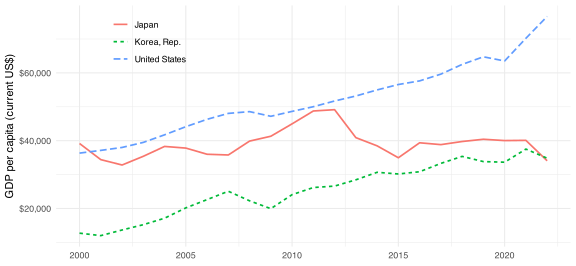
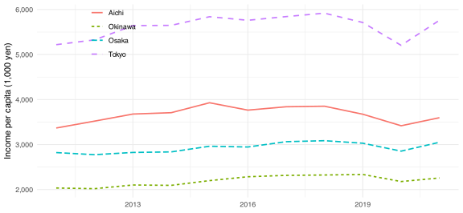
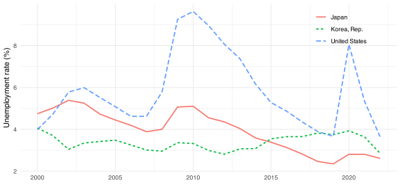
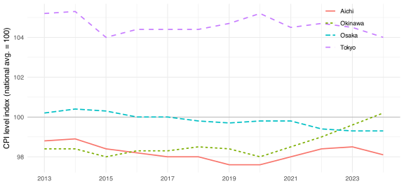

# 7  API

Code

## 7.1 Client-Server Model

私たちが普段見ている Web ページは, クライアントとサーバーのやり取りで成り立っています ([Figure fig-client-server](#fig-client-server)).

[](../static/cetz/client-server.svg "Figure 7.1: クライアントとサーバー")

Figure 7.1: クライアントとサーバー

- **クライアント** (client) は Web ブラウザやスマホのアプリなど, ユーザーが直接操作する側のソフトウェアです
- **サーバー** (server) は Web サイトを運営する側のコンピュータで, クライアントからのリクエストに応じてデータを返す役割を担います

このやり取りは HTTP (Hypertext Transfer Protocol) という共通のルールに従います. 中身は大きく2つに分かれます.

- **リクエスト** (request): 「どの URL の何が欲しいか」をサーバーに伝えます. 例えば `GET /page` は「このページをください」という意味です (`GET` は取得, `POST` は送信を表す HTTP メソッドです).
- **レスポンス** (response): サーバーからの返事です. 成否を表すステータスコード (`200 OK`, `404 Not Found` など) と, 本文 (body) から成ります. 本文は, Web ページなら HTML, API なら JSON であることが多いです.

この request と response のやり取りは, R からもそのまま再現できます. `httr2` パッケージで, シンプルな Web ページ <https://example.com> に GET リクエストを送ってみましょう.

``` r
resp <- request("https://example.com") |>
  req_perform()

resp_status(resp)
## [1] 200
```

ステータスコードが `200` なら成功です. 続けてレスポンスの本文を取り出すと, ブラウザが受け取るのと同じ HTML がそのまま返ってきます (長いので先頭だけ表示します).

``` r
resp |>
  resp_body_string() |>
  substr(1, 320) |>
  cat()
## <!doctype html><html lang="en"><head><title>Example Domain</title><link rel="icon" href="data:,"><meta name="viewport" content="width=device-width, initial-scale=1"><style>body{background:#eee;width:60vw;margin:15vh auto;font-family:system-ui,sans-serif}h1{font-size:1.5em}div{opacity:0.8}a:link,a:visited{color:#348}</s
```

私たちが普段ブラウザで見ているページは, この HTML をブラウザが解釈して描画したものです. ブラウザは, ここで R がやったのと同じリクエストを送り, 返ってきた HTML を画面に整形して表示しているにすぎません.

## 7.2 REST API の基本

人間向けの HTML を解析してデータを取り出す方法 (スクレイピング) もありますが, 多くのサービスは「プログラムがデータを取りに来るための窓口」をはじめから用意しています. これが API (Application Programming Interface) です. API にリクエストを送ると, 本文は HTML ではなく JSON のような構造化データで返ってきます. 整形済みのデータがそのまま手に入り, ページの見た目に左右されず仕様も安定しているので, データを取得するなら API が第一の選択です.

Web の API の多くは REST という様式に従っており, 普段ブラウザがページを取りに行くのと同じ HTTP のやり取り ([sec-client-server](#sec-client-server) で見たリクエストとレスポンス) でデータを受け渡します. 押さえるべきは次の3つです.

- **エンドポイント** (endpoint): リクエストの宛先となる URL です. 「どのデータが欲しいか」が URL のパスに対応します.
- **クエリパラメータ** (query parameter): URL の末尾に `?key=value&key2=value2` の形でくっつける絞り込み条件です. 期間や対象, 出力形式などを指定します.
- **レスポンス** (response): 多くの場合 JSON 形式のテキストです. ステータスコード (`200` なら成功) もあわせて返ってきます.

**JSON** (JavaScript Object Notation) は, データ交換でもっとも広く使われる形式です. 「キーと値の組」を `{...}` で, その並びを `[...]` の配列で表し, これらを入れ子にしてデータを記述します. 例えば, 国ごとの1人あたり GDP を並べると次のようになります.

``` json
[
  {"country": "Japan", "year": 2022, "gdp_pc": 33834},
  {"country": "Korea", "year": 2022, "gdp_pc": 32423}
]
```

R では `httr2` がこの JSON を自動でリスト (`list`) に変換してくれるので, あとはそこから必要な値を取り出して整えるだけです.

## 7.3 Application: 世界銀行

R で API を叩くには [`httr2`](https://httr2.r-lib.org/) を使います. リクエストを少しずつ組み立て (`req_*`), 最後に送信して (`req_perform`), レスポンスから中身を取り出す (`resp_*`), という流れです.

例として, 世界銀行の [World Bank Indicators API](https://datahelpdesk.worldbank.org/knowledgebase/articles/889392) を使い, 日本・アメリカ・韓国の1人あたり GDP (現在価格, USD) の時系列を取得します.[^1] この API のエンドポイントは `https://api.worldbank.org/v2/country/{国コード}/indicator/{指標コード}` という形です.

``` r
resp <- request("https://api.worldbank.org/v2") |>
  req_url_path_append(
    "country",
    "JPN;USA;KOR",
    "indicator",
    "NY.GDP.PCAP.CD"
  ) |>
  req_url_query(format = "json", date = "2000:2022", per_page = 20000) |>
  req_perform()

resp_status(resp)
## [1] 200
```

`request()` でベース URL からリクエストを作り, `req_url_path_append()` でパスを, `req_url_query()` でクエリパラメータを付け足しています.[^2] ここでは出力形式を JSON に, 期間を2000〜2022年に, 1ページあたりの件数を十分大きく指定しています. `req_perform()` で実際にリクエストを送り, `resp_status()` が `200` なら成功です.

### JSON を tibble に整える

レスポンスの本文は `resp_body_json()` でリストに変換します. 世界銀行 API の場合, 返ってくる JSON は2要素の配列で, 1つ目がページ情報 (総件数など) のメタデータ, 2つ目が実データの配列です.[^3]

``` r
body <- resp_body_json(resp)
records <- body[[2]]

length(records)
## [1] 69
str(records[[1]], max.level = 1)
## List of 8
##  $ indicator      :List of 2
##  $ country        :List of 2
##  $ countryiso3code: chr "JPN"
##  $ date           : chr "2022"
##  $ value          : num 35548
##  $ unit           : chr ""
##  $ obs_status     : chr ""
##  $ decimal        : int 1
```

各レコードは, 国・年・値などをキーに持つリストになっています. ここから欲しいキーだけを `purrr::map_*()` で抜き出して `tibble` に組み立てます. 値が欠損している年は `value` が `NULL` になっているので, `%||%` で `NA` に置き換えておきます.

``` r
gdp <- tibble(
  country = map_chr(records, \(r) r$country$value),
  year = as.integer(map_chr(records, \(r) r$date)),
  gdp_pc = map_dbl(records, \(r) r$value %||% NA_real_)
)

gdp |> arrange(country, year)
```

これで, ブラウザもHTMLのパースも介さずに, 分析にそのまま使える整然データ (tidy data) が手に入りました. あとはいつものように可視化できます ([Figure fig-gdp-pc](#fig-gdp-pc)).

``` r
ggplot(gdp, aes(year, gdp_pc, color = country, linetype = country)) +
  geom_line(linewidth = 0.8) +
  scale_y_continuous(labels = scales::label_dollar()) +
  scale_color_discrete(name = NULL) +
  scale_linetype_discrete(name = NULL) +
  labs(x = NULL, y = "GDP per capita (current US$)") +
  theme_minimal() +
  theme(
    legend.position = "inside",
    legend.position.inside = c(0.18, 0.85)
  )
```

[](api_files/figure-html/fig-gdp-pc-1.svg "Figure 7.2: GDP per capita, 2000-2022 (World Bank)")

Figure 7.2: GDP per capita, 2000-2022 (World Bank)

### ラッパーパッケージ: WDI

ここまで `httr2` で URL を組み立て, JSON を手でほどいてきました. 仕組みを理解するには大切な作業ですが, 世界銀行のような主要なデータソースには, この一連の流れを1つの関数に包んだラッパーパッケージが用意されていることがよくあります. 世界銀行なら [`WDI`](https://github.com/vincentarelbundock/WDI) です. さきほどと同じデータが, 次の数行で手に入ります.

``` r
gdp_wdi <- WDI(
  country = c("JP", "US", "KR"),
  indicator = c(gdp_pc = "NY.GDP.PCAP.CD"),
  start = 2000,
  end = 2022
)

gdp_wdi |> as_tibble() |> arrange(country, year)
```

国コード・指標コード・期間を渡すだけで, さきほど手作業で組み立てたのと同じ整然データが返ってきます. `indicator` に名前付きベクトルを渡すと, 値の列名 (`gdp_pc`) もその場で指定できます. ラッパーがある API では, まずこちらを使うのが近道です.

## 7.4 Application: e-Stat

実用的な API の多くは, 誰がどれだけ使ったかを管理するために, 利用登録と API キー (api key) を求めます. 日本の官庁統計を横断的に提供する [e-Stat](https://www.e-stat.go.jp/) (政府統計の総合窓口) もその一つです. ここでは, キーの安全な扱い方とあわせて, 都道府県別の1人当たり県民所得を取得してみます.

### API キーを安全に扱う

e-Stat の API を使うには, まず <https://www.e-stat.go.jp/api/> で無料のユーザー登録をして, アプリケーションID (appId) を発行します. このキーをコードに直接書くと, 誤って GitHub に公開したときにそのまま流出してしまいます. そこで, プロジェクト直下の `.Renviron` に次の1行を置き, 環境変数として読み込みます.

``` sh
ESTAT_APP_ID=your_application_id_here
```

`.Renviron` は必ず `.gitignore` に加えて, Git の管理対象から外しておきます. R を起動すると `.Renviron` が自動で読み込まれるので, あとは `Sys.getenv()` でキーを取り出せます. キーの値そのものはコードにもログにも残りません.

``` r
app_id <- Sys.getenv("ESTAT_APP_ID")
```

### 統計表を探す

世界銀行では仕組みを理解するために手で組み立てましたが, e-Stat にも専用のラッパー [`estatapi`](https://github.com/yutannihilation/estatapi) があるので, ここでは最初からそれを使います. まず, どの統計表を使うかを探します. `estat_getStatsList()` に検索語を渡すと, 条件に合う統計表の一覧が tibble で返ってきます.

``` r
tables <- estat_getStatsList(
  appId = app_id,
  searchWord = "都道府県データ 経済基盤"
)

tables |> distinct(`@id`, STATISTICS_NAME, TITLE)
```

`@id` の列が, それぞれの統計表の ID (`statsDataId`) です. ここでは「都道府県データ 基礎データ」の経済基盤の表, `0000010103` を使います.[^4]

### データを取得する

統計表の ID が分かったら, `estat_getStatsData()` に `appId`, `statsDataId`, そして絞り込み条件を渡します. 1人当たり県民所得 (`cdCat01 = "C122101"`) を, 東京・愛知・大阪・沖縄の4都府県 (`cdArea`) について取得します. 都道府県は5桁のコード (東京都なら `13000`) で指定します.

``` r
raw <- estat_getStatsData(
  appId = app_id,
  statsDataId = "0000010103",
  cdCat01 = "C122101",
  cdArea = c("13000", "23000", "27000", "47000")
)

dim(raw)
## [1] 44 11
```

整然データの tibble が直接返ってくるので, `httr2` のときのような JSON のパースは要りません. `raw` には, コード列 (`area_code`, `time_code` など) と日本語ラベルの列, そして値 `value` が並んでいます. 必要な列だけ取り出して整えます. 時点コード `"2011100000"` は先頭4桁が年度なので, `str_sub()` でそこを取り出します.

``` r
income <- raw |>
  transmute(
    area = area_code,
    year = as.integer(str_sub(time_code, 1, 4)),
    income = value
  )

income
```

### 可視化

単位は千円です. 県名を英語ラベルに直して, 1人当たり県民所得の推移を描きます ([Figure fig-estat-income](#fig-estat-income)).

``` r
income |>
  mutate(
    prefecture = recode(
      area,
      "13000" = "Tokyo",
      "23000" = "Aichi",
      "27000" = "Osaka",
      "47000" = "Okinawa"
    )
  ) |>
  ggplot(aes(year, income, color = prefecture, linetype = prefecture)) +
  geom_line(linewidth = 0.8) +
  scale_y_continuous(labels = scales::label_comma()) +
  scale_color_discrete(name = NULL) +
  scale_linetype_discrete(name = NULL) +
  labs(x = NULL, y = "Income per capita (1,000 yen)") +
  theme_minimal() +
  theme(
    legend.position = "inside",
    legend.position.inside = c(0.18, 0.85)
  )
```

[](api_files/figure-html/fig-estat-income-1.svg "Figure 7.3: 1人当たり県民所得の推移 (e-Stat)")

Figure 7.3: 1人当たり県民所得の推移 (e-Stat)

> **WARNING:**
>
> 有名なデータソースには, 本章で使った `WDI` や `estatapi` のように, API 呼び出しを R の関数で包んだラッパーパッケージが用意されていることがよくあります. FRED なら [`fredr`](https://sboysel.github.io/fredr/) など, ほかにも数多くあります. 新しいデータソースを使うときは, まずこうしたパッケージが無いか探すのが近道です. 一方で, ラッパーの無い API に出会ったら, 世界銀行の例で見たように `httr2` で自分でリクエストを組み立てることになります. 手で組み立てる方法とラッパーの両方を知っておくと心強いです.
>
> また, API には単位時間あたりのリクエスト数の上限 (rate limit) があります. `httr2` で多数のリクエストを送るときは, `req_throttle()` で送信間隔をあけ, `req_retry()` で失敗時の再試行を設定しておくと安全です.

## 演習問題

前半は HTTP と API の基本に関するクイズ, 後半は実際に API からデータを取得する演習です. クイズは選択肢をクリックすると, その場で正誤が表示されます.

### クイズ

API にリクエストを送ったら, ステータスコード 404 が返ってきました. 何が起きたと考えられるでしょうか.

リクエストは成功し, データが返ってきている  
URL の綴りやパスが間違っているなど, リクエスト先のリソースが存在しない  
サーバーの内部でエラーが起きた  
リクエストの回数制限 (rate limit) に達した  

URL `https://api.worldbank.org/v2/country/JPN/indicator/NY.GDP.PCAP.CD?format=json&date=2000:2022` について, 正しい説明はどれでしょうか.

全体がエンドポイントで, 絞り込み条件は HTTP ヘッダで送る  
? より前がエンドポイント (宛先のパス) で, ? より後がクエリパラメータ (絞り込み条件)  
format=json はエンドポイントの一部  
country/JPN の部分がクエリパラメータ  

共同研究のリポジトリで e-Stat の API キーを使います. 正しい管理方法はどれでしょうか.

.gitignore に追加した .Renviron にキーを書き, Sys.getenv() で読み込む  
誤ってコミットしても, ファイルを削除してコミットし直せば安全  
コードに直書きしておき, GitHub に push する直前に消す  
スクリプトに直書きするが, リポジトリを private にしておく  

ある API から数千件のデータをループで取得する予定です. どう実装するのがよいでしょうか.

req_throttle() で送信間隔をあけ, req_retry() で失敗時の再試行を設定する  
並列化して, できるだけ短時間で送り終える  
resp_status() が 200 になるまで, 待ち時間なしで同じリクエストを送り続ける  
req_perform() を for ループで回すだけでよく, 特別な設定は不要  

### 世界銀行 API で失業率を取得する

世界銀行 API から, 日本・アメリカ・韓国の失業率 (ILO 推計, 労働力人口に占める割合) を2000〜2022年について取得します. 指標コードは `SL.UEM.TOTL.ZS` です.

1.  本文と同じように, `httr2` でリクエストを組み立てて JSON を受け取り, `country`, `year`, `unemp` の3列の tibble に整えてください.
2.  同じデータを `WDI` パッケージでも取得してください.
3.  どちらかのデータを使って, 3か国の失業率の推移を線グラフに描いてください.

> **TIP:**
>
> まず `httr2` で手組みする方法です. エンドポイントのパスとクエリパラメータは1人あたり GDP のときと同じで, 指標コードだけが変わります.
>
> ``` r
> resp_unemp <- request("https://api.worldbank.org/v2") |>
>   req_url_path_append(
>     "country",
>     "JPN;USA;KOR",
>     "indicator",
>     "SL.UEM.TOTL.ZS"
>   ) |>
>   req_url_query(format = "json", date = "2000:2022", per_page = 20000) |>
>   req_perform()
>
> records_unemp <- resp_body_json(resp_unemp)[[2]]
>
> unemp <- tibble(
>   country = map_chr(records_unemp, \(r) r$country$value),
>   year = as.integer(map_chr(records_unemp, \(r) r$date)),
>   unemp = map_dbl(records_unemp, \(r) r$value %||% NA_real_)
> )
>
> unemp |> arrange(country, year)
> ```
>
> `WDI` なら同じデータが1つの関数呼び出しで手に入ります.
>
> ``` r
> unemp_wdi <- WDI(
>   country = c("JP", "US", "KR"),
>   indicator = c(unemp = "SL.UEM.TOTL.ZS"),
>   start = 2000,
>   end = 2022
> )
>
> unemp_wdi |> as_tibble() |> arrange(country, year)
> ```
>
> 可視化は本文の GDP の図とほぼ同じです.
>
> ``` r
> ggplot(unemp, aes(year, unemp, color = country, linetype = country)) +
>   geom_line(linewidth = 0.8) +
>   scale_color_discrete(name = NULL) +
>   scale_linetype_discrete(name = NULL) +
>   labs(x = NULL, y = "Unemployment rate (%)") +
>   theme_minimal() +
>   theme(
>     legend.position = "inside",
>     legend.position.inside = c(0.85, 0.85)
>   )
> ```
>
> [](api_files/figure-html/fig-exercise-unemp-1.svg "Figure 7.4: Unemployment rate, 2000-2022 (World Bank, ILO estimate)")
>
> Figure 7.4: Unemployment rate, 2000-2022 (World Bank, ILO estimate)

### e-Stat で物価の地域差を調べる

本文で使った統計表 `0000010103` (都道府県データ 経済基盤) には, 物価に関する指標も含まれています. e-Stat の API キーを設定したうえで, 次の手順で「消費者物価地域差指数 (総合)」を調べてください. この指数は各年の全国平均を 100 として, その年の各都道府県の物価水準を相対値で表します.

1.  `estat_getMetaInfo()` で統計表のメタデータを取得し, `cat01` の一覧から「消費者物価地域差指数（総合）」のコードを探してください.
2.  東京・愛知・大阪・沖縄の4都府県について指数を取得し, `area`, `year`, `cpi` の3列の tibble に整えてください.
3.  4都府県の指数の推移を線グラフに描いてください. 全国平均を表す 100 の水平線も引くと読みやすくなります.

> **TIP:**
>
> メタデータの `cat01` が指標コードの一覧です. 名前で絞り込みます.
>
> ``` r
> meta <- estat_getMetaInfo(appId = app_id, statsDataId = "0000010103")
>
> meta$cat01 |>
>   filter(str_detect(`@name`, "消費者物価地域差指数")) |>
>   select(`@code`, `@name`)
> ```
>
> 似た名前の系列が複数見つかりますが, これは基準や調査の切り替えでコードが分かれているためです. ここでは2013年度以降をカバーする現行の系列 `C5701` を使います.
>
> ``` r
> cpi_raw <- estat_getStatsData(
>   appId = app_id,
>   statsDataId = "0000010103",
>   cdCat01 = "C5701",
>   cdArea = c("13000", "23000", "27000", "47000")
> )
>
> cpi <- cpi_raw |>
>   transmute(
>     area = area_code,
>     year = as.integer(str_sub(time_code, 1, 4)),
>     cpi = value
>   )
>
> cpi
> ```
>
> 本文と同じように県名を英語ラベルに直して描きます.
>
> ``` r
> cpi |>
>   mutate(
>     prefecture = recode(
>       area,
>       "13000" = "Tokyo",
>       "23000" = "Aichi",
>       "27000" = "Osaka",
>       "47000" = "Okinawa"
>     )
>   ) |>
>   ggplot(aes(year, cpi, color = prefecture, linetype = prefecture)) +
>   geom_hline(yintercept = 100, linewidth = 0.3, color = "gray60") +
>   geom_line(linewidth = 0.8) +
>   scale_x_continuous(breaks = seq(2013, 2023, 2)) +
>   scale_color_discrete(name = NULL) +
>   scale_linetype_discrete(name = NULL) +
>   labs(x = NULL, y = "CPI level index (national avg. = 100)") +
>   theme_minimal() +
>   theme(
>     legend.position = "inside",
>     legend.position.inside = c(0.85, 0.85)
>   )
> ```
>
> [](api_files/figure-html/fig-exercise-cpi-1.svg "Figure 7.5: Regional CPI level index, all items (national average = 100)")
>
> Figure 7.5: Regional CPI level index, all items (national average = 100)
>
> 図を読むときには注意が必要です. この指数は特定の基準年を 100 とするのではなく, 各年の全国平均を 100 とする空間方向の指数なので, 線の上下の動きはインフレ率ではありません. 例えば沖縄が2020年度以降 100 に近づいているのは, 物価が上がったことそのものではなく, 全国平均との相対的な物価差が縮まったことを意味します. 都道府県の間の物価水準の比較は各年ででき, 時間方向の物価上昇率を見たいときは通常の消費者物価指数を使います.

[^1]: 世界銀行 API は認証なしで使え, 経済データの宝庫なので練習に向いています. 指標コード `NY.GDP.PCAP.CD` が1人あたり GDP, 国は ISO3 コード (`JPN`, `USA`, `KOR`) で指定します.

[^2]: パイプで組み立てるので, パラメータの追加や差し替えが読みやすいのが `httr2` の利点です. 古い `httr` パッケージの後継にあたります.

[^3]: この「メタデータ + データ」という二段構えは世界銀行 API 固有の作りです. API ごとに JSON の構造は異なるので, 最初は `str(body, max.level = 2)` などで形を確かめるのが近道です.

[^4]: 統計表に含まれる指標や地域のコード (`cat01`, `area` など) の一覧は `estat_getMetaInfo()` で調べられます. これも estatapi の関数です. 1人当たり県民所得の指標コードは `C122101` です.
