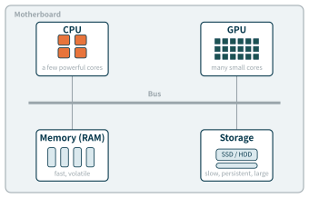
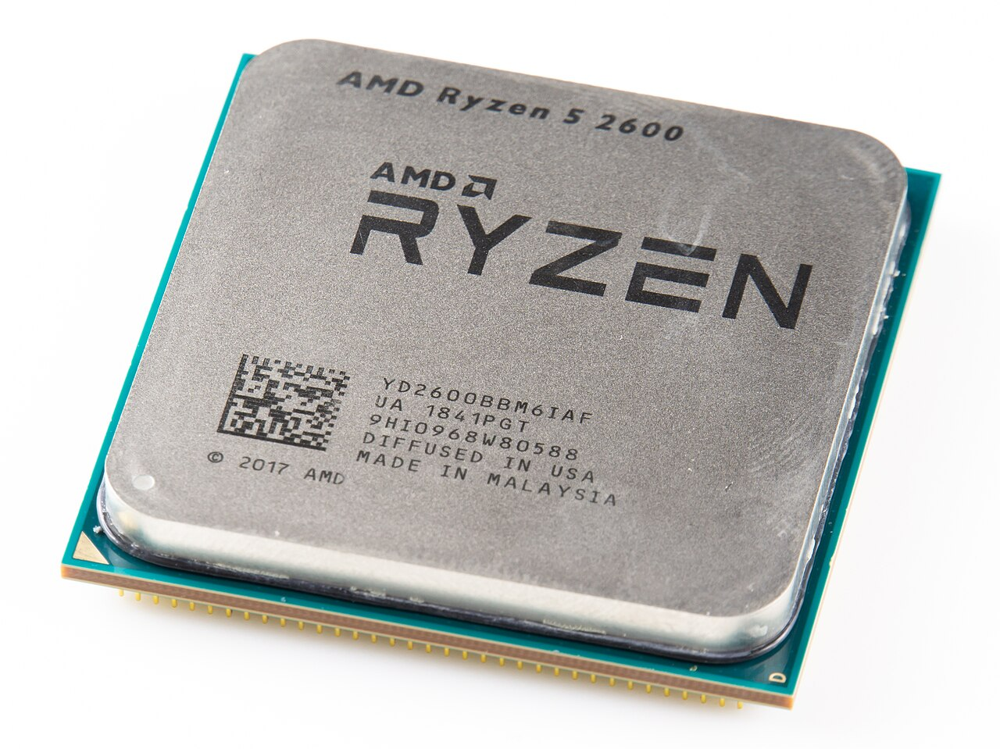
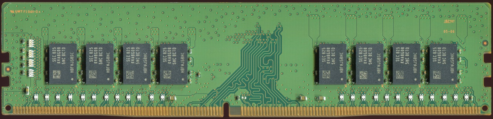
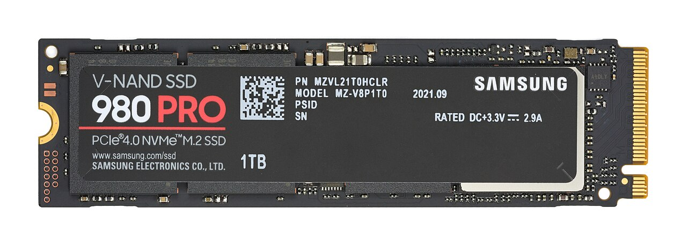
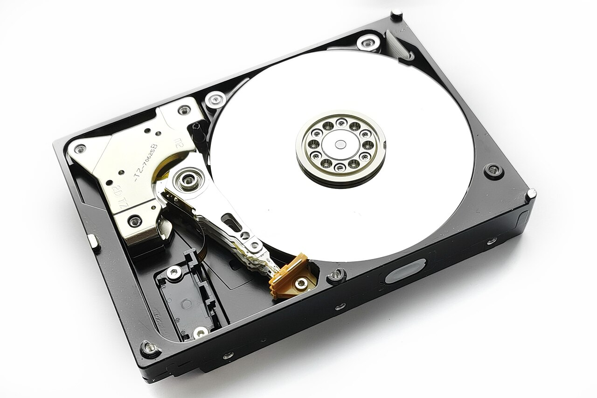
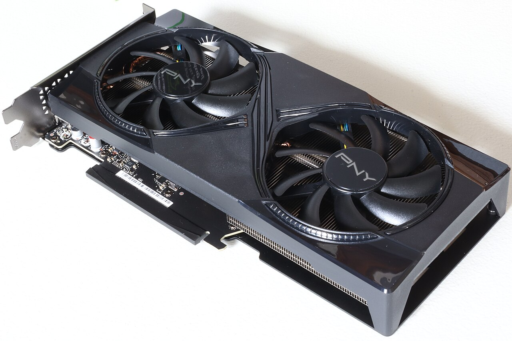
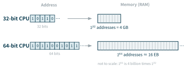
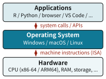
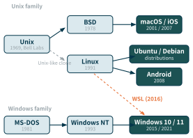

# 1  アーキテクチャ

Code

この章では, コンピュータがどのような部品からできていて, その上でソフトウェアがどのように動いているのかを学びます. 普段の分析ではあまり意識しない話題ですが, 研究生活では意外なほど頻繁に顔を出します. 新しい PC を買うとき, ソフトウェアのインストーラを選ぶとき, 大学の計算サーバーやクラウドを使うとき, そして AI に環境構築を指示するとき, この章の語彙が判断の基礎になります.

## 1.1 コンピュータの基本構成

デスクトップ PC もノート PC も, そしてスマートフォンも, 基本的な構成は同じです. [Figure fig-computer-components](#fig-computer-components) のように, CPU, メモリ, ストレージ, GPU といった部品が, マザーボード (motherboard) と呼ばれる基板の上で, バス (bus) というデータの通り道によって結ばれています.

[](../static/cetz/computer-components.svg "Figure 1.1: コンピュータの基本構成")

Figure 1.1: コンピュータの基本構成

### CPU

[](../static/img/hardware/cpu.jpg "Figure 1.2: CPU (AMD Ryzen 5 2600)")

Figure 1.2: CPU (AMD Ryzen 5 2600)

CPU (Central Processing Unit, 中央演算処理装置) は, プログラムの命令を1つずつ実行するコンピュータの頭脳です ([Figure fig-photo-cpu](#fig-photo-cpu)). 性能を表す代表的な指標が2つあります.

- **クロック周波数** (clock speed): 1秒間に刻む動作の回数で, GHz (\\10^9\\ 回/秒) で表されます. おおまかには1コアあたりの処理の速さの目安です.
- **コア数** (cores): 独立して命令を実行できる演算ユニットの数です. 近年の CPU は4から16程度のコアを持つのが一般的です.

かつては世代ごとにクロック周波数が上がり, 何もしなくてもプログラムが速くなる時代がありました. しかし発熱の限界から2000年代半ばにクロック周波数の伸びは急減速し,[^1] 以降の CPU はコア数を増やす方向に進化しています. 複数のコアを活かすには, プログラムの側で計算を分担させる並列化が必要になります ([sec-parallelization](#sec-parallelization)).

### メモリとストレージ

[](../static/img/hardware/ram.jpg "Figure 1.3: メモリ (DDR4 DIMM)")

Figure 1.3: メモリ (DDR4 DIMM)

メモリ (RAM, Random Access Memory) は, 実行中のプログラムとデータを置いておく作業スペースで ([Figure fig-photo-ram](#fig-photo-ram)), よく机の広さに例えられます. 机が広いほど多くの資料を同時に広げられるように, RAM が大きいほど大きなデータを一度に扱えます. 高速に読み書きできる一方で, 電源を切ると中身が消えます (揮発性, volatile).

[](../static/img/hardware/ssd.jpg "SSD (NVMe M.2)")

SSD (NVMe M.2)

[](../static/img/hardware/hdd.jpg "HDD (カバーを開けた内部)")

HDD (カバーを開けた内部)

Figure 1.4: ストレージ

ストレージ (storage) は, ファイルを永続的に保存しておく場所で, SSD (Solid State Drive) や HDD (Hard Disk Drive) がこれにあたります ([Figure fig-photo-storage](#fig-photo-storage)). こちらは本棚です. 容量は RAM の何十倍もありますが, 読み書きは桁違いに遅くなります.

「速いが小さい記憶」と「遅いが大きい記憶」を階層的に組み合わせるこの設計はメモリのヒエラルキーと呼ばれ, 計算の高速化を考えるうえで重要になります ([sec-computation-theory](#sec-computation-theory)). なお, データ分析で「メモリが足りない」と言うときのメモリは RAM のことです. RAM に収まらないデータの扱い方は, データ処理の章で扱います.

### GPU

[](../static/img/hardware/gpu.jpg "Figure 1.5: GPU (GeForce RTX 5060 Ti)")

Figure 1.5: GPU (GeForce RTX 5060 Ti)

GPU (Graphics Processing Unit) は, もともと画面描画のための部品です ([Figure fig-photo-gpu](#fig-photo-gpu)). 画面上の何百万というピクセルを同時に計算する必要があるため, [Figure fig-computer-components](#fig-computer-components) に描いたように, 単純な演算ユニットを数千個並べた構造をしています. 少数の強力なコアで複雑な処理を順にこなす CPU とは対照的な設計です.

この「単純な計算の大規模並列」は行列演算と相性が良いため, GPU は深層学習をはじめとする機械学習の計算基盤になりました.[^2] 経済学でも, 深層学習や大規模なシミュレーションを使う研究では GPU が登場しますが, 回帰分析が中心であれば必須ではありません.

> **TIP:**
>
> 1.  RAM: 最優先です. 16GB を最低ラインとし, 大きめのデータを扱うなら 32GB 以上を勧めます.
> 2.  CPU: コア数が多いほど並列化の恩恵を受けられます.
> 3.  ストレージ: SSD で 512GB 以上が目安です. HDD は避けましょう.
> 4.  GPU: 深層学習をしないなら不要です. 必要になったらクラウドで借りるという選択肢もあります.

## 1.2 CPU アーキテクチャ

ここからは, 同じ「CPU」の中にも互換性のない種類があるという話をします. まず, 自分の環境を R で確認してみましょう.

``` r
Sys.info()[c("sysname", "release", "machine")]
##  sysname  release  machine 
## "Darwin" "25.5.0"  "arm64"
```

`machine` に表示されているのが CPU アーキテクチャです. 筆者の環境は Apple Silicon 搭載の Mac なので `arm64` と表示されています. Intel や AMD 製 CPU の PC なら `x86_64` になるはずです. この違いが何を意味するのかを見ていきましょう (`sysname` の Darwin については OS の節で説明します).

### 機械語と命令セット

CPU が直接理解できるのは, 機械語 (machine code) と呼ばれる 0 と 1 の列だけです. R のコードを実行するときも, R のインタープリタ (それ自体が機械語のプログラム) がコードを解釈し, 最終的にはすべて機械語の命令となって CPU に届いています.

どのような機械語の命令が使えるかという「語彙」の仕様を, **命令セットアーキテクチャ** (ISA, Instruction Set Architecture) といいます. 現在の主流は [Table tbl-isa](#tbl-isa) の2系統です.

|  | x86-64 (AMD64) | ARM64 (AArch64) |
|----|----|----|
| 設計 | Intel, AMD | Arm 社が設計し各社へライセンス |
| 採用例 | Windows PC の大半, Intel Mac, サーバー | スマートフォン, Apple Silicon Mac, AWS Graviton |
| 特徴 | 高性能重視, 長い後方互換性 | 省電力重視 |

Table 1.1: 主要な CPU アーキテクチャ

x86 は1978年の Intel 8086 に始まる系譜で, 40年以上前のソフトウェアとの互換性を保ちながら拡張されてきました.[^3] 一方 ARM は省電力を重視した設計で, スマートフォンのほぼすべてに採用されています.

長らく「PC とサーバーは x86, スマートフォンは ARM」という住み分けでしたが, 2020年に Apple が Mac の CPU を自社設計の ARM チップ (Apple Silicon, M1 など) に切り替えたのを機に, この境界は崩れつつあります. クラウドでは AWS の Graviton など ARM サーバーが増えており, スーパーコンピュータ富岳の CPU も ARM 系です.

> **TIP:**
>
> x86-64 の CPU を作っているのは Intel と AMD の2社で, どちらを選んでもソフトウェアの互換性は変わりません. PC を買うときに見るべきは, 型番に埋め込まれたグレードと世代です.
>
> Intel の Core i7-13700 という型番なら, i7 がグレード (i3 \< i5 \< i7 \< i9) を, 続く 13 が第13世代であることを表します. AMD の Ryzen 7 7700 なら, Ryzen 7 がグレード (3 \< 5 \< 7 \< 9) を, 数字の先頭の 7 が 7000 シリーズという世代を表します. ノート PC 向けでは型番の末尾に文字が付き, U は省電力型, H は高性能型を意味します.
>
> 注意したいのは, グレードはあくまで同世代内での序列だという点です. 世代が新しい i5 が数世代前の i7 を上回ることは珍しくないため, セール品や中古品で「i7 搭載」とだけ書かれていたら, 必ず世代も確認しましょう.
>
> なお Intel は2023年末から, 新しい製品を Core Ultra (Core Ultra 5/7/9) というブランドに切り替えつつあります. 名前は変わりましたが, グレードと世代 (Core Ultra 7 155H なら先頭の 1 が第1世代) を確認するという読み方は同じです.

### 32-bit と 64-bit

アーキテクチャ名に付いている「64」は, CPU が一度に扱う整数やメモリアドレスの幅が 64 ビットであることを意味します. この幅が重要なのは, 扱えるメモリの上限を決めるからです ([Figure fig-bit-width](#fig-bit-width)). 32-bit の CPU が区別できるメモリアドレスは \\2^{32}\\ 通り, つまり 4GB 分しかありません. どれだけ RAM を積んでも, 1つのプログラムは 4GB までしか使えないのです. 64-bit ではこの上限が \\2^{64}\\ バイト (約1600万 TB) となり, 事実上無制限になりました.

[](../static/cetz/bit-width.svg "Figure 1.6: アドレス幅と扱えるメモリの上限")

Figure 1.6: アドレス幅と扱えるメモリの上限

現在の PC とスマートフォンは, ほぼすべて 64-bit (x86-64 か ARM64) です. ただし名残はあちこちに残っていて, ダウンロードページの `i386` や `x86` は 32-bit 版を, `x86_64` や `x64` は 64-bit 版を指しています.

> **NOTE:**
>
> 64-bit CPU の上でも, R の整数型 (integer) は 32-bit のままです.
>
> ``` r
> .Machine$integer.max
> ## [1] 2147483647
> .Machine$integer.max + 1L
> ## [1] NA
> ```
>
> この上限 (\\2^{31} - 1\\, 約21億) を超える整数はオーバーフローして `NA` になります. 大規模な行政データでは ID や人数の合計が21億を超えることがあり, その場合は double (64-bit 浮動小数点) や文字列として扱うのが安全です.

### バイナリと互換性

ソースコードを機械語に翻訳することをコンパイル (compile) といい, できあがった実行ファイルをバイナリ (binary) と呼びます. ここで重要なのは, バイナリは特定の ISA の機械語で書かれているという点です. x86-64 向けにコンパイルされたバイナリは, そのままでは ARM64 の CPU で動きません. 語彙の違う言語で書かれた指示書のようなものだからです.

そのため, 同じソフトウェアでもアーキテクチャごとに別のバイナリが配布されます. たとえば R の macOS 向けインストーラには, Apple Silicon 用 (arm64) と Intel Mac 用 (x86_64) の2種類があります. 自分の機種に合わない方を選ぶと, 動かないか, 動いても遅くなります.[^4]

## 1.3 OS

### OS の役割

オペレーティングシステム (OS) は, ハードウェアとアプリケーションの間に立つ土台のソフトウェアです ([Figure fig-software-stack](#fig-software-stack)). CPU 時間を各プログラムにどう割り振るか (プロセス管理), RAM をどう配分するか (メモリ管理), ストレージ上のデータをどうファイルとして見せるか (ファイルシステム), キーボードやネットワークとどうやり取りするか (デバイス管理) を一手に引き受けます.

[](../static/cetz/software-stack.svg "Figure 1.7: ハードウェア, OS, アプリケーションの階層")

Figure 1.7: ハードウェア, OS, アプリケーションの階層

アプリケーションはハードウェアを直接触らず, OS が用意した窓口 (システムコール) を通じて機能を利用します. この窓口の仕様が OS ごとに異なるため, バイナリは ISA だけでなく OS にも縛られます. つまり, 配布されるバイナリは「OS × アーキテクチャ」の組み合わせごとに作られます. 身近な機種での組み合わせは [Table tbl-os-arch](#tbl-os-arch) のとおりです.

| 機種                             | OS            | アーキテクチャ          |
|----------------------------------|---------------|-------------------------|
| Mac (Apple Silicon, 2020年以降)  | macOS         | ARM64                   |
| Mac (Intel, 2020年以前)          | macOS         | x86-64                  |
| Windows PC の大半                | Windows       | x86-64                  |
| Copilot+ PC (Snapdragon 搭載)    | Windows       | ARM64                   |
| 計算サーバー・クラウド・スパコン | Linux         | x86-64 (ARM64 も増加中) |
| iPhone / Android スマートフォン  | iOS / Android | ARM64                   |

Table 1.2: 身近な機種の OS とアーキテクチャ

> **WARNING:**
>
> 「Windows PC ならば x86-64」という経験則には例外が増えています. Microsoft の Surface シリーズは, 同じ製品ラインの中に Intel 製 CPU (x86-64) のモデルと Snapdragon 搭載 (ARM64) のモデルが混在しており, 見た目からは区別がつきません. 特に2024年以降の Copilot+ PC を名乗る Surface (Surface Pro 11 や Surface Laptop 7 など) は ARM64 です.
>
> ARM64 の Windows でも x86-64 用のソフトはエミュレーションで一応動きますが, 速度は落ち, ドライバや一部のソフトはそもそも動きません. 研究用ソフトは ARM64 版 Windows への対応が遅れがちで, たとえば本書の執筆時点では, CRAN が配布する Windows 版 R のバイナリは x86-64 用のみです. Windows 機の購入時には, CPU が Intel / AMD (x86-64) か Snapdragon (ARM64) かを必ず確認しましょう. 手元の Windows 機で確かめるには, 「設定 \> システム \> バージョン情報」のシステムの種類に ARM と書かれていないかを見ます.

### Unix の系譜

現在の主要な OS は Windows, macOS, Linux の3つです. この3つの関係を理解する鍵が, 1969年にベル研究所で生まれた Unix という OS です ([Figure fig-os-family](#fig-os-family)).

[](../static/cetz/os-family.svg "Figure 1.8: OS の系譜")

Figure 1.8: OS の系譜

- **macOS**: Unix の直系の子孫である BSD を土台にしています. その中核部分の名前が Darwin で, 先ほど `Sys.info()` の `sysname` に表示されていたものです. iOS も同じ土台の上に作られています.
- **Linux**: 1991年に Linus Torvalds が Unix を手本にゼロから書いた互換 OS (Unix-like) で, オープンソースで開発されています. 厳密には Linux はカーネル (OS の中核) の名前で, 利用者には Ubuntu や Debian などのディストリビューションという形で配布されます. Android も Linux カーネルの上に作られています.
- **Windows**: MS-DOS から Windows NT へと続く, Unix とは独立した系譜です.

この系譜は歴史の豆知識ではなく, そのまま実務に効いてきます. macOS と Linux は同じ Unix の流れを汲むため, コマンド, ディレクトリ構造, 開発ツールがほぼ共通です. そして研究計算の世界では Linux が標準です. 大学の計算サーバー, スーパーコンピュータ, クラウドは, ほぼすべて Linux で動いています.[^5] 手元の Mac で書いた解析コードが計算サーバーでもほぼそのまま動くのは, この共通性のおかげです.

### Windows と WSL

Windows は Unix の系譜から外れているため, シェルもコマンドも互換性がありません. この溝を埋めるのが WSL (Windows Subsystem for Linux) です. 現行の WSL2 は, Windows 上の軽量な仮想マシンで本物の Linux カーネルを動かす仕組みで, Windows のデスクトップを使いながら完全な Linux 環境 (通常は Ubuntu) を手に入れられます. VS Code は WSL 内のファイルをシームレスに開けるため, 編集は Windows 側, 実行は Linux 側という開発スタイルが自然に実現します. 本コースで Windows ユーザーに WSL を推奨しているのはこのためです.

## 1.4 Takeaways

最後に, この章の知識が役立つ場面をまとめます.

- ソフトウェアのインストール: ダウンロードページでは「OS × アーキテクチャ」で選びます. Apple Silicon の Mac なら `arm64` / `aarch64`, それ以外の PC ならたいてい `x86_64` / `x64` / `amd64` です.
- エラーメッセージの解読: `wrong architecture` や `cannot execute binary file` といったエラーを見たら, ISA か OS の不一致を疑いましょう.
- サーバー・クラウドの利用: リモート環境はほぼ Linux で, 多くは x86-64 です. 手元の Mac (macOS + ARM64) でビルドしたバイナリをコピーしても動きません. 環境ごとにインストールし直すか, コンテナを使います.[^6]
- AI への指示: 環境構築を AI に頼むときは, 「Apple Silicon の macOS」「WSL2 上の Ubuntu」のように OS とアーキテクチャを伝えると, 自分の環境に合った手順が返ってきやすくなります.

## 演習問題

この章の理解度を確認しましょう. 選択肢をクリックすると, その場で正誤が表示されます (複数選択の問題だけは, 選び終えてから「答え合わせ」を押してください).

R で大きなデータセットを読み込もうとしたら, `Error: cannot allocate vector of size 8.0 Gb` というエラーが出ました. 「足りない」と言われている部品はどれでしょうか.

SSD  
RAM  
GPU  
CPU  

何年も前に書いた分析コードを最新の PC でそのまま実行しても, 昔の「PC を買い替えたらコードが劇的に速くなった」という体験は得にくくなっています. 主な理由はどれでしょうか.

CPU が性能よりも省電力を優先するようになったから  
CPU の進化がクロック周波数の向上からコア数の増加に移ったから  
ストレージの読み書き速度が頭打ちになったから  
OS が年々重くなり, 性能向上を打ち消しているから  

32-bit のプログラムが1つのプロセスで扱えるメモリの上限はいくつでしょうか.

2GB  
積んだ RAM の分だけ  
4GB  
16GB  

Apple Silicon の Mac で作成した実行ファイル (バイナリ) を, 大学の計算サーバー (Linux, x86-64) にコピーして実行しました. どうなるでしょうか.

問題なく動く  
動かない  
遅くなるが動く  
サーバーに Rosetta 2 を入れれば動く  

次のうち, CPU が ARM64 のマシンをすべて選んでください.

Apple Silicon の Mac  

Copilot+ PC (Snapdragon 搭載)  

Intel の Mac  

大半の Windows デスクトップ PC  

次の OS のうち, Unix の系譜に属さないものはどれでしょうか.

Windows  
macOS  
iOS  
Ubuntu  

[^1]: 1994年から2004年の10年でクロック周波数は約40倍になりましたが (Pentium の 100 MHz から Pentium 4 の 3.8 GHz), その後の20年では 6 GHz 前後までしか伸びていません. 最近の CPU が謳う 5-6 GHz という数字も, 1コア・短時間のブースト時のものです.

[^2]: 機械学習で事実上の標準となっているのが, NVIDIA 製 GPU 向けの計算基盤 CUDA です. 深層学習ライブラリの多くが CUDA を前提に開発されてきたため, 「GPU 計算といえば NVIDIA」という状況が長く続いています.

[^3]: 64-bit への拡張を設計したのは Intel ではなく後発の AMD だったため, x86-64 は AMD64 とも呼ばれます.

[^4]: macOS には Rosetta 2 という変換レイヤーがあり, x86-64 のバイナリを ARM64 の命令に翻訳しながら実行できます. Intel Mac 用のソフトが Apple Silicon でも「一応動く」のはこのおかげですが, ネイティブなバイナリより遅くなります.

[^5]: スーパーコンピュータの性能ランキング [TOP500](https://www.top500.org) に載る計算機の OS は, 2017年11月のリスト以降すべて Linux です ([Sublist Generator](https://www.top500.org/statistics/sublist/) で List と Operating System Family を指定すると確認できます).

[^6]: Docker などのコンテナは OS (ディストリビューション) の差を吸収してくれますが, ISA の差は吸収しません. Apple Silicon 上で x86-64 用のイメージを動かすとエミュレーションになり, 大幅に遅くなります.
