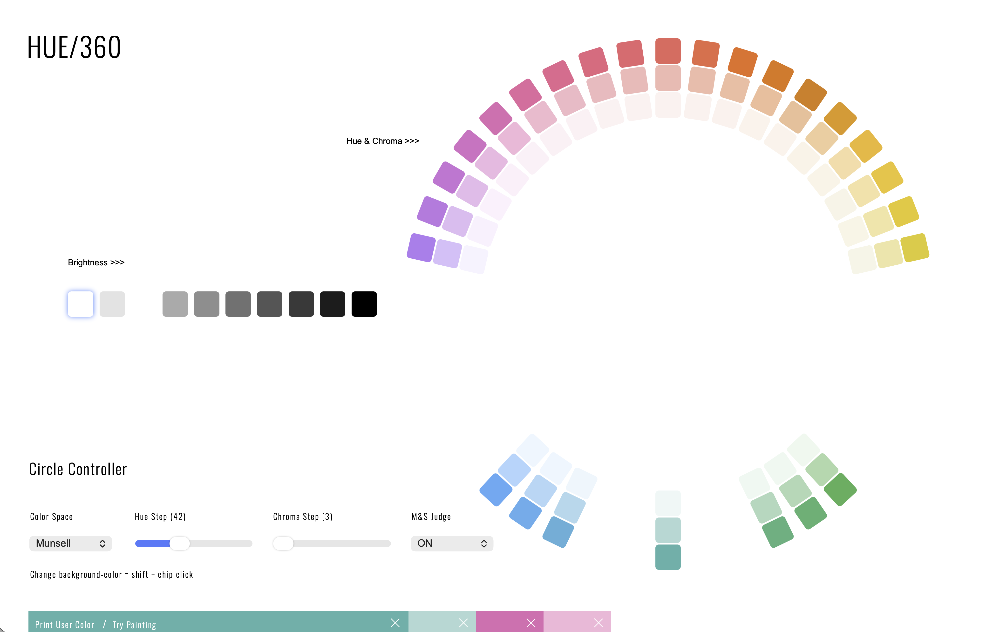

---
execute:
  echo: false
---

# 色彩論 {#sec-color}

```{r}
#| label: setup
#| include: false
library(dplyr)
library(ggplot2)
library(patchwork)
library(tinytable)
options(tinytable_html_mathjax = TRUE)
theme_set(theme_minimal(base_size = 12))
```

```{r}
#| label: vals
#| include: false
# Perceived lightness (CIELAB L*) and relative luminance (CIE Y) of pure primaries.
lab_yb <- farver::decode_colour(c("#FFFF00", "#0000FF"), to = "lab")[, "l"]
xyz_yb <- farver::decode_colour(c("#FFFF00", "#0000FF"), to = "xyz")[, "y"]
L_yellow <- lab_yb[1]
L_blue <- lab_yb[2]
lum_ratio <- xyz_yb[1] / xyz_yb[2]
```

## なぜダサいスライドが生まれるのか

BeamerやRのコードで色を指定するとき, 色に頓着のない人は原色を選んでしまいます. つまり, 純粋な赤 `#FF0000`, 緑 `#00FF00`, 青 `#0000FF` をそのまま使うことです. 色を選ぶ意思があっても, 色彩の知識がないと, ついカラーピッカーの `R, G, B` のスライダーを動かして適当に色を決めてしまいます. これらの結果は, うまく言語化できないにしろ, ダサいと感じるでしょう. これは, 人間が色から受ける印象が `R, G, B` という3つの数値に対して線形に対応していないからです. 分かりやすい例が明るさです. ここでいう純色とは, 赤・緑・青の各チャンネルが 0 か最大値 255 のいずれかだけでできた, 最も鮮やかな色のことです. 純色を並べてみると, 同じ最大の色でも, 感じる明るさは違います.

```{r}
#| label: fig-primary-lightness
#| fig-cap: "純色の知覚明度 L*"
#| fig-width: 7
#| fig-height: 3.2
prim <- tibble::tibble(
  name = c("Blue", "Magenta", "Red", "Green", "Cyan", "Yellow"),
  hex = c("#0000FF", "#FF00FF", "#FF0000", "#00FF00", "#00FFFF", "#FFFF00")
) |>
  mutate(
    L = farver::decode_colour(hex, to = "lab")[, "l"],
    rgb = apply(grDevices::col2rgb(hex), 2, \(v) {
      sprintf("(%d, %d, %d)", v[1], v[2], v[3])
    })
  ) |>
  arrange(L) |>
  mutate(
    label = factor(paste0(name, "\n", rgb), levels = paste0(name, "\n", rgb))
  )

ggplot(prim, aes(x = label, y = L, fill = hex)) +
  geom_col(width = 0.72) +
  geom_text(aes(label = sprintf("L* = %.0f", L)), vjust = -0.5, size = 3.5) +
  scale_fill_identity() +
  scale_y_continuous(limits = c(0, 110), expand = expansion(c(0, 0))) +
  labs(x = NULL, y = "Perceived lightness  L*") +
  theme(
    panel.grid.major.x = element_blank(),
    axis.text.x = element_text(lineheight = 0.9)
  )
```

@fig-primary-lightness の縦軸 `L*` は, 後で定義する知覚的な明度です. 純色の青の明度は `r sprintf("%.0f", L_blue)` しかないのに, 純色の黄は `r sprintf("%.0f", L_yellow)` もあります. つまり原色をいくつか並べただけで, 明るさが大きくばらついた, ちらちらとまとまりのない配色ができあがります. これがダサさの正体です. さらに原色は彩度も最大なので, どの色も自己主張が強く, 図の主張 (@sec-visualization) を邪魔します.

解決の方針はひとつです. 色を `R, G, B` ではなく, 人間が感じる3つの軸, すなわち明度 (lightness), 彩度 (saturation), 色相 (hue) で考えることです. こうすれば「明るさをそろえて色相だけ変える」といった, 知覚に沿った操作ができるようになります.

## 色の3要素とカラーマップ

色は, 色相 (hue), 彩度 (saturation), 明度 (lightness) という3つの知覚的な軸で捉えられます. 色相は色味そのもの (赤・黄・緑・青・紫...) で, 円環の角度で表します. 彩度は鮮やかさ, つまり灰色からどれだけ離れているかです. 明度は明るさです. まずはこの3つを, ひとつずつ動かして目で確かめましょう.

```{r}
#| label: fig-three-elements
#| fig-cap: "色の3要素: 色相・彩度・明度"
#| fig-width: 7.5
#| fig-height: 3.1
h0 <- 40 # a representative hue held fixed for the saturation and lightness bars

# Hue is an angle, so draw it as a colour ring (raster annulus at fixed L, C).
res <- 320
px <- expand.grid(
  x = seq(-1, 1, length.out = res),
  y = seq(-1, 1, length.out = res)
)
px$radius <- sqrt(px$x^2 + px$y^2)
px$h <- (atan2(px$x, px$y) * 180 / pi) %% 360
px$hex <- NA_character_
ring <- px$radius > 0.58 & px$radius < 1
px$hex[ring] <- farver::encode_colour(
  cbind(l = 62, c = 42, h = px$h[ring]),
  from = "lch"
)

p_hue <- ggplot(px, aes(x, y, fill = hex)) +
  geom_raster() +
  scale_fill_identity(na.value = "transparent") +
  coord_fixed() +
  ggtitle("Hue") +
  theme_void() +
  theme(plot.title = element_text(hjust = 0.5, size = 12))

# Saturation and Lightness are linear axes, so draw them as gradient bars.
n <- 220
bar <- function(axis, l, c, h) {
  tibble::tibble(
    axis = axis,
    t = seq(0, 1, length.out = n),
    hex = farver::encode_colour(cbind(l = l, c = c, h = h), from = "lch")
  )
}
bars <- dplyr::bind_rows(
  bar("Saturation", 62, seq(0, 66, length.out = n), h0),
  bar("Lightness", seq(18, 96, length.out = n), 36, h0)
) |>
  mutate(axis = factor(axis, levels = c("Saturation", "Lightness")))

p_bars <- ggplot(bars, aes(t, 1, fill = hex)) +
  geom_raster() +
  scale_fill_identity() +
  facet_wrap(~axis, ncol = 1, strip.position = "left") +
  labs(x = NULL, y = NULL) +
  theme(
    panel.grid = element_blank(),
    axis.text = element_blank(),
    strip.text.y.left = element_text(angle = 0, hjust = 1)
  )

(p_hue | p_bars) + patchwork::plot_layout(widths = c(1, 1.5))
```

@fig-three-elements は, 3つの軸のうち2つを固定して, ひとつだけを動かしたものです. 左の輪は色相環で, 明るさと鮮やかさを一定に保ったまま色味だけを一周させています. 色相が角度に対応することがよく分かります. 右上は色相を固定して彩度を上げたもので, 左の灰色から右の鮮やかなオレンジへ進みます. 右下は色相を固定して明度を上げたもので, 左の暗いところから右の明るいところへ進みます. どんな色も, この3つの数値の組で一意に決まります.

### 色空間: 3要素の測り方

色を表す座標系を色空間 (color space) と呼びます. 目的に応じて使い分けるのが大切なので, まず代表的なものを整理します.

- **RGB / sRGB**: 赤・緑・青の光をどれだけ足すか, という加法混色の座標です. 画面が実際に光を出すしくみそのものであり, 画像の保存形式でもあります. 一方で, 数値と知覚が対応しないため, 色を「選ぶ」のには向きません.
- **HSL / HSV**: RGBを円筒座標に置き直したものです. 色相 (hue) を角度, 彩度 (saturation) と明度 (lightness) を半径・高さで表します. 直感的でピッカーに便利ですが, あくまでRGBの座標変換にすぎず, 知覚的には均等ではありません.
- **CIELAB / LCh**: 人間の色差の実験に基づいて設計された知覚均等 (perceptually uniform) な色空間です. 明度 $L^*$, 彩度 $C^*$, 色相 $h$ の円筒座標が LCh で, これが実質的に HCL と呼ばれるものです. 距離が知覚的な色の違いに近いので, パレット設計に向きます.
- **OKLab / OKLCh**: CIELAB の弱点を近年改良した色空間で, グラデーションやパレット設計での挙動がより素直です. 考え方は LCh と同じ ($L, C, h$ の3軸) です.

3要素の定義そのものは素朴でした. 難しいのは, これらを「知覚的に均等」に測ることです. ここで色空間による差が出ます. HSL の明度と, 人が本当に感じる明度は一致しません. 実際, HSL で明度を `50%` に固定し彩度を最大にして色相だけ一周させると, 感じる明るさは大きく波打ちます. 一方, 知覚均等な HCL で $L^*$ を固定すれば, 色相を変えても明るさはほぼ一定に保てます.

```{r}
#| label: fig-hsl-hcl
#| fig-cap: "同じ「明度」でも色相で知覚明度は動く"
#| fig-width: 7.5
#| fig-height: 4.4
h <- seq(0, 360, length.out = 180)
hsl_hex <- farver::encode_colour(cbind(h = h, s = 100, l = 50), from = "hsl")
hcl_hex <- farver::encode_colour(cbind(l = 65, c = 35, h = h), from = "lch")

df <- tibble::tibble(
  hue = rep(h, 2),
  space = rep(c("HSL: fixed L = 50", "HCL: fixed L* = 65"), each = length(h)),
  hex = c(hsl_hex, hcl_hex)
) |>
  mutate(L = farver::decode_colour(hex, to = "lab")[, "l"])

pal <- c("HSL: fixed L = 50" = "#9a2515", "HCL: fixed L* = 65" = "#107895")

p_strip <- ggplot(df, aes(x = hue, y = space, fill = hex)) +
  geom_tile() +
  scale_fill_identity() +
  labs(x = NULL, y = NULL) +
  theme(panel.grid = element_blank(), axis.text.x = element_blank())

p_line <- ggplot(df, aes(x = hue, y = L, color = space, linetype = space)) +
  geom_line(linewidth = 0.9) +
  scale_color_manual(values = pal, name = NULL) +
  scale_linetype_manual(
    values = c("HSL: fixed L = 50" = "solid", "HCL: fixed L* = 65" = "dashed"),
    name = NULL
  ) +
  scale_y_continuous(limits = c(0, 100)) +
  labs(x = "Hue (degrees)", y = "Perceived  L*") +
  theme(legend.position = "inside", legend.position.inside = c(0.78, 0.22))

p_strip / p_line + patchwork::plot_layout(heights = c(1, 2.4))
```

@fig-hsl-hcl の上段が色帯, 下段がその知覚明度です. HSL の帯 (実線) は黄で明るく青で暗く, 明度が大きく上下します. HCL の帯 (破線) はほぼ平らで, どの色相でも明るさがそろっています. だからこそ, 質的な色分けをするときは HCL で明度と彩度を固定し, 色相だけを動かすのが定石になります.

ではもうひとつの軸, 色相はどうでしょうか. 3つの空間はどれも色相を角度で表しますが, その角度の割り当ては同じではありません. 同じ色が, 空間によって別の角度に置かれます.

```{r}
#| label: fig-hue-spaces
#| fig-cap: "色空間による色相角の違い"
#| fig-width: 7.5
#| fig-height: 4.4
# Unwrap a circular hue series so it increases monotonically (for plotting).
unwrap <- function(y) {
  for (i in 2:length(y)) {
    while (y[i] < y[i - 1] - 180) {
      y[i] <- y[i] + 360
    }
  }
  y
}

hs <- seq(0, 358, by = 2)
hs_hex <- farver::encode_colour(cbind(h = hs, s = 100, l = 50), from = "hsl")
lch_h <- farver::decode_colour(hs_hex, to = "lch")[, "h"]
oklab <- farver::decode_colour(hs_hex, to = "oklab")
ok_h <- (atan2(oklab[, "b"], oklab[, "a"]) * 180 / pi) %% 360

hue_df <- dplyr::bind_rows(
  tibble::tibble(hsl = hs, y = unwrap(lch_h), space = "CIELCh (HCL)"),
  tibble::tibble(hsl = hs, y = unwrap(ok_h), space = "OKLCh")
)

p_bar <- ggplot(tibble::tibble(h = hs, hex = hs_hex), aes(h, 1, fill = hex)) +
  geom_tile() +
  scale_fill_identity() +
  labs(x = NULL, y = NULL) +
  theme(panel.grid = element_blank(), axis.text = element_blank())

p_map <- ggplot(hue_df, aes(hsl, y, color = space, linetype = space)) +
  geom_abline(slope = 1, intercept = 0, color = "grey70", linetype = "dotted") +
  geom_line(linewidth = 1) +
  scale_color_manual(
    values = c("CIELCh (HCL)" = "#9a2515", "OKLCh" = "#107895"),
    name = NULL
  ) +
  scale_linetype_manual(
    values = c("CIELCh (HCL)" = "solid", "OKLCh" = "dashed"),
    name = NULL
  ) +
  scale_x_continuous(breaks = seq(0, 360, 60)) +
  labs(x = "Hue in HSL (degrees)", y = "Hue in space (degrees)") +
  theme(legend.position = "inside", legend.position.inside = c(0.85, 0.2))

p_bar / p_map + patchwork::plot_layout(heights = c(1, 5))
```

@fig-hue-spaces は, HSL で色相を一周させた各色が, CIELCh と OKLCh では何度に対応するかを示しています. 点線は「もし3つの空間で色相角が完全に一致するなら」という基準線です. まず, どちらの曲線も基準線からずれています. HSL は原色を赤 0°, 緑 120°, 青 240° と機械的に等間隔で並べますが, 知覚的な空間はそうではありません. さらに注目すべきは青の領域 (HSL で 180° から 260° あたり) です. ここだけ CIELCh と OKLCh が大きく食い違います. これは CIELAB では青が紫の方向へ曲がってしまう有名な欠陥で, OKLab はまさにこれを補正するように設計されています. 赤や緑では両者はほぼ重なります.

明度と色相を見てきました. 残るは彩度です. これも HSL では素直ではありません. HSL の彩度を最大 (100%) に固定して色相を一周させると, 知覚的な鮮やかさ (chroma) は大きく上下します.

```{r}
#| label: fig-saturation
#| fig-cap: "同じ HSL 彩度でも知覚的な鮮やかさは動く"
#| fig-width: 7.5
#| fig-height: 4
hue_s <- seq(0, 360, length.out = 180)
sat_hex <- farver::encode_colour(
  cbind(h = hue_s, s = 100, l = 50),
  from = "hsl"
)
sat_df <- tibble::tibble(
  hue = hue_s,
  hex = sat_hex,
  chroma = farver::decode_colour(sat_hex, to = "lch")[, "c"]
)

p_sat_strip <- ggplot(sat_df, aes(hue, 1, fill = hex)) +
  geom_tile() +
  scale_fill_identity() +
  labs(x = NULL, y = NULL) +
  theme(
    panel.grid = element_blank(),
    axis.text = element_blank()
  )

p_sat_line <- ggplot(sat_df, aes(hue, chroma)) +
  geom_line(color = "#9a2515", linewidth = 1) +
  scale_x_continuous(breaks = seq(0, 360, 60)) +
  scale_y_continuous(limits = c(0, NA)) +
  labs(x = "Hue in HSL (degrees)", y = "Perceived chroma  C*")

p_sat_strip / p_sat_line + patchwork::plot_layout(heights = c(1, 2.4))
```

@fig-saturation の上段は, どれも彩度 100% の色です. ところが下段の知覚的な彩度 C* を見ると, 最も鈍い水色のあたりでは `r round(min(sat_df$chroma))` ほどしかないのに, 最も鮮やかな青のあたりでは `r round(max(sat_df$chroma))` を超えます. 同じ「最大の彩度」でも, 感じる鮮やかさは色相によっておよそ `r round(max(sat_df$chroma) / min(sat_df$chroma), 1)` 倍も違うのです. 一方 HCL や OKLCh では, この C* そのものを直接指定するので, 色相をまたいで鮮やかさをそろえられます.

まとめると, HSL の3つの数値はどれも知覚とずれています. 明度 (@fig-hsl-hcl) も彩度 (@fig-saturation) も色相で暴れ, 色相角の割り当ても空間で違います (@fig-hue-spaces). そのため, パレット設計では, 3軸すべてが知覚に沿う HCL か OKLCh を使い, 明度と彩度を固定して色相だけを動かすのが定石になります. 青の扱いまで素直な OKLCh を使えるなら, さらに安全です.

### カラーマップ

連続量を色で表すときの色の並びをカラーマップ (colormap) と呼びます. 用途に応じて4つの類型があります.

```{r}
#| label: fig-colormap-types
#| fig-cap: "カラーマップの4類型"
#| fig-width: 7.5
#| fig-height: 3.6
k <- 9
cyc <- farver::encode_colour(
  cbind(l = 70, c = 45, h = seq(0, 360, length.out = k)),
  from = "lch"
)
strip <- function(type, hex) {
  tibble::tibble(type = type, i = seq_along(hex), hex = hex)
}
types <- dplyr::bind_rows(
  strip("1. Sequential", grDevices::hcl.colors(k, "viridis")),
  strip("2. Diverging", grDevices::hcl.colors(k, "Blue-Red 3")),
  strip("3. Qualitative", grDevices::palette.colors(k, "Okabe-Ito")),
  strip("4. Cyclic", cyc)
)

ggplot(types, aes(i, 1, fill = hex)) +
  geom_tile(color = "white", linewidth = 0.4) +
  scale_fill_identity() +
  facet_wrap(~type, ncol = 1, strip.position = "left") +
  labs(x = NULL, y = NULL) +
  theme(
    panel.grid = element_blank(),
    axis.text = element_blank(),
    strip.text.y.left = element_text(angle = 0, hjust = 1)
  )
```

- Sequential (連続): 低い値から高い値へ一方向に進むデータ (人口密度, 濃度など) に使います. 明度が単調に変化するのが条件です.
- Diverging (発散): 中央 (ゼロや平均) から両側に離れる量 (偏差, 相関など) に使い, 中央を淡く, 両端を濃くします.
- Qualitative (質的): 順序のないカテゴリ (国, 品種など) に使い, 明度と彩度をそろえて色相だけを変えます.
- Cyclic (循環): 角度や時刻のように端がつながる量に使い, 始点と終点の色を一致させます.

悪いカラーマップの代表が, かつてよく使われた虹 (rainbow, jet) です^[jet は長らく MATLAB の既定カラーマップでしたが, ここで述べる明度の欠陥のため, MATLAB 自身も 2014 年 (R2014b) に既定を parula へ切り替えました. Python の matplotlib も既定は jet でしたが, van der Walt と Smith が SciPy 2015 で発表した知覚均等な viridis を, バージョン 2.0 (2017年) から既定に採用しました. viridis には同じ設計思想の姉妹マップ magma, inferno, plasma があり, のちに色覚異常向けに最適化された cividis も加わりました. R では viridisLite / viridis パッケージから使えます.]. 見た目は派手ですが, 明度が単調でないため, データにない偽の境界 (false boundary) を作り出し, さらにグレースケール印刷や色覚異常で情報が失われます. これに対し viridis のような現代的なカラーマップは, 明度が単調に増加するよう設計されています.

```{r}
#| label: fig-colormap-lightness
#| fig-cap: "Rainbow と viridis の知覚明度プロファイル"
#| fig-width: 7.5
#| fig-height: 4
n <- 256
cm <- tibble::tibble(
  t = rep(seq(0, 1, length.out = n), 2),
  map = rep(c("rainbow", "viridis"), each = n),
  hex = c(grDevices::rainbow(n, end = 0.9), viridisLite::viridis(n))
) |>
  mutate(
    L = farver::decode_colour(hex, to = "lab")[, "l"],
    map = factor(map, levels = c("rainbow", "viridis"))
  )

# Direct labels at the right end of each line, in place of a legend
ends <- cm |>
  filter(t == max(t)) |>
  mutate(lab = ifelse(map == "rainbow", "Rainbow", "Viridis"))

p1 <- ggplot(cm, aes(x = t, y = map, fill = hex)) +
  geom_tile() +
  scale_fill_identity() +
  labs(x = NULL, y = NULL) +
  theme(
    panel.grid = element_blank(),
    axis.text.x = element_blank(),
    plot.margin = margin(5.5, 62, 5.5, 5.5)
  )

p2 <- ggplot(cm, aes(x = t, y = L, color = map)) +
  geom_line(linewidth = 1) +
  geom_text(
    data = ends,
    aes(label = lab),
    hjust = 0,
    nudge_x = 0.015,
    size = 3.8,
    fontface = "bold"
  ) +
  scale_color_manual(values = c(rainbow = "#9a2515", viridis = "#107895")) +
  scale_y_continuous(limits = c(0, 100)) +
  labs(x = "Position in colormap", y = "Perceived  L*") +
  coord_cartesian(clip = "off") +
  theme(legend.position = "none", plot.margin = margin(5.5, 62, 5.5, 5.5))

p1 / p2 + patchwork::plot_layout(heights = c(1, 2.4))
```

@fig-colormap-lightness の下段を見ると, 虹の明度はでこぼこで, 特に黄の位置に鋭いピークがあります. このピークが偽の等高線に見えてしまうのです. viridis の明度は右肩上がりの直線に近く, 値の大小がそのまま明るさの順序として読めます.

viridis はひとつのカラーマップではなく, 同じ設計思想をもつ姉妹マップの一群です. どれも明度が単調で, 色覚異常やグレースケールに強いという性質は共通で, 色調の好みや図の背景に合わせて選べます. これらは Python の matplotlib で提案・標準化され, R でも viridisLite パッケージ (この章の図もこれを使っています) から同じものが使えます.

```{r}
#| label: fig-viridis-family
#| fig-cap: "viridis 系のカラーマップ"
#| fig-width: 7.5
#| fig-height: 2.8
n <- 256
fam <- c("viridis", "magma", "inferno", "plasma", "cividis")
vf <- dplyr::bind_rows(lapply(fam, function(nm) {
  tibble::tibble(
    map = nm,
    t = seq(0, 1, length.out = n),
    hex = viridisLite::viridis(n, option = nm)
  )
})) |>
  mutate(map = factor(map, levels = rev(fam)))

ggplot(vf, aes(t, map, fill = hex)) +
  geom_tile() +
  scale_fill_identity() +
  labs(x = NULL, y = NULL) +
  theme(panel.grid = element_blank(), axis.text.x = element_blank())
```

## 色の選び方

原理はここまでで出そろいました. 質的なパレットが欲しいなら, 明度 $L^*$ と彩度 $C^*$ を固定し, 色相 $h$ を等間隔にずらすだけです. 連続的なグラデーションなら, 色相を固定して明度を動かします. これを手作業でやるのは面倒なので, 色相環の上で直感的に選べるツールを使うのが近道です.

その前に, 色相環がどんな形をしているのかを見ておきましょう. ある明度をひとつ固定すると, その明るさで表示できる色だけが, 色相を角度, 彩度を中心からの距離としてリング状に並びます. 色域からはみ出す色はそもそも存在しないので, 縁はいびつな形になります.

```{r}
#| label: fig-hue-wheel
#| fig-cap: "明度ごとの色相環 (CIELAB, sRGB色域内のみ)"
#| fig-width: 8.4
#| fig-height: 3.4
# CIELAB a*b* plane shown as a wheel: angle is hue, distance is chroma C*.
max_c <- 132
res <- 240
px <- expand.grid(
  a = seq(-max_c, max_c, length.out = res),
  b = seq(-max_c, max_c, length.out = res)
)
px$c <- sqrt(px$a^2 + px$b^2)
px$h <- (atan2(px$b, px$a) * 180 / pi) %% 360

build_wheel <- function(L) {
  d <- px[px$c <= max_c, ]
  d$hex <- farver::encode_colour(cbind(l = L, c = d$c, h = d$h), from = "lch")
  # In gamut only if the round trip lch -> sRGB -> lch keeps the chroma.
  back_c <- farver::decode_colour(d$hex, to = "lch")[, "c"]
  d$hex[abs(back_c - d$c) > 2 | d$c < 1] <- NA
  d$facet <- sprintf("L* = %d", L)
  d
}
w <- dplyr::bind_rows(lapply(c(45, 65, 85), build_wheel)) |>
  mutate(facet = factor(facet, levels = sprintf("L* = %d", c(45, 65, 85))))

# Polar grid overlaid on the raster: chroma rings, hue spokes, and their labels.
chroma_levels <- c(40, 80, 120)
hue_ticks <- seq(0, 300, by = 60)
circles <- dplyr::bind_rows(lapply(chroma_levels, function(cc) {
  ang <- seq(0, 2 * pi, length.out = 180)
  tibble::tibble(a = cc * cos(ang), b = cc * sin(ang), ring = cc)
}))
spokes <- dplyr::bind_rows(lapply(hue_ticks, function(d) {
  rad <- d * pi / 180
  tibble::tibble(
    a = c(0, max_c * cos(rad)),
    b = c(0, max_c * sin(rad)),
    ang = d
  )
}))
hue_lab <- tibble::tibble(
  a = 150 * cos(hue_ticks * pi / 180),
  b = 150 * sin(hue_ticks * pi / 180),
  lab = sprintf("%d°", hue_ticks)
)
chroma_lab <- tibble::tibble(
  a = 0,
  b = chroma_levels,
  lab = as.character(chroma_levels)
)

ggplot(w, aes(a, b)) +
  geom_raster(aes(fill = hex)) +
  scale_fill_identity(na.value = "transparent") +
  geom_path(
    data = circles,
    aes(a, b, group = ring),
    color = "grey45",
    linewidth = 0.25
  ) +
  geom_line(
    data = spokes,
    aes(a, b, group = ang),
    color = "grey45",
    linewidth = 0.2
  ) +
  geom_text(
    data = hue_lab,
    aes(a, b, label = lab),
    size = 3,
    color = "grey30"
  ) +
  geom_label(
    data = chroma_lab,
    aes(a, b, label = lab),
    size = 2.5,
    color = "grey30",
    fill = "white",
    label.size = 0,
    label.padding = unit(0.06, "lines")
  ) +
  coord_fixed(xlim = c(-168, 168), ylim = c(-168, 168)) +
  facet_wrap(~facet) +
  theme_void(base_size = 11)
```

@fig-hue-wheel は, 明度を 45, 65, 85 に固定したときの色相環です. 外周の角度ラベルが色相 (度), 同心円が等彩度 (C* = 40, 80, 120) を表します. 中心からの角度が色相, 距離が彩度で, その明度で sRGB に収まる色だけを描いています. 縁がいびつで, しかも明度によって形が変わることに注目してください. 明度が低いと青や赤が, 高いと黄や緑が, より鮮やかなところまで届きます. これが「明るさと鮮やかさは同時に最大化できない」という色域 (gamut) の制約です.

### hue360 の使い方

[hue360](https://www.hue360.me) は, まさにこの色相環の上で色を選ぶためのオンラインツールです. 明度 (Munsell でいう Value) をひとつ決めてから, 色相環をクリックして色を拾っていくと, 明度と彩度のそろったパレットが手に入ります. ここまで見てきた「明度をそろえて色相を回す」という操作を, そのまま画面の上で行えます (@fig-hue360).

{#fig-hue360}

使い方の流れは次のとおりです.

1. まず明度 (Brightness) を決めます. 私は, デフォルトの白を使います.
1. ベースとなる色を選ぶましょう. 選択肢の中で彩度が最大のものが使いやすいと思います.
1. ベース色と合わない (Munsell の理論において) 色は自動的に選べなくなります.
1. 次に使いたい色を選びましょう. ここは自分の感覚で合いそうと思う色を選んでください.
1. 選んだ色の彩度が低い色も選んでおくと, 第3, 第4の色として使えるので便利です.
1. "Print User Color" をクリックして, HEX コードを確認します.

## 補足: 色を感じる仕組み

最後に, なぜ黄がまぶしく見えるのか, という素朴な問いを通して, 色を感じる生理を覗いておきます. ここは実務に直結しませんが, これまでの話の裏側にある理屈です.

人間の網膜には, 色を感じる錐体細胞 (cone cell) が3種類あります. それぞれ短波長 (S, 青あたり), 中波長 (M, 緑あたり), 長波長 (L, 赤あたり) に感度のピークをもちます. 脳はこの3つの信号の比から色を復元します. つまり私たちは光の波長そのものではなく, 3種類の錐体がどれだけ反応したか, という3つの数値だけを手がかりにしているのです.

```{r}
#| label: fig-cones
#| fig-cap: "錐体細胞の分光感度 (模式図)"
#| fig-width: 7
#| fig-height: 3.4
# Schematic bumps for illustration only; NOT measured cone fundamentals.
lam <- seq(390, 700, by = 1)
bump <- function(x, mu, s) exp(-0.5 * ((x - mu) / s)^2)
cones <- tibble::tibble(
  lambda = rep(lam, 3),
  cone = rep(c("S", "M", "L"), each = length(lam)),
  sensitivity = c(bump(lam, 430, 26), bump(lam, 535, 42), bump(lam, 565, 46))
) |>
  mutate(cone = factor(cone, levels = c("S", "M", "L")))

cone_cols <- c(S = "#3b5bdb", M = "#2f9e44", L = "#e03131")

ggplot(cones, aes(lambda, sensitivity, color = cone, fill = cone)) +
  geom_area(alpha = 0.16, position = "identity", linewidth = 0.9) +
  annotate(
    "text",
    x = 396,
    y = 1.05,
    hjust = 0,
    size = 3.2,
    color = "grey40",
    label = "Schematic, not measured data"
  ) +
  scale_color_manual(values = cone_cols, name = "Cone") +
  scale_fill_manual(values = cone_cols, name = "Cone") +
  scale_y_continuous(breaks = NULL, limits = c(0, 1.1)) +
  labs(x = "Wavelength (nm)", y = "Relative sensitivity") +
  theme(legend.position = "inside", legend.position.inside = c(0.92, 0.7))
```

@fig-cones のように, M (緑) と L (赤) の感度は大きく重なっていて, そのちょうど中間, 黄のあたりの波長で両方が同時に強く反応します. ここから2つの面白い帰結が出ます.

ひとつは条件等色 (metamerism) です. 波長 580 nm 前後の単色光としての黄と, 赤い光と緑の光を混ぜて作った黄は, 物理的にはまったく別物です. 前者はひとつの波長, 後者は2つの波長の重ね合わせです. それでも, どちらも L 錐体と M 錐体を同じ比率で刺激するなら, 私たちには区別できず, 同じ黄に見えます. 画面が3色の光だけであらゆる色を表現できるのは, この「錐体をだませば同じ色に見える」性質のおかげです.

もうひとつが, 黄がまぶしく見える理由です. 明るさの感覚は, おもに L 錐体と M 錐体の反応の和で決まり, その感度は黄緑 (およそ 555 nm) 付近で最大になります. 黄はこのピークのすぐそばにあるため, 同じエネルギーの光でも明るく感じられます. 画面ではさらに事情が重なります. 加法混色では黄は赤と緑の両方を最大にした色 `#FFFF00` であり, ひとつの原色しか光らせない青 `#0000FF` より, 単純に多くの光を出しています.

```{r}
#| label: fig-additive-yellow
#| fig-cap: "加法混色: 赤 + 緑 = 黄"
#| fig-width: 6.5
#| fig-height: 2.4
sw <- tibble::tibble(
  x = c(1, 2, 3),
  hex = c("#FF0000", "#00FF00", "#FFFF00"),
  label = c(
    "Red\n(255, 0, 0)",
    "Green\n(0, 255, 0)",
    "Red + Green\n(255, 255, 0)"
  )
)

ggplot(sw, aes(x, 1)) +
  geom_tile(aes(fill = hex), width = 0.9, height = 0.7) +
  geom_text(
    aes(label = label),
    y = 0.5,
    vjust = 1,
    size = 3.3,
    lineheight = 0.95
  ) +
  scale_fill_identity() +
  scale_y_continuous(limits = c(0.1, 1.45)) +
  coord_fixed(ratio = 0.9) +
  theme_void()
```

この2つの効果が重なって, 純色の黄は際立って明るく (@fig-primary-lightness の $L^*$ で最大), 相対輝度でみると純色の青のおよそ `r sprintf("%.0f", lum_ratio)` 倍にもなります. だから白背景に黄の文字を置くと明るすぎて読めず, 逆に純色の青は暗すぎて重く見えるのです. スライドで原色を避けるべき理由は, 見た目の好みだけでなく, こうした知覚と生理の裏づけがあるのです.

::: {.callout-tip}

## 実践のまとめ

- 原色 (`#FF0000` などの純色) と, 虹 (rainbow / jet) のカラーマップは避ける.
- 質的な色分けは, 明度と彩度をそろえて色相だけを変える (HCL / OKLCh で考える).
- 連続量には viridis のような明度が単調なカラーマップを使う.
- 色は色覚異常やグレースケールでも通じるよう, 明度差でも区別をつける (@sec-visualization).

:::
