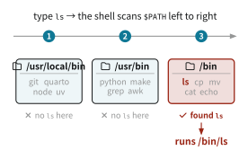

# Appendix C — 用語解説

Code

## C.1 環境変数

### 環境変数とは

環境変数 (environment variable) は, 実行中のプロセスに紐づく「名前と値」の組です. OS やシェルが, プログラムに設定や実行時の文脈を渡すために使います. 例えば `HOME` はホームディレクトリの場所を, `LANG` は言語・文字コードの設定を, `USER` はログインユーザー名を保持しています. そして, 次に説明する `PATH` も環境変数の一つです.

シェルでは, 変数名の前に `$` を付けて値を参照できます. `echo $HOME` で自分のホームディレクトリが表示され, `printenv` (または `env`) で今のシェルが持つ環境変数の一覧が見られます. 新しく設定するには `export NAME=value` とします.

``` bash
echo $HOME          # print one variable
printenv            # list all environment variables
export API_KEY=xxx  # set a variable for this shell and its child processes
```

環境変数の重要な性質が, 子プロセスへの継承です. あるプロセスが別のプロセスを起動すると, 環境変数はコピーされて引き継がれます. だから, シェルで `export` した変数は, そのシェルから起動したプログラム (R や Quarto など) からも見えます. [API](../lesson/api.llms.md) の章で, `.Renviron` に書いた `ESTAT_APP_ID` を R の `Sys.getenv()` で読み出せたのは, R が起動時にそれを環境変数として読み込み, 自分のプロセスの環境に入れているからです.

ただし環境変数はプロセス単位のもので, 別のシェルや再起動後には残りません. 恒久的に設定したいときは, 設定ファイルに書いておきます (後述).

### コマンドはどこから実行されるのか

シェルで `ls` と打つと, ファイル一覧を表示するプログラムが動きます. しかしシェルは, `ls` というプログラムがディスク上のどこにあるのかを, どうやって知るのでしょうか.

その答えが環境変数 `PATH` です. `PATH` は, 実行ファイルを探すディレクトリを `:` で区切って並べたリストです. 例えば次のようになっています.

``` bash
echo $PATH
# /usr/local/bin:/usr/bin:/bin:/usr/sbin:/sbin
```

コマンド名を打つと, シェルはこのリストの先頭から順にディレクトリを見ていき, 同じ名前の実行ファイルが最初に見つかった場所のものを実行します. 実際にどのファイルが使われるかは, `which` (または `type`) で確認できます.

``` bash
which ls
# /bin/ls
```

つまり, `ls` と打つのは, 実質的に `/bin/ls` というファイルを実行しているということです ([Figure fig-path-search](#fig-path-search)). `git` や `quarto`, `R` といったコマンドも同じで, `PATH` のどこかのディレクトリに置かれた実行ファイルが呼び出されています. コマンドは魔法で動いているのではなく, ディスク上の実行ファイルを名前で探して起動しているだけなのです.

[](../static/cetz/path-search.svg "Figure C.1: シェルが PATH からコマンドを探す流れ")

Figure C.1: シェルが PATH からコマンドを探す流れ

リストの先頭から順に探すので, 同じ名前のコマンドが複数の場所にあると, `PATH` で前に並んでいるディレクトリのものが優先されます. また, コマンドを打って `command not found` と出るのは, 「そのプログラムが存在しない」とは限らず, 「`PATH` のどのディレクトリにも見つからない」だけのこともあります.

### パスを通すとは

新しいプログラムをインストールしても, その実行ファイルの置き場所が `PATH` に含まれていなければ, シェルは名前だけでは見つけられません. その場合, 毎回フルパス (例えば `/opt/foo/bin/foo`) で打つ必要があり, 面倒です.

「パスを通す」とは, その置き場所のディレクトリを `PATH` に加えて, コマンド名だけで呼び出せるようにすることです. 次のように, 既存の `$PATH` に新しいディレクトリを足します.

``` bash
export PATH="/opt/foo/bin:$PATH"   # prepend: the new directory takes priority
```

先頭に足すと新しいディレクトリが優先され, 末尾 (`export PATH="$PATH:/opt/foo/bin"`) に足すと既存のものが優先されます.

ただし, この `export` はそのシェルの中だけで有効で, 新しいシェルを開くと消えてしまいます. 恒久化するには, シェルの設定ファイル (`~/.zshrc` や `~/.bashrc` など, シェルを開くたびに読み込まれるファイル) に同じ行を書いておきます. すると, シェルを開くたびに読み込まれて, いつでもそのコマンドが使えるようになります.

R でも同じことが起こります. R は起動時に `.Renviron` を読んで環境変数を設定します. [targets による再現性](../lesson/targets.llms.md) の章では, R の中から Julia を呼ぶために, `.Renviron` に `PATH_JULIA=...` と書き, `.Rprofile` で `Sys.setenv(PATH = paste(Sys.getenv("PATH_JULIA"), Sys.getenv("PATH"), sep = ":"))` として R プロセスの `PATH` に足していました. これも, R のプロセスに対して「パスを通す」操作にほかなりません.

## C.2 コンパイラ

### コンパイラとは

コンパイラ (compiler) は, 人が書いたソースコードを, CPU が直接実行できる機械語 ([sec-os](#sec-os) で触れた機械語命令) に翻訳するプログラムです. C, C++, Fortran, Rust, Go などは, 実行前にコンパイラでまとめて機械語に変換してから動かします. このような言語をコンパイル型言語とよびます.

これと対になるのがインタプリタ (interpreter) で, ソースコードをその場で1行ずつ読んで実行します. R や Python はこのインタプリタ型の言語です. あらかじめ機械語に変換しておくコンパイル型は, 変換に時間がかかるかわりに実行が速く, その場で解釈するインタプリタ型は, 手軽で対話的に使えるかわりに実行は遅くなりがちです.

### R とコンパイラ

R 本体はインタプリタ型ですが, 速度が要る部分では, 多くのパッケージが内部に C や C++, Fortran のコードを抱えています ([Rcpp](https://www.rcpp.org/) がその代表的な仕組みです). こうしたパッケージをソースからインストールするとき ([sec-environment](#sec-environment)), その過程でコンパイラが走り, C/C++ のコードを R が読み込める機械語の共有ライブラリ (`.so` や `.dll`) に変換します.

そのため, パッケージをソースからビルドするにはコンパイラ一式 (ツールチェーン) が必要です. Debian や Ubuntu では `build-essential` が C/C++ コンパイラ (gcc / g++) と make をまとめて入れ, Fortran には別途 gfortran が要ります. macOS では Xcode Command Line Tools (clang), Windows では Rtools が同じ役割を担います. 一方, コンパイル済みのバイナリパッケージ ([sec-environment](#sec-environment)) を使えば, この変換は済んでいるので, コンパイラなしで速く導入できます.

## C.3 ハッシュ

### ハッシュ関数

ハッシュ関数 (hash function) とは, 任意の長さのデータを受け取り, 決まった長さの値へと変換する関数のことをいいます. 入力は何バイトでも構いませんが, 出力の長さは入力によらず常に一定です. この出力をハッシュ値とよびます ([sec-hash-value](#sec-hash-value)).

データをビット列とみなすと, ハッシュ関数は次のように書けます.

> **NOTE:**
>
> ハッシュ関数とは, 任意長のビット列の集合 \\\\0,1\\^\*\\ から, 固定長 \\n\\ ビットの集合 \\\\0,1\\^n\\ への写像 \\ h\colon \\0,1\\^\* \to \\0,1\\^n \\ のことをいう.

定義域 \\\\0,1\\^\*\\ は長さに上限のないビット列全体からなる無限集合であるのに対し, 値域 \\\\0,1\\^n\\ の要素数は \\2^n\\ 個と有限です. たとえば Git が標準で用いる SHA-1 では \\n = 160\\ で, 取りうるハッシュ値は \\2^{160}\\ 通りあります.

良いハッシュ関数, とくに Git のように改ざん検知を目的とする暗号学的ハッシュ関数 (cryptographic hash function) には, 次のような性質が求められます.

- **決定性** (deterministic): 同じ入力からは必ず同じハッシュ値が返ります.
- **高速性**: 入力からハッシュ値を計算するのは高速です.
- **なだれ効果** (avalanche effect): 入力をほんの少し変えただけで, 出力は予測できないほど大きく変わります. 1ビットの違いでも, 出力のおよそ半分のビットが入れ替わるのが理想です.
- **一方向性** (preimage resistance): ハッシュ値から, それを生んだ入力を逆算するのは事実上不可能です.
- **衝突困難性** (collision resistance): 同じハッシュ値になる異なる入力の組 (衝突) を意図的に見つけるのは事実上不可能です.

衝突困難性について補足します. 入力は無限に作れるのに出力は有限なので, 異なる入力が同じハッシュ値になる組 (衝突) は, どんなハッシュ関数にも必ず存在します (鳩の巣原理). つまり衝突困難性とは, 衝突が存在しないという意味ではなく, 衝突を意図的に見つけ出すのが現実的な時間では不可能, という意味です.

偶然の衝突についても直感を持っておきましょう. 誕生日のパラドックス (birthday problem) として知られるように, 取りうるハッシュ値の種類の, およそ平方根くらいの個数のデータを集めると, どれかが偶然衝突し始めます. SHA-1 は \\2^{160}\\ 通りなので, その平方根はおよそ \\2^{80}\\ (10 進で \\10^{24}\\ 程度) という天文学的な数です. ふだん Git を使っている限り, 偶然ハッシュが衝突してコミットが取り違えられる心配はまずありません.

ただし, ここで「心配ない」と言えるのは, ハッシュ値が一様ランダムに散らばると仮定したときの, 偶然による衝突に限った話です. これとは別に, ハッシュ関数の内部構造の弱点を突いて, 同じハッシュ値をもつデータを意図的に作り出す攻撃があります. こうした攻撃では, 上で見積もった \\2^{n/2}\\ という壁を大きく下回る計算量で衝突を作れてしまうことがあり, 実際 SHA-1 はこの意味ですでに破られています[^1]. そのため, 悪意ある改ざんまで防ぎたい用途では SHA-1 はもはや安全とは言えず, Git でも後継の SHA-256 (\\n = 256\\) への移行が進められています.

### ハッシュ値

ハッシュ値 (hash value) とは, ハッシュ関数がデータに対して返す固定長の出力のことです. 同じデータからは必ず同じハッシュ値が得られ, 中身が少しでも違えばまったく異なるハッシュ値になるため, ハッシュ値はデータの中身そのものから決まる一意な「指紋」として使えます.

実際の表示では, \\n\\ ビットの値をそのまま 0 と 1 の羅列で見せても扱いにくいので, 4ビットを1文字に対応させた16進数 (`0`-`9`, `a`-`f`) で書くのが一般的です. SHA-1 の 160 ビットは \\160 / 4 = 40\\ 桁の16進数になります. Git のコミットに割り当てられる `a84d0e9...` のような名前は, まさにこのハッシュ値で, 普段はその先頭の7文字ほどを取り出して使います.

## C.4 グラフィックデバイス

### グラフィックデバイスとは

R で `plot()` や `ggplot2` の図を描くとき, 点や線, 文字を実際の画面やファイルに変換しているのは, グラフィックデバイス (graphics device) とよばれる仕組みです. R 本体は「この座標に文字列を書く」「ここからここまで線を引く」といった抽象的な描画命令を発行するだけで, それをピクセルや PDF のオブジェクトとして書き出すのは各デバイスの仕事です. そのため, 同じコードでも, どのデバイスで描くかによって出力の性質が変わります.

デバイスは大きく分けて2種類あります.

- **スクリーンデバイス**: ウィンドウに直接描画するデバイスです. macOS の `quartz`, Windows の `windows`, Linux の `x11` などがあり, RStudio の Plots ペーンに表示される図もこの一種が描いています.
- **ファイルデバイス**: 図をファイルとして書き出すデバイスです. ラスタ形式の `png()` や `jpeg()`, ベクタ形式の `pdf()`, `cairo_pdf()`, `svg()` のほか, パッケージが提供する `ragg::agg_png()` や `svglite::svglite()` などがあります.

Quarto (knitr) で文書をレンダリングするときは, チャンクごとにファイルデバイスが開かれ, 図が一度ファイルとして書き出されてから文書に埋め込まれます. どのデバイスを使うかはチャンクオプション `dev` で指定でき, この資料では SVG デバイス (`dev: svg`) を使っています.

### デバイスとフォント

文字の描画もデバイスの仕事であるため, 指定されたフォント名を実際のフォントファイルにどう対応づけるかは, デバイスごとに異なります. 代表的なデバイスの挙動は次のとおりです.

- **`pdf()`**: R 標準の PDF デバイスですが, フォントの扱いは最も原始的です. システムのフォントを自動では参照せず, デバイスに登録された Type 1 フォント (日本語は `Japan1` などの CID フォント) しか使えません. さらにデフォルトではフォントを埋め込まず, PDF にはフォント名だけが書き込まれるため, 閲覧環境に同じフォントがなければ表示が崩れます. 埋め込むには Ghostscript 経由の `embedFonts()` が別途必要です.
- **cairo 系 (`cairo_pdf()`, `svg()` など)**: fontconfig というライブラリを通じてシステムフォントを検索します. `cairo_pdf()` は使用したフォントをサブセット化して埋め込むため `pdf()` よりずっと扱いやすいですが, フォントの解決は OS 側の設定に依存します.
- **quartz (macOS)**: macOS のフォント機構をそのまま使うため, Mac 上ではヒラギノなども問題なく使えますが, 他の OS では動きません.
- **ragg (`agg_png()` など)**: `systemfonts` パッケージ経由でシステムフォントを解決する現代的なラスタデバイスです. インストール済みフォントの検索が最も堅牢で, ウェイトの指定などにも対応します.

つまり, システムに目的のフォントが入っていることと, いま使っているデバイスがそのフォントを見つけて出力に反映できることは, 別の問題です. 「フォントを指定したのに豆腐化する」「手元では正しく表示されるのに, 共有した PDF では崩れる」といった現象は, ほとんどがこのデバイス側のフォント解決と埋め込みの問題に由来します.

### showtext の仕組み

`showtext` パッケージは, このデバイス依存性を根本から回避します. テキストの描画命令をフックし, `sysfonts` で登録されたフォントファイルから各文字のグリフ (字形) を取り出して, 文字をアウトライン (曲線) として描画します. 出力ファイルには文字ではなく図形が書き込まれるため, デバイスがフォントを解決できるかどうかも, 閲覧環境にフォントがあるかどうかも, 一切関係なくなります.

副作用もあります. 文字が図形化されるため, PDF や SVG の中でテキストの選択・検索ができなくなり, ファイルサイズも増えます. また, ラスタデバイスでは DPI の解釈が R 本体とずれるため, `showtext_opts(dpi = ...)` を出力の解像度 (Quarto の `fig-dpi`) に合わせる必要があります.

`showtext_auto()` は, このフックを以後に開かれるすべてのデバイスで自動的に有効化する関数です. knitr はチャンクごとに新しいデバイスを開くため, これを最初に一度呼んでおかないと, 図ごとに `showtext_begin()` と `showtext_end()` で囲むことになります.

### showtext を使わない選択肢

`showtext` の対極にあるのは, 文字をアウトライン化せず, フォントを正しく解決できるデバイスを出力形式ごとに選ぶ, という方針です.

- **PDF**: `cairo_pdf()` を使います. システムフォントを解決し, サブセット化して埋め込むため, 文字はテキストとして残り, 検索・コピーもできます. 論文に載せる図はこれが標準的な選択です.
- **SVG**: `svglite::svglite()` は文字を `<text>` 要素のまま残します. ただし SVG 自体はフォントを埋め込まないため, 表示には閲覧環境側に同じフォントが必要です (ウェブサイトなら CSS で Web フォントを読み込んで補います). 一方, cairo ベースの `svg()` は文字をパスに変換するため, 検索できない代わりに閲覧環境へのフォント要求がなく, この点では showtext と似た性質になります.
- **ラスタ (PNG など)**: `ragg::agg_png()` が `systemfonts` 経由でシステムフォントを堅牢に解決します. ラスタ画像では文字はピクセルになるので, 選択・検索の概念はそもそもありません.

この方針の弱点は, レンダリングするマシンに目的のフォントがインストールされていることが前提になる点で, コードを共有したときの再現性の問題は残ります. `showtext` が本領を発揮するのは, まさにこの前提を外したい場合です. すなわち, `font_add_google()` でフォントのインストール自体をコードに閉じ込めたい場合や, `pdf()` を含むあらゆるデバイスで同じ見た目を保証したい場合には `showtext` を, 文字をテキストとして残すことが重要な場合には上記のデバイスを選ぶ, という使い分けになります.

## C.5 MCP (Model Context Protocol)

### MCP とは

MCP (Model Context Protocol) は, AI アシスタント (Claude など) のようなアプリケーションを, 外部のツールやデータソースに接続するためのオープンな規格です. 2024年に Anthropic が公開し, 仕様は [modelcontextprotocol.io](https://modelcontextprotocol.io/) で公開されています. 特定の企業の製品ではなく公開された規格なので, 誰でも MCP に対応したサーバーを作れますし, MCP に対応したアプリケーション (Claude Desktop, Claude Code, VSCode など) ならどれからでも使えます.

MCP が解決するのは, 「AI アシスタントごと・ツールごとに, 個別の接続方法を実装しなければならない」という手間です. AI に Zotero・ファイル・データベースの3つを触らせたいとき, MCP が無ければ, アプリと AI の組み合わせごとに専用の接続を書くことになります. MCP は, この接続部分に共通の「話し方」を定めます. USB が, 機器ごとに違うケーブルを不要にしたのと同じ発想です. ツールを提供する側は MCP に従ってサーバーを1つ作れば, MCP に対応したどの AI アプリからも使えるようになります.

### クライアント・サーバーモデル

MCP の構造は, [sec-client-server](#sec-client-server) で見たクライアント・サーバーモデルとよく似ています. 登場人物は3つです.

- ホスト (host): ユーザーが直接操作する AI アプリケーションです. Claude Desktop や, ターミナルで動く Claude Code などがこれにあたります.
- クライアント (client): ホストの内部にあり, 1つのサーバーとの接続を担当する部品です. ホストは, 使いたいサーバーの数だけクライアントを持ちます.
- サーバー (server): 特定のツールやデータへの窓口です. Zotero MCP サーバーなら Zotero のライブラリへの窓口になります.

ユーザーがホスト (Claude) に「Zotero でこの論文を探して」と頼むと, ホストは対応するサーバーにリクエストを送り, サーバーは Zotero を実際に操作して結果を返します. AI はその結果を読んで回答に使います. AI 自身が Zotero を直接触るのではなく, あいだにサーバーを挟むことで, 何ができるか・何をしてよいかがサーバー側で明確に管理される点が重要です.

### サーバーが提供するもの

MCP サーバーがホストに提供できるものは, 大きく3種類に分かれます.

- ツール (tools): AI が実行できる操作です. 「ライブラリを検索する」「論文の全文を取得する」といった, 引数を受け取って結果を返す関数だと考えてください.
- リソース (resources): AI が読み取れるデータです. ファイルの中身やデータベースのレコードなど, 参照用の情報を指します.
- プロンプト (prompts): 定型的な指示のテンプレートです. よく使う依頼を, あらかじめ形にして呼び出せるようにしたものです.

このうち, 実際の研究作業でよく使うのはツールです. AI がユーザーの依頼を解釈し, 必要なツールを自分で選んで呼び出し, 返ってきた結果を使って作業を進めます.

### トランスポート: ローカルとリモート

ホストとサーバーが通信する経路 (トランスポート) には, 大きく2種類あります.

- 標準入出力 (stdio): サーバーを自分の PC 上のプロセスとして起動し, その入出力を通じて通信します. サーバーが手元で動くので, ローカルの Zotero やファイルにアクセスするのに向いています.
- HTTP: サーバーがネットワーク上の別の場所で動き, HTTP を通じて通信します. クラウド上のサービスを MCP サーバーとして公開する場合などに使われます.

ローカルの stdio 方式では, サーバーはユーザーの権限で PC 上で動きます. したがって, 信頼できるサーバーだけを追加することが大切です. 素性の分からない MCP サーバーを設定に加えると, PC 上のファイルや認証情報にアクセスされる恐れがあります. 導入するのは, ソースコードが公開され広く使われているサーバーに限るのが安全です. どのサーバーを許可するかはユーザーが設定で決められるので, AI にできることの範囲は自分でコントロールできます.

Stevens, Marc, Elie Bursztein, Pierre Karpman, Ange Albertini, and Yarik Markov. 2017. “The First Collision for Full SHA-1.” In *Advances in Cryptology – CRYPTO 2017*, edited by Jonathan Katz and Hovav Shacham, vol. 10401. Springer International Publishing. <https://doi.org/10.1007/978-3-319-63688-7_19>.

Wang, Xiaoyun, Dengguo Feng, Xuejia Lai, and Hongbo Yu. 2004. *Collisions for Hash Functions MD4, MD5, HAVAL-128 and RIPEMD*. 2004/199.

Wang, Xiaoyun, Yiqun Lisa Yin, and Hongbo Yu. 2005. “Finding Collisions in the Full SHA-1.” In *Advances in Cryptology – CRYPTO 2005*, edited by David Hutchison, Takeo Kanade, Josef Kittler, et al., vol. 3621. Springer Berlin Heidelberg. <https://doi.org/10.1007/11535218_2>.

[^1]: 王小云 (Wang Xiaoyun) のグループは, まず 2004 年に, SHA-1 より古い MD5 などについて, 実際に同じハッシュ値となる具体的な入力対 (数値例) を構成してみせました ([Wang et al. 2004](#ref-wang2004)). 続く 2005 年には, 同グループが SHA-1 についても, 衝突探索の計算量を総当たりの \\2^{80}\\ より小さい \\2^{69}\\ 程度まで下げられることを理論的に示します ([Wang et al. 2005](#ref-wang2005)) そして 2017 年, Google と CWI のグループが, 実際に同じ SHA-1 ハッシュをもつ2つの PDF を構成してみせ, 初めて現実の SHA-1 衝突を実証しました (SHAttered と呼ばれます) ([Stevens et al. 2017](#ref-stevens2017)).
