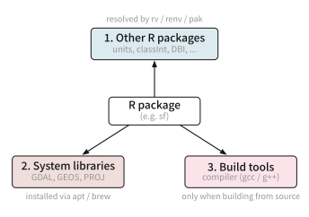
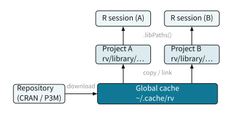

# 2  環境の再現性

コード

この講義では rig で R を入れ rv でパッケージを揃えることを推奨しています. この章では, その裏で何が起きているのか, 「モダンな」パッケージ管理ツールの仕組みを学んでいきます. 半年後の自分や共同研究者が数コマンドで同じ計算を再現できる環境を作ることが目標です.

## 2.1 パッケージの依存関係

環境をそろえるのがなぜ難しいのかは, パッケージの依存関係を見ると分かります. パッケージは単独では動かず, 1つ入れようとすると芋づる式に他のものまで必要になります. しかもその依存には, 性質の違う3つの種類があります ([図 fig-dependency-kinds](#fig-dependency-kinds)).

[](../static/cetz/dependency-kinds.svg "図 2.1: パッケージの3種類の依存関係")

図 2.1: パッケージの3種類の依存関係

- **1. 他の R パッケージへの依存**: 一番よくある依存です. たとえば `ggplot2` は `rlang`, `scales`, `gtable`, `farver` などに依存し, それらがさらに別のパッケージに依存します. R のパッケージ管理ツール (install.packages / pak / rv / renv) が, この依存の木を自動でたどって一緒に入れ, ロックファイルに全体を記録します. R の世界の中で完結する依存です.
- **2. 他のアプリケーション・システムライブラリへの依存**: R の外にある C ライブラリや外部プログラムに依存するパッケージもあります. これらは R パッケージではないので, R のツールだけでは入りません. たとえば空間データの `sf` は GDAL・GEOS・PROJ を必要とします. OS のパッケージマネージャ ([sec-os](#sec-os) の apt や Homebrew) で先に用意します.
- **3. ビルドに必要な依存**: パッケージをソースからインストールするとき, 中に C/C++/Fortran のコードがあれば, それを機械語に変換するコンパイラ ([sec-compiler](#sec-compiler)) が要ります. 実行時ではなく, インストール時にだけ必要な「道具」への依存です. Debian / Ubuntu なら `build-essential` (gcc / g++ / make) がこれにあたります.

この3つは責任の持ち主が違います. 1 は R のパッケージ管理ツールとロックファイルが引き受けますが, 2 と 3 は R の外 (OS 側) の話なので, ロックファイルだけでは再現しきれません. この章の残りは, この見取り図に沿って進めます. まず土台となる R 本体のバージョンをそろえ, つづいて依存1 (R パッケージ), 依存2 (システムライブラリ), 依存3 (ビルドの道具) を順に見ていきます.

## 2.2 R 本体のバージョン

あるプロジェクトが特定の R のバージョンを要求する場合があります. また, 昔のプロジェクトを再現するために, 古い R のバージョンを使う必要があることもあります. OS のパッケージマネージャ ([sec-os](#sec-os)) で R を1つだけ入れると, この要求の食い違いに対応できません. そこで, 複数のバージョンを並べて置き, 切り替えるための専用ツールを使います.

R では [rig](https://github.com/r-lib/rig) (R Installation Manager) がこれにあたります. 複数の R を独立に並置し, どれを既定にするかを切り替えます.

``` sh
rig add release      # install the latest stable R
rig add 4.4          # keep an older version side by side
rig list             # show installed versions
rig default 4.6      # switch the `R` / `Rscript` on PATH
```

仕組みは単純で, rig は各バージョンを別々の場所にインストールし, `rig default` が選んだバージョンへの参照 (PATH 上の `R`) を張り替えるだけです. そのため切り替えは一瞬で, アンインストールも安全です. どのバージョンを使うかは, 後述の宣言ファイルにプロジェクト単位で書いておけます (このリポジトリなら `rproject.toml` の `r_version = "4.6"`). この「ランタイムのバージョンを並べて切り替える」道具は, R に限らずどの言語にもあります (のちほど「他の言語も同じ構図」で扱います).

## 2.3 他の R パッケージ

R 本体をそろえたら, 次は R パッケージ (依存の種類1) です. すべてのプロジェクトが1つの共有ライブラリにパッケージを入れると, プロジェクトAのための更新がプロジェクトBを壊す, という事故が起きます. 解決策は, プロジェクトごとに独立したライブラリを持ち, その中身をロックファイルに正確に記録することです.

仕組みの中心は, プロジェクト起動時に走る `.Rprofile` です. R はプロジェクト直下の `.Rprofile` を起動時に読み込むので, ここでプロジェクト専用ライブラリを `.libPaths()` の先頭に差し込みます. すると `library()` はまずそのプロジェクトのライブラリを見にいき, ユーザー全体のライブラリから隔離されます. プロジェクトを開くだけで, そのプロジェクト用の環境に自動で入る, というわけです.

R には成り立ちの違う2つのツールがあります.

- **renv**: 確立された標準です. `renv::snapshot()` で「いま入っているパッケージ」を `renv.lock` に記録し, `renv::restore()` でそれを別のマシンに正確に再現します. スナップショット型で, 手元の状態を写し取る発想です.
- **rv**: 新しい Rust 製のツールで, このリポジトリが採用しています. 宣言型で, 欲しいパッケージを `rproject.toml` に書き並べ, `rv sync` を実行すると, 依存を解決してライブラリを構築し, `rv.lock` に固定します. 「入れた結果を記録する」renv に対し, 「欲しい状態を宣言し, ツールにそれを実現させる」発想です. 後述する uv や cargo に近い考え方です.

このリポジトリの `rproject.toml` は, 使う R のバージョンと, 取得元, 欲しいパッケージを宣言しています.

``` toml
[project]
name = "workshop-graduate-2026"
r_version = "4.6"

repositories = [
    {alias = "CRAN", url = "https://cloud.r-project.org/"},
    {alias = "r-multiverse", url = "https://community.r-multiverse.org"},
]

dependencies = [
    "dplyr",
    "ggplot2",
    "tinytable",
    "fixest",
    # ...
]
```

`rv sync` を実行すると, この宣言を満たすようにパッケージが解決・インストールされ, 実際に選ばれた正確なバージョンが `rv.lock` に書き込まれます. `rproject.toml` が「欲しいもの」, `rv.lock` が「実際に入ったもの」で, 共同研究者は `rv.lock` から寸分違わぬ環境を復元できます. `.Rprofile` はこのプロジェクトライブラリを起動時に有効化する役割を担います.

### どこに何が保存されるか

rv も renv も, パッケージを2か所に分けて置きます. ひとつはプロジェクト専用のライブラリ, もうひとつは全プロジェクトで共有するキャッシュです. このリポジトリ (rv) の実際の配置は次のようになっています.

``` default
workshop-graduate-2026/            # project root
├── .Rprofile                      # runs rv/scripts/activate.R on startup
├── rproject.toml                  # declared packages         <- committed
├── rv.lock                        # exact locked versions     <- committed
└── rv/
    ├── scripts/activate.R         # prepends project lib to .libPaths()  <- committed
    └── library/4.6/arm64/         # project-local library     <- gitignored
        ├── dplyr/                   (materialized from the cache)
        ├── ggplot2/
        └── ...

~/.cache/rv/                        # cache shared across all projects
├── 66bf25474b/                     (each package version stored once)
├── abfa7ade75/
└── ...
```

ポイントは2つあります. まず, プロジェクトライブラリ (`rv/library/4.6/arm64/`) は R のバージョンとプラットフォームごとに分かれていて, `.Rprofile` がこのパスを `.libPaths()` の先頭に差し込むことで, このプロジェクトの R だけがここを参照します. つぎに, パッケージの実体は共有キャッシュ (`~/.cache/rv/`) に版ごとに1回だけ保存され, 各プロジェクトのライブラリはそこから用意されます. このとき rv はキャッシュからコピーし (同じディスク上なので, ファイルシステムによっては copy-on-write で安価です), renv はキャッシュ実体へのシンボリックリンクを張ります. いずれもパッケージを再ビルドしないので, 2つ目以降のプロジェクトではインストールがほぼ一瞬になり, ディスクも節約できます. [図 fig-rv-cache](#fig-rv-cache) は, ひとつの共有キャッシュを複数のプロジェクトが利用し, それぞれが `.libPaths()` を通じて自分のライブラリだけを見る様子です.

[](../static/cetz/rv-cache.svg "図 2.2: 共有キャッシュとプロジェクトライブラリ")

図 2.2: 共有キャッシュとプロジェクトライブラリ

git にコミットするのは, 宣言ファイル (`rproject.toml`), ロックファイル (`rv.lock`), 有効化スクリプト (`rv/scripts/`) だけです. ライブラリ本体 (`rv/library/`) は `.gitignore` で除外し, 各マシンで `rv sync` が `rv.lock` から作り直します. 「環境そのもの」ではなく「環境の作り方」を共有する, というのが要点です. renv もまったく同じ構図で, `renv/library/...` がプロジェクトライブラリ, `~/.cache/R/renv/` が共有キャッシュ, `renv.lock` が固定, という対応になります.

### install.packages と pak

rv や renv も, 最終的には1つ1つのパッケージをどこかのライブラリにインストールしています. その最も基本的なコマンドが, R に標準で付いてくる `install.packages()` です. 呼ぶと, パッケージを取得して `.libPaths()` の先頭 (書き込める最初の場所) にインストールします.

``` r
install.packages("dplyr") # install into the first writable .libPaths()
```

`install.packages()` は確実ですが, 依存パッケージを1つずつ順に取ってくるため遅く, パッケージが必要とする OS 側のライブラリ (依存の種類2) までは面倒を見ません. これを現代化したのが [pak](https://pak.r-lib.org/) です. pak は依存関係をまとめて解決し, 並列にダウンロード・インストールするので速く, CRAN・Bioconductor・GitHub・URL を同じ書き方で扱え, 足りないシステム依存も教えてくれます.

``` r
pak::pak("dplyr")            # from CRAN
pak::pak("tidyverse/dplyr")  # from GitHub, same function
```

GitHub など CRAN 以外にあるパッケージは, `install.packages()` では入れられません. 従来は `remotes::install_github("user/repo")` を使ってきました (`devtools::install_github()` も中身は remotes で, devtools は開発用ツールの詰め合わせパッケージです). `pak::pak("user/repo")` は同じことをより速く行い, CRAN も GitHub も同じ関数で扱えるので, これから使うなら pak に一本化すると覚えることが減ります.

じつは rig で R を入れると, この pak も自動で一緒に入ります (`rig add` の既定で, `--without-pak` で無効化できます). そのため追加の準備なしに, R を入れた直後から `pak::pak()` が使えます. 手動で1つ足すだけなら pak が快適です. ただしプロジェクトの文脈では, これらを直接叩くよりも, rv や renv 経由で入れて `rv.lock` / `renv.lock` に記録するのが原則です (rv は独自のインストーラを内蔵し, renv は内部で pak を使えます). 手で入れたパッケージはロックファイルに残らず, 再現性の穴になるからです.

## 2.4 システムライブラリ

他の依存として, R の外にある C ライブラリや外部プログラムも考えられます. R パッケージではないので, `install.packages()` も rv も入れてくれません. これらは OS のパッケージマネージャ ([sec-os](#sec-os) の apt や Homebrew) で, プロジェクトとは別に用意します.

代表的な例を挙げます. 空間データの `sf` は GDAL・GEOS・PROJ, `curl` は libcurl, `xml2` は libxml2, 画像処理の `magick` は ImageMagick, 文字描画の `ragg` / `textshaping` は freetype・harfbuzz を必要とします. `sf` が入らないときの多くは, R の問題ではなく, これらの C ライブラリが OS に無いことが原因です.

どのシステムライブラリが要るかは, pak が教えてくれます. `pak::pkg_sysreqs()` は, そのパッケージが必要とする OS パッケージと, それを入れるコマンドを返します (Ubuntu なら `apt install ...` にあたります).

``` r
pak::pkg_sysreqs("sf") # report the OS libraries sf needs, and how to install them
```

注意点として, ロックファイル (`rv.lock` など) はこの層を記録しません. そのため, 必要なシステムライブラリは README に書いておくか, コンテナ (Docker など) に固めるなどして, R パッケージとは別に共有する必要があります.

## 2.5 ソースかバイナリか

依存の種類3は, パッケージをソースからビルドするときに要るコンパイラ ([sec-compiler](#sec-compiler)) でした. これが必要になるかどうかは, パッケージをソースで取るか, ビルド済みのバイナリで取るかで決まります. R のパッケージは2つの形で配られます. ひとつはソース (`.tar.gz`) で, どの OS でも使えますが, 中の C/C++/Fortran コードはインストール時にコンパイルが必要です. もうひとつはバイナリで, ある OS と R のバージョン向けにコンパイル済みのため, 展開するだけで入ります.

|              | ソース                      | バイナリ                      |
|--------------|-----------------------------|-------------------------------|
| 中身         | 未コンパイルのコード        | コンパイル済み                |
| インストール | ビルドが必要 (要コンパイラ) | 展開するだけ                  |
| 速度         | 遅い                        | 速い                          |
| 対応範囲     | どの OS・R 版でも           | OS・R 版に固定                |
| 主な入手元   | CRAN (Linux の既定)         | CRAN (Win / Mac), P3M (Linux) |

どちらが使われるかは, 既定でほぼ自動的に決まります. `install.packages()` が取る型は `getOption("pkgType")` で決まり, Windows と macOS では実質バイナリ優先, Linux では `"source"` (ソースからビルド) です. これは配布側の事情を反映しています. CRAN は Windows と macOS にはバイナリを提供しますが, Linux にはソースしか提供してこなかったからです. そのため WSL などの Linux では, 既定だとパッケージをソースからビルドすることになり, コンパイラ (build-essential) やシステムライブラリのヘッダが必要になります. 環境構築で `build-essential` を入れたのはこのためです. ビルドには時間もかかります.

Linux でもバイナリを使う方法があります. [Posit Public Package Manager](https://packagemanager.posit.co/) (P3M) は, ディストリビューションごとにビルド済みのバイナリを配布しています. `rproject.toml` (や renv の設定) の `repositories` にその URL を指定すると, rv や renv はソースの代わりにバイナリを取得し, インストールが桁違いに速くなります. コンパイル環境の細かな違いに悩まされることも減ります. 速さと再現性の両立という点で, 共同作業や CI ではバイナリ配布のリポジトリを使うのが定石です.

## 2.6 Python / Julia

PythonやJuliaといった他の言語でも, 依存関係の管理は同じ構図です. ランタイムのバージョンを切り替えるツール, 欲しい依存を書く宣言ファイル, 実際の版を固定するロックファイルの三点セットです. Python の uv や Julia の Pkg は, R の rv / renv と同じ考え方で動きます.

| 言語 | ランタイム管理 | 宣言ファイル | ロックファイル |
|----|----|----|----|
| R | rig | `rproject.toml` (rv) / DESCRIPTION (renv) | `rv.lock` / `renv.lock` |
| Python | uv, pyenv | `pyproject.toml` | `uv.lock` |
| Julia | juliaup | `Project.toml` | `Manifest.toml` |

Python の [uv](https://docs.astral.sh/uv/) は, この構図を1つのツールにまとめた好例です. Python 本体のバージョンとパッケージの両方を管理し, `pyproject.toml` に依存を宣言して `uv.lock` に固定します. 従来は pyenv (バージョン), venv (隔離環境), pip (インストール), poetry (依存解決) と役割ごとに分かれていたものを, Rust 製の高速な1つのツールに統合しています.

``` sh
uv init            # start a project (creates pyproject.toml)
uv add polars      # declare and install a dependency
uv sync            # reproduce the environment from uv.lock
uv run script.py   # run inside the project environment
```

Julia は言語自体にパッケージマネージャ Pkg を内蔵しています. `Project.toml` に直接の依存を書き, `Manifest.toml` が依存の依存まで含めた完全なツリーを固定します. 環境の有効化は `julia --project` や `Pkg.activate()` で行い, `Pkg.instantiate()` が `Manifest.toml` から環境を復元します.

宣言ファイルとロックファイルを分ける理由は共通しています. 宣言ファイルには人間が読める大まかな要求 (「dplyr が欲しい」) を書き, ロックファイルには機械が解決した正確な版 (「dplyr 1.1.4, この取得元, このハッシュ」) が入ります. 前者は git で共有して意図を伝え, 後者は git で共有して環境を一致させます. どちらもコミットするのが原則です.

## 2.7 このプロジェクトでの実践

以上を踏まえると, このリポジトリの環境を復元する手順はごく短くなります.

``` sh
rig add release                 # 1. get R via rig
git clone <this repository>     # 2. clone the project
cd workshop-graduate-2026
rv sync                         # 3. build the project library from rv.lock
```

`rv sync` の後は, `.Rprofile` がプロジェクトライブラリを有効化するので, R を起動すればそのまま同じパッケージ環境で作業できます. 日々の開発でパッケージを増やすときは, `rproject.toml` に書き足して `rv sync` するか, `rv add <package>` を使います. どちらも `rv.lock` を更新するので, その差分をコミットすれば, 環境の変更履歴も git に残ります.

> **TIP:**
>
> - 新しく R のプロジェクトを始めるなら, 宣言型で速い rv が扱いやすいです. 既存資産や共同研究者が renv を使っているなら renv に合わせます.
> - ロックファイル (`rv.lock` / `renv.lock` / `uv.lock` / `Manifest.toml`) は必ず git にコミットします. これが再現性の実体です.
> - 環境の再現は, 計算の再現 (targets の章) と対になる話です. 同じ環境の上で同じパイプラインを回して, はじめて結果が完全に再現します.

## 演習問題

`sf` パッケージを入れようとしたら, `GDAL` が見つからないというエラーが出ました. この GDAL は, どの種類の依存で, どう用意するのが正しいでしょうか.

R パッケージ. install.packages で入れる\
R 本体のバージョン違い. rig で R を入れ直す\
システムライブラリ. OS のパッケージマネージャ (apt / brew) で入れる\
ロックファイルの記録漏れ. rv.lock を手で編集する\

WSL (Ubuntu) で `install.packages()` を実行すると, 毎回コンパイルが走って時間がかかります. 最も的確な理由はどれでしょうか.

CRAN は Linux 向けにソースしか配布しておらず, 既定でソースからビルドするから\
メモリ (RAM) が不足しているから\
WSL は仮想環境なので, すべての処理が遅くなるから\
R のバージョンが古く, バイナリに対応していないから\

作った環境を共同研究者が再現できるよう, git にコミットすべきものはどれでしょうか (rv を使う場合).

.Rprofile だけ\
rproject.toml と rv.lock (と rv/scripts/)\
共有キャッシュ ~/.cache/rv/ 全体\
rv/library/ のパッケージ本体一式\

プロジェクト A は R 4.2, プロジェクト B は R 4.6 を必要とします. どう対応するのが筋でしょうか.

rig で両方の R を入れ, プロジェクトごとに切り替える\
OS の R を毎回アンインストールして入れ直す\
rv.lock に R のバージョンを書けば R 本体も切り替わる\
新しい R 4.6 に統一し, A もそれで動かす\
