# 3  Git & GitHub

コード

## 3.1 なぜ Git を使うのか

研究の分析コードは, 一度書いて終わり, ということはまずありません. データの前処理をやり直したり, 推定の仕様を変えたり, 図を作り直したりと, 何度も書き換えていきます. その過程で「昨日まで動いていたのに今日は動かない」「論文のあの数字を出したのはどの版だったか」といった事態は, 誰しも一度は経験します. Git は, こうしたコードの変更履歴を管理するための道具です.

Git を使うと, 主に次の4つのことができるようになります.

- **Recording**: 自分と共同研究者の変更履歴を, すべて残せます.
- **Restore**: 過去の任意の時点の状態に, いつでも戻れます.
- **Compare**: 2つの時点の違いだけを取り出して, バグの原因を絞り込めます.
- **Branch**: 完成した部分と作業中の部分を, 分けて進められます.

### AI時代のバージョン管理

経済学では個人で全体像がギリギリ把握できるサイズのプロジェクトが多いので, Gitは十分普及してきませんでした. しかし, AIにコードを書かせられる今, 人間の直感よりも高速にコードを書き換えられるようになりました. そうなると, 変更履歴の管理の重要性はむしろ増しています.

また, Git自体の複雑さも, AIに操作させることで解消できるようになりました. Gitはトラブル解決時に必要となるコマンドや知識が多く, 初心者にとっては大きなハードルでした. しかし, そうした面倒はAIに任せて仕舞えば, 人間はGitの恩恵だけを受けられるようになりました.

### Git と GitHub

Git と GitHub は名前が似ているため混同されがちですが, 別のものです. Git は手元のマシンで動くバージョン管理ツール (コマンドラインのアプリ) で, GitHub はそのコミット履歴を公開・共有し, 共同作業をするための Web サービスです([図 fig-git-vs-github](#fig-git-vs-github)).[^1]

[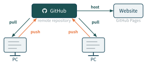](../static/cetz/git-vs-github.svg "図 3.1: GitHub を介した履歴の共有と公開")

図 3.1: GitHub を介した履歴の共有と公開

### コマンドライン

Git を操作するGUIアプリは数多くありますが (VSCodeやRStudioにも), 私は学習の段階ではコマンドライン操作で学ぶことをお勧めしています. Gitの仕組みがそもそも非直感的なので, GUIといった直感的なツールでは裏で起こっていることをマスクしてしまって, 帰って仕組みの理解を妨げるからです. また, トラブルが起きた時もGUIからは解決できないことが多く, コマンドライン操作の知識が結局必要です. コマンドライン操作を理解することがGitを理解することと同義なので, AI時代であってもコマンドラインから学ぶことをお勧めします.

## 3.2 Git の基礎概念

### レポジトリ

Gitによるバージョン管理は, レポジトリ (repository) という単位で行われます. Gitが一塊として管理していく単位のことなので, ほぼプロジェクトフォルダと考えてもらって構いません.

Gitのプロジェクトを始めるにはプロジェクトフォルダ内で次のようにします.

``` bash
git init
```

[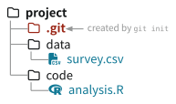](../static/cetz/repo-tree.svg "図 3.2: リポジトリ")

図 3.2: リポジトリ

この時, `.git` という隠しフォルダが作られます. 以降, Gitはこのフォルダの中に, プロジェクトフォルダの状態を記録していきます. つまり, Gitはプロジェクトフォルダの中身を丸ごと保存する仕組みです. なお, 競技にはこの `.git` フォルダのことを「リポジトリ」と呼ぶこともありますが, ここではプロジェクトフォルダ全体を指す意味で使います.

### コミット

Git でもっとも大切な概念がコミット (commit) です. コミットとは, プロジェクトフォルダのある時点の状態を丸ごと保存したセーブポイントだと考えてください. 「Git を使う」とは, 突き詰めればこのコミットを一つずつ積み重ねていく作業にほかなりません ([図 fig-commit-savepoint](#fig-commit-savepoint)).

[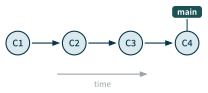](../static/cetz/commit-savepoint.svg "図 3.3: コミット")

図 3.3: コミット

デフォルトでは `main` という名前のブランチ (後述) に1つ目のコミットが作られます.

**HEAD**

いま自分がどのコミットを見ているかを指す目印を HEAD と呼びます. HEAD を過去のコミットに移すと, フォルダの中身はその時点の状態に戻ります ([図 fig-commit-back](#fig-commit-back)). 一度作ったコミットは消えないので, 失敗を恐れずに思い切って実験できます. この「いつでも戻れる」という安心感こそ, セーブポイントを積む意味です.

[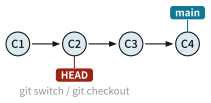](../static/cetz/commit-back.svg "図 3.4: 過去のコミットに戻る")

図 3.4: 過去のコミットに戻る

**コミットの比較**

任意の2つのコミットの差分 (diff) を取れば, 「どこが, どう変わったか」だけに注目できます ([図 fig-commit-compare](#fig-commit-compare)). これはバグの発見やコードレビューで大きな助けになります. 例えば, 昨日まで出ていた数字が今日は変わってしまったとき, その間のコミットの差分を見れば, 原因の見当がつきます.

[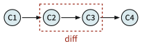](../static/cetz/commit-compare.svg "図 3.5: コミット間の差分 (diff)")

図 3.5: コミット間の差分 (diff)

> **NOTE:**
>
> 私たちは「コミットは変更点 (差分) を記録している」と思いがちですが, 実際は違います. コミットが保存しているのは, その時点で Git が追跡しているファイル全体の状態, つまり丸ごとのスナップショットです ([図 fig-commit-snapshot](#fig-commit-snapshot)).[^2] [図 fig-commit-back](#fig-commit-back) で見た「どの時点にも戻れる」性質は, 各コミットが完全なスナップショットだからこそ成り立ちます.
>
> [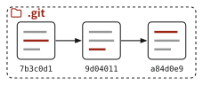](../static/cetz/commit-snapshot.svg "図 3.6: スナップショットとハッシュ名")
>
> 図 3.6: スナップショットとハッシュ名
>
> 図でオレンジに塗られた行は, そのコミットで変更されたファイルを表します. 変更の有無にかかわらず, コミットは毎回すべてのファイルの状態を丸ごと記録します. そして個々のコミットには, 人間が付ける連番ではなく, その中身から計算されたハッシュ値 ([sec-hash](#sec-hash) を参照) (例: `a84d0e9...`) が名前として割り当てられます. 中身が少しでも違えば異なるハッシュになるため, 名前が一意に定まり, 「このコミット」を確実に指し示せます. ふだんは, 図の各スナップショットの下に並ぶように, 先頭の7文字ほど (`a84d0e9`) だけを使ってコミットを指定することが多いです.

### ローカルとリモート

手元のマシンにある, `.git` を含むフォルダをローカルリポジトリ (local repository) と呼びます. [図 fig-repo-tree](#fig-repo-tree) のように, `data/` や `code/` といった普段のプロジェクトフォルダの直下に `.git` フォルダが置かれた状態が, ひとつのリポジトリです.

コードを共有したりバックアップしたりするには, GitHub 上のリモートリポジトリ (remote repository) を使います. この2つは, ローカルからリモートへ送る push と, リモートからローカルへ取り込む pull によって同期します ([図 fig-local-remote](#fig-local-remote)).

[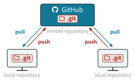](../static/cetz/local-remote.svg "図 3.7: ローカルとリモートの同期")

図 3.7: ローカルとリモートの同期

なお, Dropbox や Google Drive などと違って, 自分で明示的に push しない限り, ローカルの変更がリモートに反映されることはありません. つまり, ローカルでいくらコミットを積んでも, push しない限りリモートには何も変化が起きません. 逆も同様で, リモートの変更は pull しない限りローカルには反映されません.

## 3.3 基本の操作

### ステージング

ファイルをいくつ変更しても, それが自動でコミットされるわけではありません. コミットの前に「次のコミットに含める変更」を選び, ステージングエリア (staging area) と呼ばれる場所に載せます. この載せる操作が `git add` で, 載せる作業をステージング (staging) と呼びます ([図 fig-staging](#fig-staging)). 「次のコミットという舞台 (stage) に, 必要な変更だけを上げる」イメージだと考えてください.

ステージングエリアに載せた変更だけが, 続く `git commit` でコミットになります. 図の `draft.txt` のように, 変更してあっても `git add` しなければコミットには含まれません. こうして, 関係する変更だけをひとまとめにした, 意味のあるコミットを作れます.

[](../static/cetz/staging.svg "図 3.8: ステージングとコミット")

図 3.8: ステージングとコミット

``` bash
git add foo1.txt              # stage one file
git add foo1.txt foo2.txt     # stage several files at once
git add .                     # stage all changed files
```

### コミット

ステージしたら, メッセージを付けてコミットします. メッセージは必須で, あとから履歴を読み返すときの手がかりになります. 「何を」変更したのかが一目で分かる短い説明を書きましょう.

``` bash
git commit -m "MESSAGE"
```

### ログ

積み重ねたコミットの履歴は `git log` で確認できます. ただし標準の `git log` は, コミットごとにハッシュ・著者・日時・メッセージを数行ずつ表示するため, コミットが増えると一覧性が下がります. 普段は `--oneline` を付けて, 1コミットを1行で表示するのがおすすめです.

``` bash
git log --oneline
```

出力はたとえば次のようになります (上が新しいコミット).

``` text
a84d0e9 add computation-data
9d04011 migrate to quarto book
6761acb add high-speed
```

各行は, 先頭がコミットのハッシュ (短縮形), 続いてコミットメッセージです. メッセージを「何をしたか」が分かる短文にしておくと, この一覧がそのまま変更の目次になります. 先頭のハッシュは, あとで「どのコミットに戻るか」「どの2つを比較するか」を指定するときの目印になります.

### Push と Pull

ローカルの変更をリモートへ送るのが push, リモートの変更をローカルへ取り込むのが pull です.

``` bash
git push origin main    # send local commits to the remote
git pull origin main    # bring remote changes into local
```

`main` はブランチ名で, ここではデフォルトの main ブランチを指します. `origin` はリモートリポジトリの名前で, GitHub 上の自分のリポジトリを指します.

コミットからプッシュまでの一連の流れを, 実際に手を動かしてたどってみましょう.

1.  [GitHub](https://github.com/) でリポジトリを作ります
2.  研究用なら private リポジトリを選びます.
3.  gitignore, README, License は選ばなくて構いません (後から追加できます).
4.  `git clone REPO_URL` で, リモートレポジトリをローカルにコピーします.
5.  適当なテキストファイル (例: `foo1.txt`) を作り, 適当な一文 (例: “Hello Git!”) を書きます.
6.  ステージを忘れずに, コミットを作ります.
7.  リモートリポジトリへ push します. GitHub 上でファイルが更新されていることを確認しましょう.

## 3.4 ブランチとマージ

### ブランチと HEAD

ブランチ (branch) は, あるコミットに付けたラベルのようなものです. よくある誤解として, ブランチは「変更の流れ」を表すものだと思われがちですが, 実際は「コミットの位置」を指すものです. そして HEAD は, いま自分がどのブランチ (どのコミット) にいるかを指します. 例えば, 安定版の main から枝分かれさせた dev のように, 複数のブランチを同時に持てます ([図 fig-branch-head](#fig-branch-head)).

[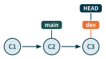](../static/cetz/branch-head.svg "図 3.9: ブランチと HEAD")

図 3.9: ブランチと HEAD

``` bash
git branch BRANCH_NAME    # create a branch
git switch BRANCH_NAME    # move HEAD to a branch
```

### マージ

あるブランチの変更を, いま HEAD のあるブランチへ取り込む操作をマージ (merge) と呼びます. dev を main にマージすると, 両方の変更を併せ持つ新しいコミット ([図 fig-merge](#fig-merge) の M) ができます.

[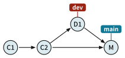](../static/cetz/merge.svg "図 3.10: ブランチのマージ")

図 3.10: ブランチのマージ

``` bash
git merge BRANCH_NAME
```

### なぜブランチを使うのか

ブランチを使う最大の目的は, main ブランチをいつでもきれいに動く状態に保つことです. main が常に動くと分かっていれば, 新しく入れた変更がバグの原因かどうかを切り分けやすくなります. 共同研究者も, それぞれ main からブランチを切って作業します.

> **NOTE:**
>
> 私が勧めるのは, シンプルな main-dev ワークフローです.
>
> - 作業は dev ブランチでのみ行います (共同研究者がいる場合は, 自分の名前をブランチ名にします).
> - 意味のあるまとまりが完成したら, 不要なファイルを片付けてから dev を main にマージします.

### 2種類のマージ

まず, 次のような状況を考えます ([図 fig-merge-setup](#fig-merge-setup)). 手元 (Local) では, main の C2 から dev ブランチを切って D1 というコミットを作りました. 一方リモート (Remote) はまだ C1-C2 のままで, dev も D1 も持っていません. この D1 の変更を main に取り込み, [図 fig-merge](#fig-merge) の M のようなマージコミットをリモートに作ることが目的です.

[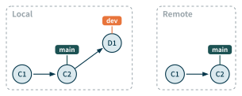](../static/cetz/merge-setup.svg "図 3.11: マージ前の Local と Remote")

図 3.11: マージ前の Local と Remote

この dev を main に取り込む方法は, 大きく2つあります. 1つ目は, ローカルでマージする方法です. ローカルで dev を main にマージし, その main をリモートへ push します ([図 fig-local-merge](#fig-local-merge)). 手数が少なく, 一人で進めるプロジェクトに向いています.

[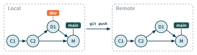](../static/cetz/local-merge.svg "図 3.12: ローカルマージ")

図 3.12: ローカルマージ

2つ目は, リモートでマージする方法です. dev をリモートへ push し, GitHub 上で Pull Request を作って main に取り込みます ([図 fig-remote-merge](#fig-remote-merge)). 変更をレビューしてから取り込めるので, 共同作業に向いています (私は一人のときもこちらを使います).

[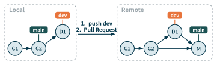](../static/cetz/remote-merge.svg "図 3.13: リモートマージ (Pull Request)")

図 3.13: リモートマージ (Pull Request)

2種類のマージ (ローカルマージとリモートマージ) を, どちらも実際に試してみましょう.

**ローカルマージ**

1.  新しいブランチ `dev` を作ります
2.  HEAD を `dev` に移します
3.  いくつかコミットを作ります
4.  HEAD を `main` に戻します
5.  `dev` を `main` にマージします
6.  `origin/main` へ push します
7.  (ローカルの) `dev` ブランチを消します (`git branch -d dev`)

**リモートマージ**

1.  `dev` ブランチを作ります
2.  `dev` に移ります
3.  いくつかコミットを作ります
4.  `origin/dev` へ push します
5.  GitHub で Pull Request を作ります
6.  `dev` を `main` にマージし, リモートの `dev` を消します
7.  ローカルに戻り `main` に移ります
8.  main を pull し, ローカルの `dev` を消します (`git branch -d dev`)

## 3.5 コンフリクト

Gitを使っていると, 2つのブランチをマージしたときに, Git がどちらの変更を採用すべきか判断できない場合があります. その状態をコンフリクト (conflict) と呼びます ([図 fig-conflict](#fig-conflict)). Git はどちらを採用すべきか判断できないので, 解決を人間に委ねます.

[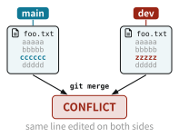](../static/cetz/conflict.svg "図 3.14: コンフリクト")

図 3.14: コンフリクト

コンフリクトが起きると, 該当するファイルの中に, 両方の変更が次のように並べて書き込まれます.

``` markdown
aaaaa
bbbbb
<<<<<<< HEAD
cccccc
=======
zzzzzz
>>>>>>> dev
ddddd
```

解決するには, 残したい方を選び, 不要な行とマーカー (`<<<<<<<` `=======` `>>>>>>>`) を消してファイルを保存し, 解決のためのコミットを作ります. 例えば dev 側の `zzzzz` を残すなら, 次のように整えます.

``` markdown
aaaaa
bbbbb
zzzzz
ddddd
```

VSCode では, 「Accept Current Change」「Accept Incoming Change」などのボタンでどちらの変更を残すか選び, 保存してからコミットすれば済みます. なお, 同じファイルを複数人で同時に編集しないというルールを守るだけで, コンフリクトのほとんどは防げます.

### Pull

実は pull は, 2つの操作を続けて行っています ([図 fig-pull-fetch-merge](#fig-pull-fetch-merge)).

[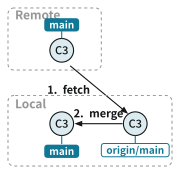](../static/cetz/pull-fetch-merge.svg "図 3.15: pull = fetch + merge")

図 3.15: pull = fetch + merge

1.  **fetch**: リモートのブランチをローカルへ取得して `origin/BRANCH_NAME` と名付ける
2.  **merge**: `origin/BRANCH_NAME` をいまのブランチへ取り込む

``` bash
git pull origin main
# shorthand for the two commands below
git fetch origin main
git merge origin/main
```

中身がマージである以上, pull でもコンフリクトが起こりうる点には注意してください.

3種類のコンフリクトを自分で起こして, それぞれ解決してみましょう.

**ローカルコンフリクト**

1.  `dev` に移り `foo1.txt` を作って一行 (例: “Tortilla sin Cebolla”) を書き, コミットします.
2.  `main` に移り `foo1.txt` を作って別の一行 (例: “Tortilla con Cebolla”) を書き, コミットします.
3.  `dev` を `main` にマージしてコンフリクトを起こします.
4.  どちらかの行を選んで解決します.

**リモートコンフリクト**

1.  `dev` に移り `foo2.txt` を作って一行 (例: “But the Emperor has nothing at all on!”) を書き, `origin/dev` へ push します.
2.  `main` に移り `foo2.txt` を作って別の一行 (例: “Oh! How beautiful are our Emperor’s new clothes!”) を書き, `origin/main` へ push します.
3.  GitHub で Pull Request を作り, コンフリクトを起こします.
    - 軽微なコンフリクトなら, GitHub 上で解決できます
    - 複雑なコンフリクトの場合, ローカルで `origin/main` を `dev` にマージし, コンフリクトを解決してから `origin/dev` へ push します.

**Pullとコンフリクト**

1.  `dev` に移り `foo3.txt` を作って一行 (例: “Mountain of Mushroom”) を書き, コミットして `origin/dev` へ push します.
2.  GitHub で `dev` を `main` にマージします.
3.  ローカルに戻り `main` に移って `foo3.txt` に別の一行 (例: “Village of Bamboo Shoot”) を書き, コミットします.
4.  `origin/main` から pull してコンフリクトを起こし, それを解決します.

## 3.6 研究のワークフロー

ここまでの道具を, 日々の研究で繰り返す一連の流れにまとめます. 私はだいたい次の6ステップを回しています. 最初はこの流れをそのまま真似るだけで十分です.

### 1. ローカルを同期する

作業を始める前に, まず main を最新の状態にしておきます ([図 fig-wf-pull](#fig-wf-pull)).

[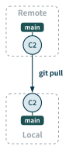](../static/cetz/wf-pull.svg "図 3.16: main を最新化")

図 3.16: main を最新化

``` bash
git switch main
git pull origin main
```

### 2. dev ブランチで書く

main から dev を切り, そこで作業します ([図 fig-wf-branch](#fig-wf-branch)).

[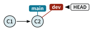](../static/cetz/wf-branch.svg "図 3.17: dev ブランチで作業")

図 3.17: dev ブランチで作業

``` bash
git switch -c dev    # create dev and switch to it (same as: git branch dev && git switch dev)
# ... write code ...
```

### 3. コミットする

意味のあるまとまりごとに, ステージしてコミットします ([図 fig-wf-commit](#fig-wf-commit)).

[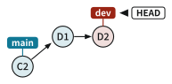](../static/cetz/wf-commit.svg "図 3.18: コミットを積む")

図 3.18: コミットを積む

``` bash
git add foo1.txt foo2.txt    # stage files to commit (git add . for all)
git commit -m "MESSAGE"
```

### 4. リモートへ Push する

dev をリモートへ送ります ([図 fig-wf-push](#fig-wf-push)).

[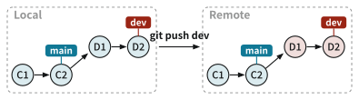](../static/cetz/wf-push.svg "図 3.19: dev を push")

図 3.19: dev を push

``` bash
git push origin dev
```

### 5. Pull Request とマージ

GitHub 上で Pull Request を作り, dev を main にマージします ([図 fig-wf-pr](#fig-wf-pr)). マージが終わったら, リモートの dev ブランチを消しておくことを勧めます.

[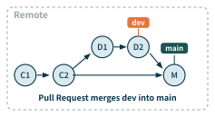](../static/cetz/wf-pr.svg "図 3.20: Pull Request でマージ")

図 3.20: Pull Request でマージ

### 6. ローカルの main を最新化する

Pull Request でマージが済んだら, ローカルの main に戻って pull し, 役目を終えた dev を消します ([図 fig-wf-sync](#fig-wf-sync)). これで手元の main にもマージ結果 (M) が反映され, 次の作業に備えられます.

[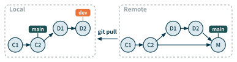](../static/cetz/wf-sync.svg "図 3.21: ローカルの main を最新化")

図 3.21: ローカルの main を最新化

``` bash
git switch main
git pull origin main
git branch -d dev    # delete local dev branch
```

上で紹介した研究のワークフローを, 実際に真似てみましょう.

- ステップ1〜6を, いくつかコミットを作りながら一通りたどってみましょう.

## 3.7 困ったときは

git を使う最大の強みは, トラブルが起きた時に過去に戻って再開できることです.

### 履歴をたどる

まずは `git log --oneline` で, これまでのコミットを一覧します ([sec-git-log](#sec-git-log)).

``` bash
git log --oneline
```

``` text
a84d0e9 add computation-data
9d04011 migrate to quarto book
6761acb add high-speed
```

この一覧を図にすると [図 fig-commit-chain](#fig-commit-chain) のようになります. 各コミットはハッシュ名で識別され, いまの作業位置を指す HEAD は, 最新コミット `a84d0e9` の main 上にあります. この一覧から, どのコミットのあたりで問題が起きたか, どの2つを見比べればよいかの見当をつけます.

[](../static/cetz/commit-chain.svg "図 3.22: コミット列と HEAD")

図 3.22: コミット列と HEAD

### 変更を見比べる

怪しいコミットの見当がついたら, `git diff` で中身を見比べます. [図 fig-commit-compare](#fig-commit-compare) で見たように, 差分 (diff) を取れば「どこが, どう変わったか」だけに注目できます.

``` bash
git diff                  # uncommitted changes vs the last commit
git diff 9d04011 a84d0e9  # differences between two commits
```

出力では, 取り除かれた行が `-`, 加わった行が `+` で示されます.

``` text
- tip <- mean(tip_amount)
+ tip <- mean(tip_amount, na.rm = TRUE)
```

この例なら, `na.rm = TRUE` を足したことが変化の原因だと分かります. ここまで切り分けられれば, あとはその場で直すか, 前の状態に戻すかです.

### 操作を取り消す

戻りたいコミットが分かったら, `git reset` で HEAD をそこへ移します. 行き先は `git log` で調べたハッシュで指定します. `--soft` は変更内容を手元に残したまま HEAD の位置だけを戻し, `--hard` は作業ディレクトリごとその状態に戻します (`--hard` は未コミットの変更を捨てるので注意してください).

``` bash
git reset --soft HEAD~1    # undo the last commit, keep its changes
git reset --hard 9d04011   # discard everything back to commit 9d04011
```

### 最終兵器: git reflog

`git reset --hard` で戻りすぎたり, コミットを消してしまったりして, `git log` を見ても目当てのコミットが見つからない. そんなときの最終兵器が `git reflog` です. `git log` がいまの HEAD からたどれるコミット (プロジェクトの公式の歴史) しか見せないのに対し, `git reflog` は HEAD がこれまで指してきた位置の足あとを, 操作の種類ごとにすべて見せます.

``` bash
git reflog
```

出力はたとえば次のようになります.

``` text
a84d0e9 HEAD@{0}: commit: add computation-data
9d04011 HEAD@{1}: reset: moving to HEAD~1
1f2e3c4 HEAD@{2}: commit: experimental change
9d04011 HEAD@{3}: commit: migrate to quarto book
```

各行は, コミットのハッシュ, `HEAD@{N}` (N が何手前の状態か. 0 が最新), そして操作の種類と内容です. 注目してほしいのは `HEAD@{2}` の `1f2e3c4` です. これは一度コミットしたものの, その後の `reset` で main の履歴から外れたコミットで, `git log` にはもう現れません. それでも reflog には足あととして残っているので,

``` bash
git reset --hard 1f2e3c4
```

とすれば復元できます. このように reflog は, 他の方法で見失ったコミットまで救い出せる, 最後の安全網です.

reset で履歴を巻き戻し, 戻りすぎたぶんを reflog で救い出す流れを体験してみましょう.

まず, 練習用のコミットをいくつか作ります.

1.  `foo.txt` を作り, “line 1” と書いてコミットします.
2.  “line 2” を追記してコミットします.
3.  “line 3” を追記してコミットします.
4.  `git log --oneline` で, 3つのコミットが積まれたことを確認します.

次に, `reset` で1つ前に戻します.

1.  最新の “line 3” を取り消したいので, `git reset --hard HEAD~1` を実行します.
2.  `git log --oneline` と `foo.txt` を見て, “line 3” のコミットと行が消えたことを確認します.

最後に, 戻りすぎたぶんを `reflog` で元に戻します.

1.  やはり “line 3” が必要でした. `git reflog` を実行し, reset する前の状態 (`HEAD@{1}` の “line 3” のコミット) を探します.
2.  `git reset --hard HEAD@{1}` で, その状態に戻します.
3.  `git log --oneline` と `foo.txt` で, “line 3” が復活したことを確認します.

### Git で悪いことは起きない

最後に覚えておいてほしいのは, Git はセーブポイントを保存しているだけなので, 悪いことは起きない, ということです. 実際にコミットから古いファイルを復元する場面はめったにありません. それでも「いつでも戻れる」という安心感が, 思い切ってコードを書き換える自由を支えてくれます.

[^1]: そのため, GitLabといった同種のWebサービスもあります.

[^2]: とはいえ, 変わっていないファイルまで毎回コピーするわけではありません. Git は内部で同じ中身のファイルを使い回す (重複排除する) ため, スナップショット方式でも容量はそれほど膨らみません.
