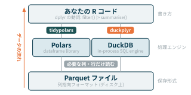
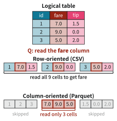
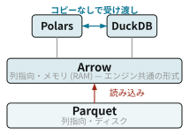
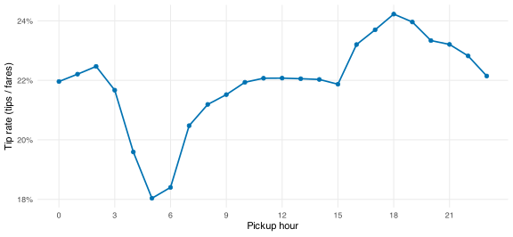

# 5  大規模データ

Code

## 5.1 大規模データとメモリ

`dplyr` や `data.frame` のような R の標準的な道具は, データ全体をメモリ (RAM) に読み込んでから処理します. [sec-computation-theory](#sec-computation-theory) のメモリのヒエラルキーで見たように, RAM の容量には限りがあります. データが RAM に収まらなくなると, 処理は途端に遅くなり, やがて止まってしまいます.

しかし, よく考えると, 分析のたびにデータ全体が必要になることはめったにありません. たいていのクエリは, 一部の列と一部の行しか使わないからです. そこで鍵になるのが, データ全体を RAM に載せるのではなく **必要な分だけ読む** という発想です. クエリに必要な列・行だけを読み込んで処理すれば, RAM を超えるデータも扱えます.

これを実現するには, 役割の違う2つの道具を組み合わせます. データの **保存形式** と, それを処理する **エンジン** です. この関係を整理したのが [Figure fig-data-stack](#fig-data-stack) です.

[](../static/cetz/data-stack.svg "Figure 5.1: Parquet・Polars・DuckDB の関係")

Figure 5.1: Parquet・Polars・DuckDB の関係

- Parquet は保存形式. データをディスクにどう並べるかを決めるだけで, それ自体は計算しません.
- Polars と DuckDB は処理エンジン. ディスク上のデータを読み込み, 絞り込みや集計を実行します. 役割はほぼ同じで, 互いに置き換えられる選択肢です. Polars は Rust 製のデータフレームライブラリ, DuckDB は分析に特化した組み込み型のデータベースです.
- R からの書き方は共通です. どちらのエンジンも, dplyr とほぼ同じ構文で操作できます (Polars は `tidypolars`, DuckDB は `duckplyr` を通します).

エンジンが「必要な分だけ読む」には, それを許す保存形式が要ります. 列指向フォーマット (Parquet) は, まさにそのための基礎技術です. データを Parquet で保存し, それを Polars か DuckDB で読んで処理する, というのが基本の形になります.

### NYC タクシーデータ

データとしてニューヨーク市タクシー・リムジン委員会 (TLC) が公開している [タクシー乗車記録](https://www.nyc.gov/site/tlc/about/tlc-trip-record-data.page) を使います. 乗車1回ごとに乗車・降車時刻, 距離, 料金, チップ額などが記録された, 取引レベルの実データです. ここでは2024年1月のイエロータクシー分 (2,964,624 行, 列) を使います.[^1]

このノートは, データが `data/` 以下に置かれている前提で進めます. ダウンロードは `targets` パイプラインに組み込んであるので, 手元に無ければ次で取得できます.[^2]

``` bash
Rscript -e 'targets::tar_make(taxi_parquet)'
```

ファイルのパスは, プロジェクトのどこから実行しても解決できるよう [`here`](https://here.r-lib.org/) で組み立てます.

``` r
path_pq <- here::here("data", "yellow_tripdata_2024-01.parquet")
```

## 5.2 列指向フォーマット

大規模データを「必要な分だけ読む」ための鍵が, この **列指向フォーマット** です. CSV は **行指向** のテキストファイルで, 1行ずつ順に値がカンマ区切りで並びます. そのため, 一部の列だけが欲しいときでも, 結局すべての行・すべての列を読む必要があります.

[Parquet](https://parquet.apache.org/) は **列指向** のバイナリフォーマットです. 同じテーブルでも, CSV が1行ぶんをまとめて並べるのに対し, Parquet は1列ぶんをまとめて並べます. この違いは, 一部の列だけを読むときに大きく効いてきます ([Figure fig-row-vs-column](#fig-row-vs-column)).

[](../static/cetz/row-vs-column.svg "Figure 5.2: 行指向と列指向")

Figure 5.2: 行指向と列指向

同じ列の値が連続して並ぶことから, 次のような利点が生まれます.

- **必要な列だけ読める**: 19列のうち3列しか使わないなら, その3列だけをディスクから読めます (projection pushdown).
- **行グループをスキップできる**: ファイルは行グループ (row group) に分かれており, 各グループの統計量 (最小値・最大値など) がメタデータに記録されています. 条件に合わない行グループは丸ごと読み飛ばせます (predicate pushdown).
- **小さい**: 列ごとに型がそろっているため圧縮が効きます.
- **型が保たれる**: CSV と違い, 数値・日付・文字列などの型情報がファイルに含まれます.

実際にどのくらい小さいのか, 同じデータを CSV に書き出して比べてみましょう. ここでは変換に DuckDB を使います.

``` r
path_csv <- file.path(tempdir(), "taxi.csv")
con <- dbConnect(duckdb::duckdb())
dbExecute(
  con,
  sprintf(
    "COPY (SELECT * FROM read_parquet('%s')) TO '%s' (FORMAT CSV, HEADER)",
    path_pq,
    path_csv
  )
)
## [1] 2964624
dbDisconnect(con)
```

| 形式    | ファイルサイズ |
|---------|----------------|
| CSV     | 285.4 MB       |
| Parquet | 47.6 MB        |

Table 5.1: CSV と Parquet のファイルサイズ

Parquet は CSV のおよそ 6 分の1のサイズに収まっています. Rからだと [`nanoparquet`](https://nanoparquet.r-lib.org/) (軽量) や [`arrow`](https://arrow.apache.org/docs/r/) で Parquet を読み書きできます. 分析用のデータは, できるだけ Parquet で保存しておくのがよいでしょう.

### Arrow との関係

Parquet とよく一緒に名前が挙がるArrowも列指向ですが, 担う層が違います. Parquet がディスク上の保存形式なのに対し, Arrow はメモリ (RAM) 上 の列指向フォーマットで, ディスクの Parquet を読み込むとメモリ上では Arrow の形になる, という対の関係です ([Figure fig-parquet-arrow](#fig-parquet-arrow)).

[](../static/cetz/parquet-arrow.svg "Figure 5.3: Parquet と Arrow")

Figure 5.3: Parquet と Arrow

Arrowは標準的な形式になっているので, Arrow を使うツール同士 (Polars, DuckDB, さらに Python のツールなど) は, データをコピーせずに (zero-copy) 受け渡せます. 逆に, RのデータフレームはArrow形式ではないため, 変換のため `collect()` / `as_tibble()` などのステップが必要になります.[^3]

> **NOTE:**
>
> Parquet はデファクトスタンダードですが, 他にも列指向フォーマットはあります.
>
> - **ORC**: Hadoop / Hive / Spark 系でよく使われる, Parquet と似たディスク列指向形式.
> - **Feather** (Arrow IPC): Arrow のメモリ上の形をほぼそのままディスクに書いた形式. 圧縮をほとんどかけず読み書きが非常に速い反面ファイルは大きく, 長期保存より一時ファイルや R ↔︎ Python の高速な受け渡しに向きます (小さく圧縮して保存・大規模クエリ向けに最適化する Parquet とは設計の方向が逆です).
> - クラウドのデータウェアハウス (BigQuery, Redshift, Snowflake など) も, 内部は列指向です.

## 5.3  Polars

[Polars](https://pola.rs/) は Rust で書かれた高速なデータフレームライブラリです. マルチスレッドで動き ([sec-computation-theory](#sec-computation-theory) の並列化を思い出してください), **遅延評価** (lazy evaluation) によってクエリを最適化します.

> **NOTE:**
>
> ここでは Polars を `tidypolars` (dplyr 構文) 経由で使います. tidypolars は polars に依存しますが, どちらも CRAN では配布されていない (polars は2024年に削除) ため, [R-multiverse](https://r-multiverse.org/) からまとめてインストールします.
>
> ``` r
> install.packages(c("polars", "tidypolars"), repos = "https://community.r-multiverse.org")
> ```

ここでは [`tidypolars`](https://tidypolars.etiennebacher.com/) を通して, **dplyr とほぼ同じ構文** で Polars を使います.[^4] 例として, 料金が正の乗車について, 支払い方法 (`payment_type`) ごとの平均チップ額を求めてみます.[^5]

``` r
q <- scan_parquet_polars(path_pq) |>
  filter(fare_amount > 0) |>
  summarise(tip = mean(tip_amount), .by = payment_type)

q |>
  arrange(payment_type) |>
  as_tibble()
```

`scan_parquet_polars()` はファイルを開くだけで, データはまだ読み込みません. **遅延評価** (lazy evaluation) とは, コマンドを書いた時点ではすぐに計算せず, 「何をするか」という計画 (プラン) だけを組み立てておく方式です. `as_tibble()` (や `collect()`) を呼んで初めて, 最適化されたプランが実行されます.

その最適化された計画は `explain()` で確認できます.

``` r
cat(explain(q))
## AGGREGATE[maintain_order: false]
##   [when([(col("tip_amount").null_count().cast(Float64)) > (0.0)]).then(null.strict_cast(Float64)).otherwise(col("tip_amount").mean()).alias("tip")] BY [col("payment_type")]
##   FROM
##   simple π 2/2 ["payment_type", "tip_amount"]
##     Parquet SCAN [/Users/kazuharu/github/workshop-graduate-2026/data/yellow_tripdata_2024-01.parquet]
##     PROJECT 3/19 COLUMNS
##     SELECTION: [(col("fare_amount")) > (0.0)]
##     ESTIMATED ROWS: 2964624
```

`PROJECT 3/19 COLUMNS` は, 19列のうち必要な3列 (`payment_type`, `fare_amount`, `tip_amount`) だけを読むこと (列の刈り込み) を表します. `SELECTION: [(col("fare_amount")) > 0.0]` は, `filter` の条件が Parquet の読み込み段階まで押し下げられていること (述語の押し下げ) を表します. このように Polars は, こちらが書いた順序にとらわれず, 「必要なデータだけを最小限読む」ように勝手に並べ替えてくれます.

## 5.4  DuckDB

[DuckDB](https://duckdb.org/) は, 分析用途に特化した組み込み型のデータベースです. SQLite が「手軽なトランザクション用 DB」なら, DuckDB は「手軽な分析用 DB」だと考えるとよいでしょう. マルチスレッドで動き, RAM に収まらないデータ (larger-than-memory) も扱えます. 先ほど CSV への変換に使ったのも, この DuckDB です.

R からは [`duckplyr`](https://duckplyr.tidyverse.org/) を使うのが手軽です. これは **dplyr のドロップイン置換** で, 既存の dplyr コードをほぼそのまま, バックエンドだけ DuckDB に差し替えて高速化できます.[^6]

``` r
read_parquet_duckdb(path_pq) |>
  filter(fare_amount > 0) |>
  summarise(tip = mean(tip_amount), .by = payment_type) |>
  arrange(payment_type) |>
  collect()
```

`read_parquet_duckdb()` で遅延的に Parquet を開き, dplyr の動詞を並べ, `collect()` で結果を取り出します. Polars (tidypolars) と書き方がほとんど同じであることに注目してください. どちらも内部では遅延評価とクエリ最適化を行っています.

## 5.5 ベンチマーク

では, 同じ集計を `dplyr`, `tidypolars`, `duckplyr` の3通りで実行し, 速度とメモリを比べてみましょう. `dplyr` 版は, Parquet をいったん全部メモリに読み込んでから処理します.

``` r
bm <- bench::mark(
  dplyr = nanoparquet::read_parquet(path_pq) |>
    filter(fare_amount > 0) |>
    summarise(tip = mean(tip_amount), .by = payment_type) |>
    arrange(payment_type),
  tidypolars = scan_parquet_polars(path_pq) |>
    filter(fare_amount > 0) |>
    summarise(tip = mean(tip_amount), .by = payment_type) |>
    arrange(payment_type) |>
    as_tibble(),
  duckplyr = read_parquet_duckdb(path_pq) |>
    filter(fare_amount > 0) |>
    summarise(tip = mean(tip_amount), .by = payment_type) |>
    arrange(payment_type) |>
    collect(),
  check = FALSE,
  iterations = 5,
  filter_gc = FALSE
)
```

| 手法       | 中央値 (ms) | メモリ割り当て |
|------------|-------------|----------------|
| dplyr      | 437         | 1.3 GB         |
| tidypolars | 44          | 421.1 KB       |
| duckplyr   | 22          | 85.9 KB        |

Table 5.2: 集計の計算時間とメモリ

集計そのものも `tidypolars` と `duckplyr` の方が `dplyr` より約 10 倍速いですが, より目を引くのは **R が確保するメモリ** の差です. [Table tbl-benchmark-data](#tbl-benchmark-data) のとおり, `dplyr` が数百 MB を確保するのに対し, `tidypolars` と `duckplyr` のそれは桁違いに小さくなっています.

理由は2つあります. 第一に, 遅延評価と Parquet の組み合わせにより, 「必要なのは `payment_type`, `fare_amount`, `tip_amount` の列と `fare_amount > 0` の行だけ」と見抜いて, その分しか読み込みません ([sec-polars](#sec-polars) の `explain()` で見た列の刈り込みと述語の押し下げです). 第二に, Polars と DuckDB はデータを R のメモリではなく自前のメモリ (Rust や C++ 側) に持ち, R へは最終的な集計結果だけを渡します. そのため R のヒープにはほとんど何も積まれません. 一方 `dplyr` は, 19列すべてを R に読み込み, 中間結果まで含めて R オブジェクトとして抱えます.

この違いは, データが RAM を超えるようになると「動くか動かないか」を分けます. DuckDB は必要に応じて中間結果をディスクに退避できるため, RAM に収まらないデータも処理できます.

### どれを使えばよいか

実証家として皆さんに覚えておいて欲しいのは次の三つです.

1.  Parquetで保存する
2.  データ処理のエンジンとしては, `duckplyr` を使う

特に理由がなければ, parquet形式でデータを保存しておくのが高速化かつ軽量という点でおすすめです. Polars はPythonで扱う分にはとても便利ですが, CRANから外されたりなどRでのサポートが不安定であるため, `duckplyr` を使うのが便利かなと思っています.

なお, R のオブジェクトをそのまま高速に保存したいだけなら, [`fst`](https://www.fstpackage.org/) や [`qs2`](https://github.com/qsbase/qs2) も便利です. これらは `saveRDS()` の高速な代替として使えます.

## 演習問題

前半は保存形式とエンジンの考え方に関するクイズ, 後半はタクシーデータを使った演習です. クイズは選択肢をクリックすると, その場で正誤が表示されます.

### クイズ

19列のテーブルから3列だけを使って集計するとき, Parquet + Polars が CSV + dplyr より圧倒的に速い最大の理由はどれでしょうか.

Parquet はテキストではなくバイナリだから\
Polars が R より新しい言語で書かれているから\
列指向なので, 必要な3列だけをディスクから読める\
CSV は型情報を持たないから\

``` r
q <- scan_parquet_polars(path) |>
  filter(fare_amount > 0) |>
  summarise(tip = mean(tip_amount), .by = payment_type)
```

を実行した直後, どういう状態になっているでしょうか.

データはまだ読まれておらず, 何をするかの計画だけができている\
集計結果まですでに計算されている\
ファイル全体がメモリに読み込まれている\
filter までは実行済みで, summarise だけが残っている\

Parquet と Arrow の関係として正しいものはどれでしょうか.

Arrow は Parquet の新しいバージョン\
どちらもディスク上の保存形式で, 圧縮率が違うだけ\
Parquet はディスク上の保存形式で, Arrow はメモリ上の形式\
Arrow がディスク上の保存形式で, Parquet はメモリ上の形式\

RAM が 8GB のノート PC で, 20GB のデータを集計する必要があります. どうするのがよいでしょうか.

データ全体をメモリに読み込んでから, 不要な列を落とす\
RAM を超えるデータは, メモリを増設しない限り R では扱えない\
Parquet に変換し, duckplyr で必要な列・行だけ読む遅延クエリとして集計する\
乱数で 1% に間引いてから dplyr で集計する\

### 時間帯別のチップ率と explain

タクシーデータで, カード払い (`payment_type == 1`) かつ `fare_amount > 0` の乗車について, 乗車時刻の時間帯 (0〜23時) ごとのチップ率を調べます. 時間帯は `lubridate::hour(tpep_pickup_datetime)` で, チップ率は `sum(tip_amount) / sum(fare_amount)` で計算します.

1.  `tidypolars` で, 時間帯ごとの乗車数とチップ率を求める遅延クエリ `q` を書いてください (まだ実行はしません).
2.  `explain(q)` で最適化された計画を確認してください. 19列のうち何列が読まれるでしょうか. また `filter` の条件はどこで処理されているでしょうか.
3.  クエリを実行し, 時間帯ごとのチップ率を折れ線グラフに描いてください.

> **TIP:**
>
> ``` r
> q <- scan_parquet_polars(path_pq) |>
>   filter(payment_type == 1, fare_amount > 0) |>
>   mutate(hour = lubridate::hour(tpep_pickup_datetime)) |>
>   summarise(
>     n = n(),
>     tip_rate = sum(tip_amount) / sum(fare_amount),
>     .by = hour
>   ) |>
>   arrange(hour)
>
> cat(explain(q))
> ## simple π 3/3 ["hour", "n", "tip_rate"]
> ##   SORT BY [nulls_last: [true]] [col("__TIDYPOLARS_TEMP_SORT__1")]
> ##      WITH_COLUMNS:
> ##      [col("hour").alias("__TIDYPOLARS_TEMP_SORT__1")] 
> ##       AGGREGATE[maintain_order: false]
> ##         [len().alias("n"), [(when([(col("tip_amount").null_count().cast(Float64)) > (0.0)]).then(null.strict_cast(Float64)).otherwise(col("tip_amount").sum())) / (when([(col("fare_amount").null_count().cast(Float64)) > (0.0)]).then(null.strict_cast(Float64)).otherwise(col("fare_amount").sum()))].alias("tip_rate")] BY [col("hour")]
> ##         FROM
> ##         simple π 3/3 ["hour", "tip_amount", ... 1 other column]
> ##            WITH_COLUMNS:
> ##            [col("tpep_pickup_datetime").dt.hour().alias("hour")] 
> ##             simple π 3/3 ["tpep_pickup_datetime", ... 2 other columns]
> ##               Parquet SCAN [/Users/kazuharu/github/workshop-graduate-2026/data/yellow_tripdata_2024-01.parquet]
> ##               PROJECT 4/19 COLUMNS
> ##               SELECTION: [([(col("fare_amount")) > (0.0)]) & ([(col("payment_type").cast(Float64)) == (1.0)])]
> ##               ESTIMATED ROWS: 2964624
> ```
>
> `PROJECT 4/19 COLUMNS` とあるとおり, 読まれるのは `payment_type`, `fare_amount`, `tpep_pickup_datetime`, `tip_amount` の4列だけです. また `SELECTION` に `filter` の2条件が入っており, 述語の押し下げによって Parquet の読み込み段階で行が絞り込まれることがわかります.
>
> ``` r
> library(ggplot2)
>
> q |>
>   as_tibble() |>
>   ggplot(aes(hour, tip_rate)) +
>   geom_line(linewidth = 0.8, color = "#0072B2") +
>   geom_point(size = 1.8, color = "#0072B2") +
>   scale_x_continuous(breaks = seq(0, 23, 3)) +
>   scale_y_continuous(labels = scales::label_percent()) +
>   labs(x = "Pickup hour", y = "Tip rate (tips / fares)") +
>   theme_minimal() +
>   theme(panel.grid.minor = element_blank())
> ```
>
> [](largedata_files/figure-html/fig-exercise-tip-hour-1.svg "Figure 5.4: Tip rate by pickup hour (credit-card trips, January 2024)")
>
> Figure 5.4: Tip rate by pickup hour (credit-card trips, January 2024)
>
> 300万行のデータですが, 遅延評価と列の刈り込みのおかげで, 集計は一瞬で終わります.

### 自分のクエリでベンチマーク

`fare_amount > 0` の乗車について, 乗客数 (`passenger_count`) ごとの乗車数と平均運賃を求めるクエリを考えます.

1.  この集計を, (a) `nanoparquet::read_parquet()` で全体を読み込んでから `dplyr` で処理する方法と, (b) `duckplyr` の遅延クエリの2通りで書いてください.
2.  `bench::mark()` (`iterations = 5`, `check = FALSE`, `filter_gc = FALSE`) で計算時間とメモリ割り当てを比較してください.
3.  メモリ割り当ての差がなぜ生まれるのか, 説明してください.

> **TIP:**
>
> ``` r
> bm_ex <- bench::mark(
>   dplyr = nanoparquet::read_parquet(path_pq) |>
>     filter(fare_amount > 0) |>
>     summarise(n = n(), fare = mean(fare_amount), .by = passenger_count) |>
>     arrange(passenger_count),
>   duckplyr = read_parquet_duckdb(path_pq) |>
>     filter(fare_amount > 0) |>
>     summarise(n = n(), fare = mean(fare_amount), .by = passenger_count) |>
>     arrange(passenger_count) |>
>     collect(),
>   check = FALSE,
>   iterations = 5,
>   filter_gc = FALSE
> )
>
> bm_ex |>
>   mutate(expression = as.character(expression)) |>
>   select(expression, median, mem_alloc)
> ```
>
> このクエリで本当に必要なのは `passenger_count` と `fare_amount` の2列だけです. `duckplyr` は遅延評価によってそれを見抜き, 2列分しか読みません. さらに集計は DuckDB 側 (C++) のメモリで行われ, R に渡ってくるのは数行の集計結果だけなので, R のメモリ割り当てはごくわずかです. 一方 `dplyr` 版は, まず19列すべてを R のメモリに読み込み, filter の中間結果も R オブジェクトとして抱えるため, 数百 MB を確保します. データが RAM を超えると, この差は「遅い」ではなく「動かない」に変わります.

[^1]: このデータは元から Parquet 形式で配布されており, 1か月分でも約 48 MB あります. 全期間 (2009年〜) を合わせると数十 GB・十数億行になり, RAM には到底収まりません. まさに大規模データの練習にうってつけです.

[^2]: `data/` は `.gitignore` の対象です. `taxi_parquet` ターゲットが TLC のサーバーから Parquet を取得し, `data/yellow_tripdata_2024-01.parquet` に保存します.

[^3]: ややこしいことにRには [`arrow`](https://arrow.apache.org/docs/r/) というパッケージもありますが, これもArrow形式を扱うため, Polars や DuckDB と同様に Parquet を遅延読み込みして集計するエンジンとしても使えます.

[^4]: Polars には Python 版に合わせた独自の構文 (`pl$col(...)$agg(...)`) もあります. Python も使う人にはそちらが便利でしょう.

[^5]: `payment_type` は支払い方法のコードで, 1 がクレジットカード, 2 が現金です. カード払いではチップが記録される一方, 現金のチップは記録されないことが多い, という現実が結果に表れます.

[^6]: `duckplyr` は2025年に tidyverse の一員となり, CRAN で配布されています (`install.packages("duckplyr")`). Polars と違い, 追加のリポジトリ設定なしに入ります.
