# 11  文献と引用

Code

## 11.1 Zoteroによる文献管理

Zoteroを使うと, 文献情報 (著者, 年, タイトル, DOI など) を整理して, BibTeX形式として書き出せます.

### BibTeXとは

BibTeXは, 文献情報を管理するためのフォーマットの一つです. 文献ごとに `@article` や `@book` などのエントリータイプを指定し, キーと値のペアで書誌情報を記述します. 例えば, 本 1 冊 (`@book`) と論文 1 本 (`@article`) を BibTeX で表すと次のようになります. 以下ではこれを `references.bib` というファイル名で保存したものとして扱います.

``` bibtex
@book{acemoglu2012,
  author    = {Acemoglu, Daron and Robinson, James A.},
  title     = {Why Nations Fail: The Origins of Power, Prosperity, and Poverty},
  year      = {2012},
  publisher = {Crown Publishers},
  address   = {New York}
}

@article{halljones1999,
  author  = {Hall, Robert E. and Jones, Charles I.},
  title   = {Why Do Some Countries Produce So Much More Output Per Worker Than Others?},
  journal = {The Quarterly Journal of Economics},
  year    = {1999},
  volume  = {114},
  number  = {1},
  pages   = {83--116}
}
```

エントリータイプによって必要なフィールドが異なる点に注目してください. `@book` は `publisher` を, `@article` は `journal` や `volume` を持ちます. 元々はLaTeXで文献管理するためのフォーマットですが, Typst でもBibTeX形式のファイルを読み込んで引用に利用できます.

### ZoteroによるBibTeXファイルの作成

ZoteroからBibTeXファイルを作る手順は次の通りです.

> **TIP:**
>
> 1.  コレクションを好きな名前で作る
> 2.  Zotero に文献を入れる (ブラウザ拡張, ドラッグ&ドロップ, DOIなど)
> 3.  メタデータを確認・修正する (著者名の表記ゆれ, 年, 雑誌名など)
> 4.  `references.bib` にエクスポートする (BibTeX形式)
>
> なお, Zotero拡張の[Better BibTeX](https://retorque.re/zotero-better-bibtex/) を導入することで, BiBTeXファイルを自動で更新するなどの便利な機能が使えるようになります.

**Step 1. コレクションを作る**

[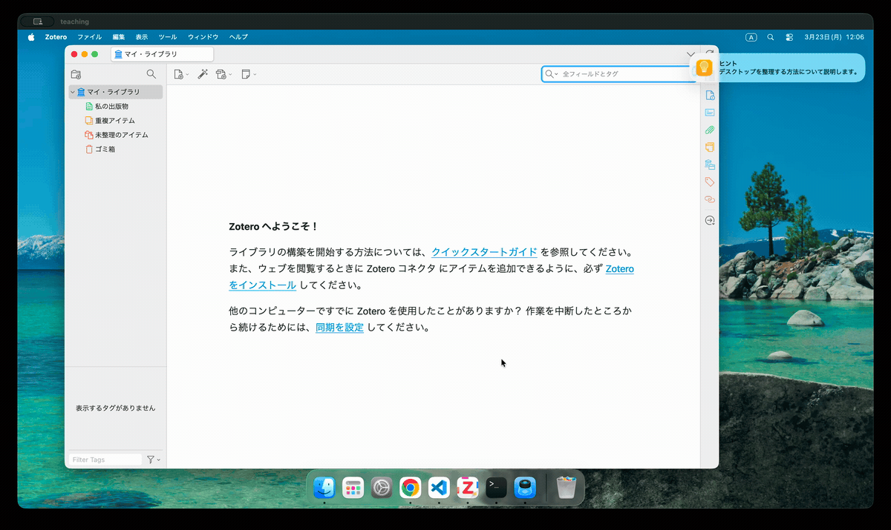](../static/img/literature/1_create_collection.gif)

Zoteroでは全ての文献は「ライブラリ」に属します. ライブラリには複数の「コレクション」を作ることができ, 基本的には文献を管理したいプロジェクト (レポート, 論文) ごとに作成します. コレクションはフォルダのようなもので, 同じ文献を複数のコレクションに入れることもできます.

**Step 2. Zoteroに文献を入れる**

## ブラウザ拡張

[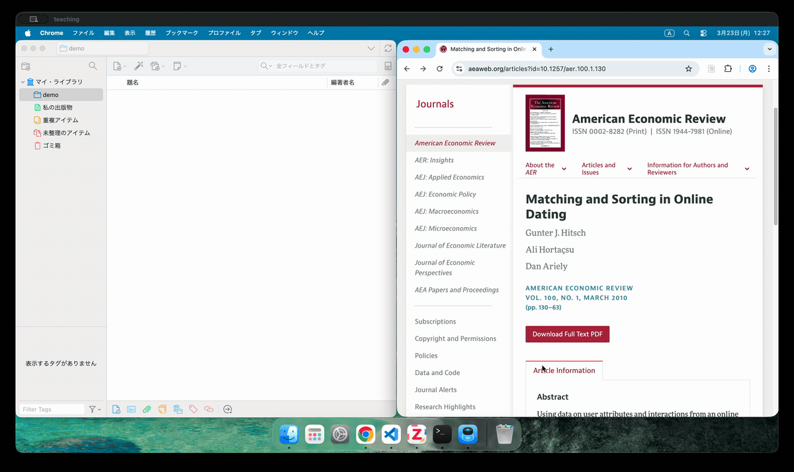](../static/img/literature/2_import_extension.gif)

## ドラッグ & ドロップ

[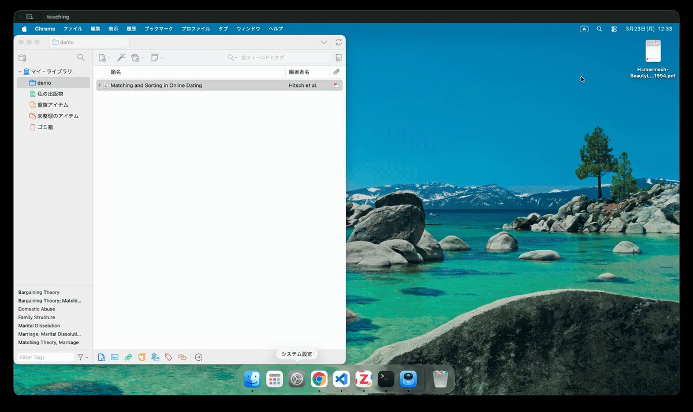](../static/img/literature/2_import_drag.gif)

## DOI

[](../static/img/literature/2_import_doi.gif)

> **TIP:**
>
> ZoteroはDOIやURLから自動で書誌情報 (メタデータ) を取得しますが, 全ての情報が正確に入るわけではありません. 基本的には DOI という論文ごとのユニークな識別子が発見できた場合, [CrossRef](https://www.crossref.org) などのデータベースから情報を取得しています. しかし, これでも間違いがあったり, DOIがない資料があったりするため, メタデータは必ず確認して修正する必要があります.

**Step 3. メタデータを確認・修正する**

[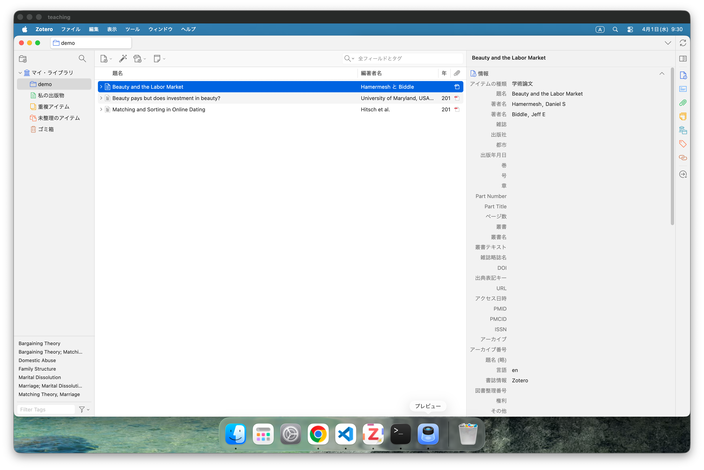](../static/img/literature/3_meta_zotero.png)

ドラッグ & ドロップで入れた “Beauty and Labor Market” は, タイトルと著者名は正しく入っていますが, その他の情報が空欄になっています. 書誌情報のところを見ると “Zotero” となっているので, これはZoteroがDOIなどの情報を自動で取得できなかったことを示しています.

[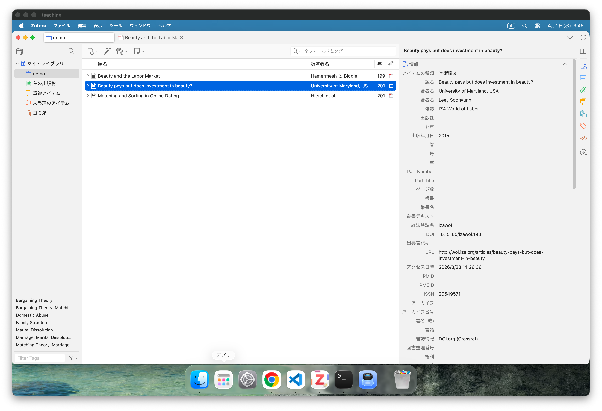](../static/img/literature/3_meta_doi.png)

上の例は, CrossRefから取得したデータでも間違いがあったケースです. 著者名に “University of Maryland, USA” という著者の所属する機関名が入ってしまっています. ここでは, RISファイルによる修正方法と, Zotero上で直接修正する方法の両方を紹介します.

## RISファイル

[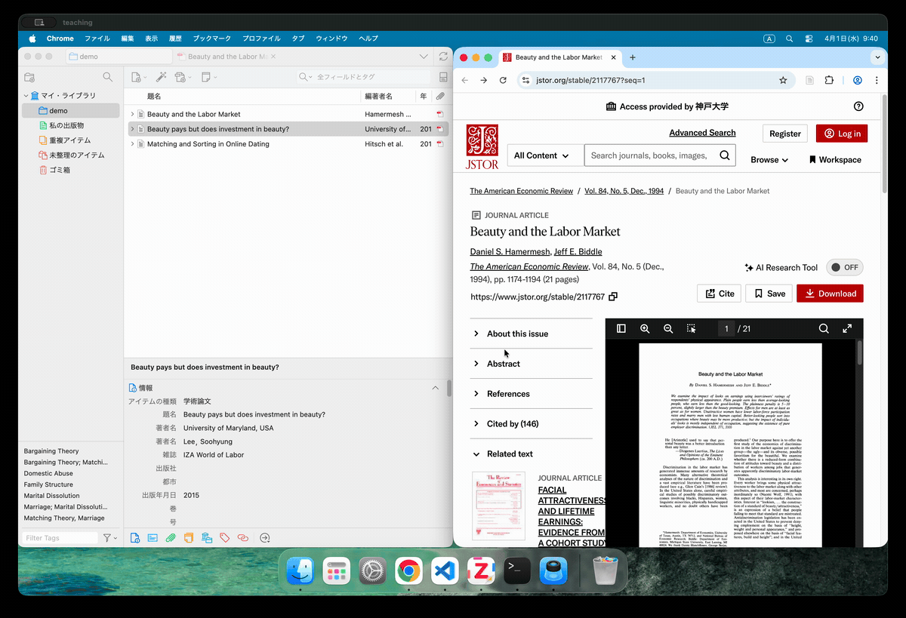](../static/img/literature/3_import_ris.gif)

RISファイルとは, 文献情報を管理するためのファイル形式の一つです. 多くの出版社やデータベースが, 文献情報をRIS形式でエクスポートする機能を提供しています. 本来は

1.  RISファイルをダウンロード
2.  Zoteroにインポート

という手順で書誌情報を取り込むのですが, Zoteroのブラウザ拡張では, RISのダウンロードの際に自動でZoteroにインポートする機能もあります.

## 手動

[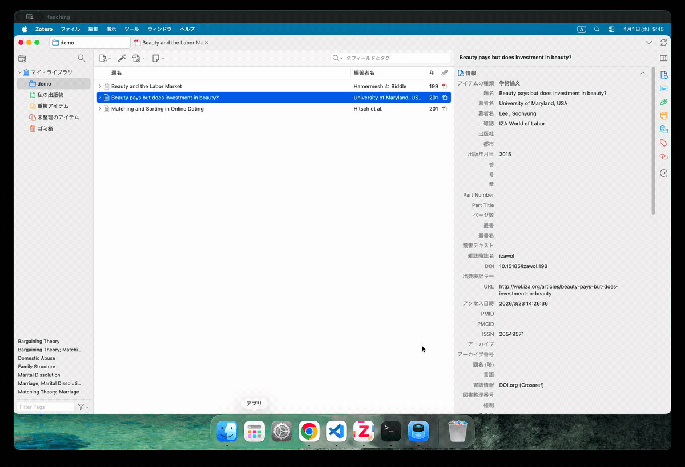](../static/img/literature/3_fix_meta.gif)

Zoteroの画面上で直接書誌情報を修正することもできます. しかし, 手入力はミスが起こりやすいので, 可能な限り出版社やデータベースから正しい書誌情報を取得し, 最終手段として手入力で修正するのが望ましいです.

**Step 4. `references.bib` にエクスポートする**

[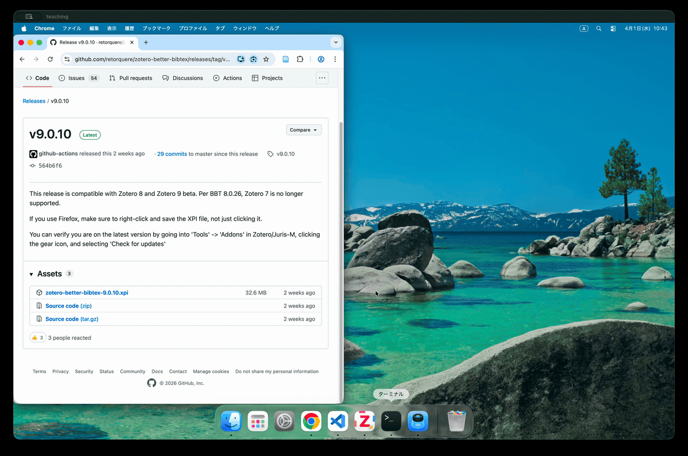](../static/img/literature/4_install_betterbibtex.gif)

Better BibTeXは, Zoteroの拡張機能で, BiBTeX形式でのエクスポートを強化するものです. これを入れると, ZoteroのコレクションをBiBTeXファイルにエクスポートする際に, ファイルを自動で更新するなどの便利な機能が使えるようになります. インストールは, GitHubの[リリースページ](https://github.com/retorquere/zotero-better-bibtex/releases/latest)からダウンロードした `.xpi` ファイルを, Zoteroの「ツール」→「プラグイン」→「Install Plugin from File」からインストールするだけです.

[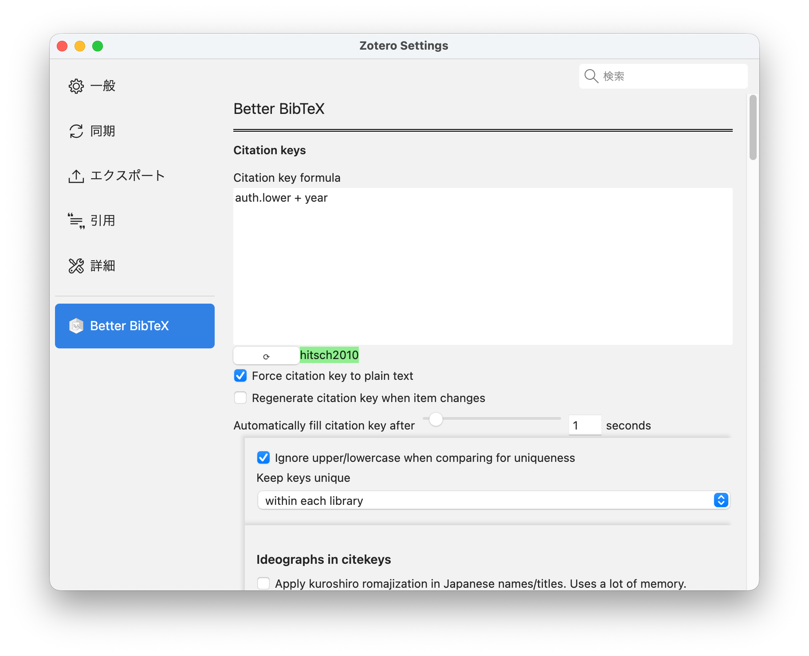](../static/img/literature/4_citekey.png)

Better BibTeXを入れると, Zoteroの文献ごとに “citekey” という識別子が自動で割り当てられます. これが, Quartoの `[@...]` で引用するときのキーになります. 個人的には, `auth.lower + year` 形式 (例: `knuth1984`) が分かりやすいと思いますが, 好みに合わせて変更することもできます.

[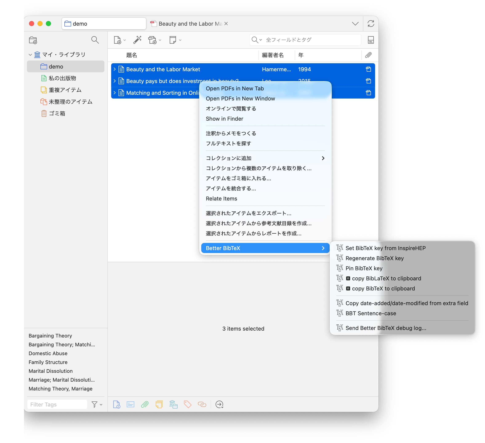](../static/img/literature/4_regenerate_citekey.png)

Better BibTeXが設定されていると, 自動的にcitekeyが生成されるようになりますが, 既に文献を入れてしまった後にBetter BibTeXを入れた場合は, Zoteroの「ツール」→「Better BibTeX」→「Regenerate BibTeX keys」で既存の文献にもcitekeyを割り当てることができます.

[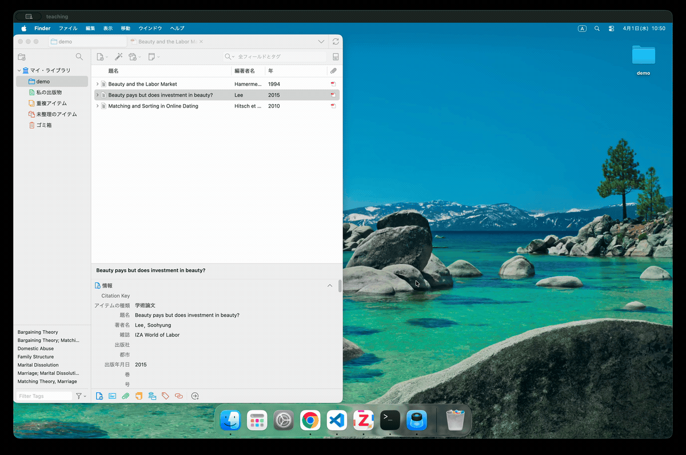](../static/img/literature/4_export_bib.gif)

コレクション名を右クリックすることで, そのコレクションに入っている文献をBiBTeX形式でエクスポートできます. 出力形式は “Better BibTeX” を選び, ファイル名は `references.bib` として, Quartoプロジェクトのルートディレクトリに保存してください. この時, 「Keep updated」をチェックしておくと, Zoteroのコレクションに文献を追加・削除したときに `references.bib` が自動で更新されるようになります.

## 11.2 LaTeX による引用

`references.bib` を用いることで, LaTeX などの文書作成システムで引用が可能になります. 経済学の文献は, ほぼ例外なく著者・年方式 (author-year) です.

> **NOTE:**
>
> 著者・年方式とは, 引用を番号 (\[1\], \[2\] など) ではなく, 著者の姓と出版年で示す方式です. 使われ方は大きく 2 通りあります.
>
> 1.  「Acemoglu and Robinson (2012) は …」
> 2.  「… が知られています (Acemoglu and Robinson 2012).」
>
> 著者が 3 名以上のときは, 慣例として「Acemoglu et al. (2012)」のように筆頭著者と et al. に省略します.

LaTeX で著者・年の引用を扱うには, 大きく 2 つの選択肢があります. 一つは古くから使われてきた `natbib` パッケージ (バックエンドは BibTeX), もう一つはより新しい `biblatex` パッケージ (バックエンドは Biber) です. どちらも `.bib` ファイルをそのまま読めますが, 引用コマンドの書き方が異なります.

### `natbib` + BibTeX

`natbib` は経済学で最も広く使われている方式です. 多くの学術誌が `natbib` 用のスタイルファイル (`.bst`) を配布しており (例: AEA の `aea.bst`, Econometrica の `ecta.bst`), 投稿規定もこれを前提にしていることが多いためです. 手元で AEA スタイルを試すだけなら, TeX Live に含まれる `econ-bst` パッケージの `econ-aea.bst` が手軽です (`tlmgr install econ-bst` で入ります).

`natbib` の引用コマンドは, 著者名を文の主語として地の文に組み込む `\citet` (textual) と, 文末などで括弧に入れる `\citep` (parenthetical) の使い分けが基本です. このほか, 著者名だけの `\citeauthor`, 年だけの `\citeyear`, 括弧なしの `\citealt` などがあります.

``` latex
\documentclass[11pt]{article}
% The page is sized to the content so the figure needs no cropping.
\usepackage[paperwidth=17cm, paperheight=8.2cm, margin=1cm]{geometry}
\usepackage[round]{natbib}      % round -> parentheses are ( )
\pagestyle{empty}
\setlength{\parindent}{0pt}

\begin{document}

\citet{acemoglu2012} argue that institutions are a fundamental cause
of long-run growth. This view builds on earlier work
\citep{halljones1999}, and is developed in detail elsewhere
\citep[see][chap.~2]{acemoglu2012}.

\bibliographystyle{econ-aea}    % AEA style provided by econ-bst
\bibliography{references}             % read references.bib

\end{document}
```

[](../static/tex/main.svg "Figure 11.1: natbib + BibTeX による引用と文献リスト")

Figure 11.1: natbib + BibTeX による引用と文献リスト

コンパイルした結果が [Figure fig-natbib-bibtex](#fig-natbib-bibtex) です. `\citet` が地の文の「Acemoglu and Robinson (2012)」に, `\citep` が括弧内の「(Hall and Jones, 1999)」に, 後置注が「(see …, chap. 2)」になっている点に注目してください.

### `biblatex` + Biber

`biblatex` は, 引用スタイルを LaTeX マクロとして柔軟に設定できる新しい仕組みで, Unicode (日本語やアクセント付き文字) をそのまま扱えるのが大きな利点です. バックエンドの Biber が `.bib` を解釈します. 著者・年方式は組み込みの `style=authoryear` でも出せますが, 経済学では Chicago の著者・年スタイルを実装した `biblatex-chicago` パッケージ (`tlmgr install biblatex-chicago`) を使うと, AEA に近い体裁になります.

ここで一点注意があります. biblatex には, natbib の `econ-aea.bst` のような AEA 専用スタイルが存在しません. もっとも近いのが Chicago の `biblatex-chicago` で, AEA のハウススタイル自体が Chicago 著者・年方式をベースにしているため見た目はほぼ揃いますが, 厳密に AEA の体裁が要求される投稿では結局 natbib + `.bst` のほうが確実です.

引用コマンドは biblatex 共通で, `\textcite` が `natbib` の `\citet` に, `\parencite` が `\citep` に対応します (どちらのパッケージでも `natbib=true` オプションを足せば `\citet` / `\citep` という慣れた名前も使えます). 著者名の最大表示数 (`maxcitenames`) や同一著者・同一年の区別 (2012a, 2012b) なども細かく制御できます.

``` latex
\documentclass[11pt]{article}
% The page is sized to the content so the figure needs no cropping.
\usepackage[paperwidth=17cm, paperheight=8.2cm, margin=1cm]{geometry}
\usepackage[authordate, backend=biber]{biblatex-chicago}
\addbibresource{references.bib} % include the extension
\pagestyle{empty}
\setlength{\parindent}{0pt}

\begin{document}

\textcite{acemoglu2012} argue that institutions are a fundamental cause
of long-run growth. This view builds on earlier work
\parencite{halljones1999}, and is developed in detail elsewhere
\parencite[see][chap.~2]{acemoglu2012}.

\printbibliography              % print the reference list

\end{document}
```

[](../static/tex/biblatex.svg "Figure 11.2: biblatex + Biber による引用と文献リスト")

Figure 11.2: biblatex + Biber による引用と文献リスト

コンパイルした結果が [Figure fig-biblatex-biber](#fig-biblatex-biber) です (スタイルは `biblatex-chicago` の author-date). `natbib` + `econ-aea` 版とほぼ同じ出力になっているのが分かります.

### コマンドの対応

両者の主な引用コマンドと出力の対応をまとめると次のようになります.

| やりたいこと     | `natbib`      | `biblatex`    | 出力例                       |
|------------------|---------------|---------------|------------------------------|
| 地の文に組み込む | `\citet`      | `\textcite`   | Acemoglu and Robinson (2012) |
| 括弧に入れる     | `\citep`      | `\parencite`  | (Acemoglu and Robinson 2012) |
| 著者名だけ       | `\citeauthor` | `\citeauthor` | Acemoglu and Robinson        |
| 年だけ           | `\citeyear`   | `\citeyear`   | 2012                         |

### どちらを使うべきか

結論から言えば, 経済学では `natbib` + BibTeX を既定にしておくのが無難です. 多くのジャーナルが `natbib` 用の `.bst` を配布していること, そして投稿時にトラブルが起きにくいことが理由です. `biblatex` + Biber は Unicode 対応やスタイルの柔軟さで優れており, 凝った書式を組みたいときには魅力的ですが, その柔軟さが本当に必要になる場面は経済学の論文ではそう多くありません. 迷ったら `natbib` を選び, `biblatex` は明確な必要が出てから検討すれば十分です. いずれにせよ, 引用元の `references.bib` を Zotero で一元管理しておけば, あとからエンジンを乗り換えても問題は起きません.

> **TIP:**
>
> `natbib` を勧めるもう一つの理由が, [arXiv](https://arxiv.org) への投稿です. arXiv は投稿された `.tex` をコンパイルしますが, bibtex も biber も実行しません. 代わりに, 一緒にアップロードした `.bbl` ファイル (文献リストを組版した中間ファイル) をそのまま使います. ここで両者に差が出ます. BibTeX が生成する `.bbl` は素朴なテキストでバージョンに依存しないため, arXiv 上でもそのまま通ります. 一方 `biblatex` の `.bbl` は biblatex/biber のバージョンと強く結合しており, arXiv 側の biblatex が手元と違うバージョンだと読めずにエラーになることがあります. どちらも `.bbl` を同梱すれば投稿自体は可能ですが, この一点でも `natbib` + BibTeX のほうが安全です.

## 11.3 Quartoによる引用

Quarto では LaTeX のように `\citet` / `\citep` を使わず, Markdown の `@` 記法で引用します. `@key` が地の文に入る形 (`\citet` 相当), `[@key]` が括弧に入る形 (`\citep` 相当) で, ページや章は `[@key, chap. 2]` のように後置します. スタイルを指定しなければ citeproc の既定である Chicago 著者・年方式になり, 経済学で標準的な体裁がそのまま得られます[^1]. `link-citations: true` を指定すると, 本文の引用から対応する文献リストの項目へのリンクが張られます.

`example.qmd` のフロントマター (設定) は次の通りです.

``` yaml
---
bibliography: references.bib
reference-section-title: References
link-citations: true
format:
  pdf:
    documentclass: article
    pagestyle: empty
    geometry: [paperwidth=17cm, paperheight=8cm, margin=1cm]
---
```

続く本文では, `@` 記法で引用します.

``` markdown
@acemoglu2012 argue that institutions are a fundamental cause of
long-run growth. This view builds on earlier work [@halljones1999],
and is developed in detail elsewhere [see @acemoglu2012, chap. 2].
```

[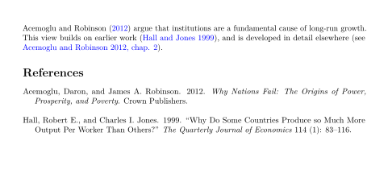](../static/quarto/example.svg "Figure 11.3: Quartoによる引用と文献リスト")

Figure 11.3: Quartoによる引用と文献リスト

これをレンダリングした結果が [Figure fig-quarto-cite](#fig-quarto-cite) です. natbib + `econ-aea` や biblatex-chicago の例とほぼ同じ出力が得られます. `link-citations: true` を入れたため, 本文の引用 (図中の色付き部分) が文献リストへのリンクになっています.

> **NOTE:**
>
> Quarto は引用の処理に [citeproc](https://citeproc-js.readthedocs.io/en/latest/) を使っています. citeproc は, CSL (Citation Style Language) という XML 形式のスタイル定義を読み込み, 文献リストの整形や引用の組版を行う JavaScript ライブラリです. Quarto は citeproc を組み込んでおり, `.bib` ファイルを読み込んで引用を処理します. citeproc は LaTeX のように `.bbl` を生成するわけではなく, 文献リストも本文中の引用も, 組版済みの文字列として直接埋め込みます.
>
> ``` latex
> Acemoglu and Robinson (\citeproc{ref-acemoglu2012}{2012}) argue that
> institutions are a fundamental cause of long-run growth. This view
> builds on earlier work (\citeproc{ref-halljones1999}{Hall and Jones
> 1999}), and is developed in detail elsewhere (see
> \citeproc{ref-acemoglu2012}{Acemoglu and Robinson 2012, chap. 2}).
>
> \section*{References}\label{bibliography}
>
> \begin{CSLReferences}{1}{1}
> \bibitem[\citeproctext]{ref-acemoglu2012}
> Acemoglu, Daron, and James A. Robinson. 2012. \emph{Why Nations Fail:
> The Origins of Power, Prosperity, and Poverty}. Crown Publishers.
>
> \bibitem[\citeproctext]{ref-halljones1999}
> Hall, Robert E., and Charles I. Jones. 1999. {``Why Do Some Countries
> Produce so Much More Output Per Worker Than Others?''} \emph{The
> Quarterly Journal of Economics} 114 (1): 83--116.
> \end{CSLReferences}
> ```
>
> `\citet` や `\bibliography` といったコマンドは一切登場しません. 引用は `\citeproc{ref-acemoglu2012}{...}` の形で, 組版済みの文字列を埋め込みつつ, 対応する文献エントリ (`\bibitem[...]{ref-acemoglu2012}`) へのリンクを張っています (`link-citations: true` の効果です). 文献リストも citeproc が整形したテキストが並ぶだけです. したがって, `natbib` や `biblatex` が走る必要がなく, arXiv に投稿する際も `.bbl` を同包する必要はありません.

### Typst バックエンド

Quarto は PDF を LaTeX ではなく [Typst](https://typst.app/) で組むこともできます (`format: typst`). その既定スタイルは IEEE の番号引用 (\[1\], \[2\] …) なので, 経済学の著者・年方式にするには, `bibliographystyle` に Typst 組み込みのスタイル名 `chicago-author-date` を渡します.

``` yaml
---
bibliography: references.bib
bibliographystyle: chicago-author-date
link-citations: true
format: typst
---
```

[](../static/quarto/example-typst.svg "Figure 11.4: Typst バックエンドでの引用と文献リスト")

Figure 11.4: Typst バックエンドでの引用と文献リスト

本文は [Figure fig-quarto-cite](#fig-quarto-cite) の例と同じです. コンパイルした結果が [Figure fig-quarto-typst](#fig-quarto-typst) で, LaTeX 経由の出力 ([Figure fig-quarto-cite](#fig-quarto-cite)) とほぼ同じ著者・年方式になります (Typstの規定の参考文献のタイトルは “Bibliography” になります).

## 11.4 演習問題

この章の演習は, 文献を Zotero で取り込んでから, それを Quarto の `@` 記法で引用するところまでを, 実際に手を動かして通します. Zotero と Better BibTeX を導入していない場合は, まず本文の手順にそって用意してください.

Zotero を使って, 自分の研究に関係する論文を1本, 書誌情報つきで取り込んでみましょう.

1.  Zotero で練習用のコレクションを1つ作ります.
2.  論文を1本選び, その DOI から Zotero に取り込みます (ブラウザ拡張か, 「新規アイテムを DOI から追加」を使います).
3.  取り込んだ文献のメタデータ (著者名の表記, 年, 雑誌名など) を確認し, 誤りがあれば出版社や CrossRef の情報で修正します.
4.  Better BibTeX が割り当てた citekey (例: `auth.lower + year`) を確認します. これが Quarto で引用するときのキーになります.
5.  コレクションを右クリックし, 「Better BibTeX」形式で `references.bib` としてエクスポートします. 練習用の Quarto プロジェクトのルートに置き, 「Keep updated」も試してみましょう.

取り込んだ文献を, Quarto から引用します. ここでは確実に手順を追えるよう, この章の冒頭に載せた2件のエントリ (`acemoglu2012` と `halljones1999`) を使います. これらを含む `references.bib` を用意し, 地の文に組み込む引用と括弧に入れる引用を1つずつ書いて, 文献リストつきでレンダリングしてください.

> **TIP:**
>
> `example.qmd` のフロントマターで, `references.bib` を読み込むように指定します.
>
> ``` yaml
> ---
> title: 引用の練習
> bibliography: references.bib
> link-citations: true
> format: html
> ---
> ```
>
> 本文では, `@key` を地の文に, `[@key]` を括弧に使います.
>
> ``` markdown
> @acemoglu2012 は, 制度が長期的な成長の根本的な要因だと論じています. この見方は, 初期の研究 [@halljones1999] を踏まえたものです.
> ```
>
> レンダリングすると, 地の文の引用は「Acemoglu and Robinson (2012)」, 括弧の引用は「(Hall and Jones 1999)」となり, 末尾に文献リストが自動で生成されます. スタイルを指定しなければ Chicago 著者・年方式になり, 経済学で標準的な体裁がそのまま得られます. `link-citations: true` を入れたので, 本文の引用から文献リストの該当項目へリンクが張られます. 別のスタイルにしたいときは, フロントマターに `csl: econometrica.csl` のように CSL ファイルを渡します.

[^1]: 別のスタイルにしたいときは `csl` に CSL (Citation Style Language) ファイルを渡します (例: `econometrica.csl`, `the-quarterly-journal-of-economics.csl`; [Zotero Style Repository](https://www.zotero.org/styles) から入手できます). なお AEA/AER 専用の CSL は公式リポジトリには無く, AEA のハウススタイル自体が Chicago 著者・年方式ベースなので, 既定のままで実質 AEA に近い体裁になります. LaTeX の `bibliographystyle` に当たる `bibliography-style` のようなキーは citeproc では使われません.
