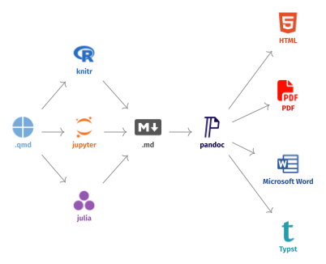

```{r}
#| label: setup
#| include: false
library(dplyr)
library(ggplot2)
library(tinytable)
```

## Quarto とは

{fig-align="center"}

Quartoはプログラミングコードを含んだレポートやスライドを作成するためのツールです. これによって, 研究者が再現可能なドキュメントを簡単に作成できるようになっています. Quartoは, `.qmd` という拡張子のファイルにあるコードを実行し, Markdown (`.md`) 形式のドキュメントを生成します. さらに, [pandoc](https://pandoc.org) というツールを使って, HTMLやPDF, Microsoft Word, Typstなどの様々な形式に変換することができます.

## Markdown 記法

コードの実行については後の章で説明しますが, まずはMarkdown記法について簡単に説明します.

### Heading (見出し)

:::: {.columns}

::: {.column width="49%"}

**Input**

```md
# Heading 1

## Heading 2

### Heading 3
```

:::

::: {.column width="2%"}
:::

::: {.column width="49%"}

**Output**

<h1>Heading 1</h1>

<h2>Heading 2</h2>

<h3>Heading 3</h3>

:::

::::

`#` の個数で見出しのレベルが決まります. HTMLのルールとして, `h1` はそのページのタイトルに使うことが推奨されているため, 通常は `h2` 以降を見出しとして使います. Quartoの場合は, 後に紹介するYAMLフロントマターで指定したタイトルが `h1` として扱われるため, 基本的には `h2` 以降を使ってください.^[論文の場合は, `h1` を節ごとに使うこともありますが, その場合はQuartoが`##` を `h1` に自動で変換するため, 基本的には `##` 以降を見出しとして使うと覚えておくと良いでしょう.]

### 改行とパラグラフ

アカデミックな文章では, 改行は段落の区切りを意味します. Markdownでは, パラグラフを明示的に区切るために, 空行を入れる必要があります. 逆に, markdown上で改行しているだけでは, 出力上では改行されません.

:::: {.columns}

::: {.column width="49%"}

**Input**

```md
吾輩は猫である.
名前はまだない.

どこで生れたかとんと見当がつかぬ.
```

:::

::: {.column width="2%"}
:::


::: {.column width="49%"}

**Output**

吾輩は猫である.
名前はまだない.

どこで生れたかとんと見当がつかぬ.

:::

::::

### 強調

Markdownでは必要最小限の以下の三つの装飾が用意されています.

:::: {.columns}

::: {.column width="49%"}

**Input**

```md
**太字** か __太字__ と書きます.

*斜体* か _斜体_ と書きます.

***太字かつ斜体*** か ___太字かつ斜体___

~~打ち消し線~~ はあまり使いません.
```

:::

::: {.column width="2%"}
:::

::: {.column width="49%"}

**Output**

**太字** か __太字__ と書きます.

*斜体* か _斜体_ と書きます.

***太字かつ斜体*** か ___太字かつ斜体___

~~打ち消し線~~ はあまり使いません.

:::
::::

### リンク

:::: {.columns}

::: {.column width="49%"}

**Input**

```md
[Google](https://google.com) へのリンク
```

:::

::: {.column width="2%"}
:::

::: {.column width="49%"}

**Output**

[Google](https://google.com) へのリンク

:::
::::

### 箇条書き

番号付きでないものは `-` や `*` を使って箇条書きにできます. ネストも可能です.

:::: {.columns}

::: {.column width="49%"}

**Input**

```md
- 項目1
- 項目2
    - 項目2.1
    - 項目2.2
- 項目3
```

:::

::: {.column width="2%"}
:::

::: {.column width="49%"}

**Output**

- 項目1
- 項目2
    - 項目2.1
    - 項目2.2
- 項目3

:::
::::

番号つきのものは, 数字を使います. なお, 全ての行で `1.` と書いても, 出力上では正しい番号になります.

:::: {.columns}

::: {.column width="49%"}

**Input**

```md
1. 項目1
1. 項目2
    1. 項目2.1
    1. 項目2.2
1. 項目3
```

:::

::: {.column width="2%"}
:::

::: {.column width="49%"}

**Output**

1. 項目1
1. 項目2
    1. 項目2.1
    1. 項目2.2
1. 項目3

:::
::::

### 図の挿入

:::: {.columns}

::: {.column width="49%"}

**Input**

```md

```

:::

::: {.column width="2%"}
:::

::: {.column width="49%"}

**Output**


:::
::::

ここでパスという概念が重要になります. Quartoでは, ドキュメントのルートディレクトリを基準にして画像ファイルを指定します. 基本的には, `.qmd` ファイルと同じ階層に `img` というフォルダを作り, そこに画像ファイルを入れるのが一般的です. 例えば, `report.qmd` と同じ階層に `img/hokusai_kanagawa.jpg` というファイルがある場合は, `` と書くことで画像を挿入できます.

### 表の挿入

:::: {.columns}

::: {.column width="49%"}

**Input**

```md
| Default | Left | Right | Center |
|---------|:-----|------:|:------:|
| 12      | 12   |    12 |   12   |
| 123     | 123  |   123 |  123   |

: 表のタイトル
```

:::

::: {.column width="2%"}
:::

::: {.column width="49%"}

**Output**

| Default | Left | Right | Center |
|---------|:-----|------:|:------:|
| 12      | 12   |    12 |   12   |
| 123     | 123  |   123 |  123   |

: 表のタイトル

:::
::::

Markdownでは, `|` と `-` を使って表を作ることができます. さらに, `:` を使うことで, 列の位置を指定することもできます. デフォルトでは, 列は全て左寄せになりますが, `:---` と書くと左寄せ, `---:` と書くと右寄せ, `:---:` と書くと中央寄せになります. GUIツールで表を作ってmarkdwon形式でエクスポートするサービスとして, [Tables Generator](https://www.tablesgenerator.com/markdown_tables) などがあります.

## $\LaTeX$ Math 記法

Markdownでは $\LaTeX$ という組版ソフトの数式記法を使って数式を表現することができます. 数式は, `$...$` で囲むとインライン数式, `$$...$$` で囲むとブロック数式 (改行して中央揃え) になります.

:::: {.columns}

::: {.column width="49%"}

**Input**

```md
$e^{i\pi} + 1 = 0$ は最も美しい数式だ.
```

:::

::: {.column width="2%"}
:::

::: {.column width="49%"}

**Output**

$e^{i\pi} + 1 = 0$ は最も美しい数式だ.

:::
::::

::: {.panel-tabset}

## Input

```md
ラマヌジャンの円周率公式は次の通り:

$$
\frac{1}{\pi}=\frac{2 \sqrt{2}}{99^2}
\sum_{n=0}^{\infty} \frac{(4 n)!}{(n!)^4}
\frac{26390 n+1103}{396^{4 n}}
$$
```

## Output

ラマヌジャンの円周率公式は次の通り:

$$
\frac{1}{\pi}=\frac{2 \sqrt{2}}{99^2} \sum_{n=0}^{\infty} \frac{(4 n)!}{(n!)^4} \frac{26390 n+1103}{396^{4 n}}
$$

:::

## Quarto 記法

ここからは Quarto独自の記法についての説明です. 引用と文献情報については [文献と引用](literature.qmd) の章で説明します.

### Front Matter

```yaml
---
title: タイトル
author: 著者名
date: 2026-04-01
format: typst
---

ここから本文
```

Quartoのドキュメントでは, 冒頭に `---` で囲まれたYAML形式のフロントマターを置くことができます. ここには, ドキュメントのタイトルや著者名, 日付などのメタデータを記述することができます. また, `format` というフィールドで, 出力形式を指定することもできます. 例えば, `format: typst` と書くと, Typst形式で出力されるようになります.

### 相互参照 (Cross Reference)

スライドでは必須ではありませんが, レポートなどを書く場合は, 図表番号や節番号を自動で管理できると便利です. Quartoでは, `fig-xxxx`, `tbl-xxx`, `sec-xxx` などの特別なラベルを貼ることで, それらの番号を自動で管理することができます.


::: {.panel-tabset}

## Input

```md
{#fig-kanagawa}

@fig-kanagawa は葛飾北斎の有名な浮世絵である.
```

## Output

{#fig-kanagawa}

@fig-kanagawa は葛飾北斎の有名な浮世絵である.

:::

::: {.panel-tabset}

## Input

```md
| fruit  | price  |
|--------|--------|
| apple  | 2.05   |
| pear   | 1.37   |
| orange | 3.09   |

: Fruit prices {#tbl-fruit}

@tbl-fruit は果物の値段を表している.
```

## Output

| fruit  | price  |
|--------|--------|
| apple  | 2.05   |
| pear   | 1.37   |
| orange | 3.09   |

: Fruit prices {#tbl-fruit}

@tbl-fruit は果物の値段を表している.

:::

基本的には, 特別な prefix (`fig-`, `tbl-`, `sec-` など) をつけたラベルを `{#label}` という形式で指定し, 本文中では `@label` と書くことで, その要素の番号を自動で参照することができます. その他の要素 (式や命題など) も同様の方法で参照できるので [Quartoのドキュメント](https://quarto.org/docs/authoring/cross-references.html) を参照してください.

## コードの実行

Quartoの最大の特徴は, ドキュメントの中にコードを埋め込んで実行できることです. コードは, ` ```{r} ` で始まり ` ``` ` で終わる コードチャンク (code chunk) の中に書きます. コンパイルのたびにQuartoがそのコードを実行し, コードと結果をドキュメントに挿入します.^[ここでは `{r}` と書いてR言語を使っていますが, `{python}` や `{julia}` に変えれば, それぞれの言語のコードも実行できます. 一つのドキュメントの中で複数の言語を混在させることも可能です.]

```{r}
#| echo: fenced
1 + 1
```

チャンクの冒頭にある `#|` で始まる行は, チャンクオプション (chunk option) です. YAML形式で, そのチャンクの挙動を細かく制御します. 例えば次のチャンクには `label` と `eval` の2つのオプションが付いています.

```{r}
#| label: install-example
#| eval: false
#| echo: fenced
install.packages("ggplot2")
```

`eval: false` を指定しているので, このコードは表示されるだけで実行されません. `install.packages()` のように, コンパイルのたびに走らせたくないコードを載せるときに便利です. 実際, 上のチャンクには結果が表示されていないことを確かめてください. よく使うオプションは次の通りです.

- `label`: チャンクにつける名前. 後述の相互参照で使います.
- `echo`: コード自体を出力に表示するか (`true` / `false`). 結果だけ見せたいときは `false` にします.
- `eval`: コードを実行するか. `false` にすると, 上の例のように, コードは表示されるだけで実行されません.
- `include`: コードも結果も出力に含めるか. `false` にすると, 実行はされますが何も表示されません (パッケージの読み込みなど, 裏方の処理に使います).
- `warning` / `message`: 警告やメッセージを表示するか.

## コードと相互参照

前の「相互参照」の節では, 手で書いた画像やMarkdownの表に番号を振りました. コードが生成する図や表にも, 同じ仕組みがそのまま使えます.

### `ggplot2` による図

コードで生成する図には, チャンクオプションの `#| label:` を `fig-` で始め, `#| fig-cap:` でキャプションを付けます. 図そのものに `{#...}` を付ける必要はありません.

```{r}
#| label: fig-penguins
#| fig-cap: "くちばしの長さとひれの長さの関係"
#| echo: fenced
penguins |>
  ggplot(aes(x = flipper_len, y = bill_len, color = species)) +
  geom_point() +
  labs(
    x = "Flipper length (mm)",
    y = "Bill length (mm)",
    color = "Species"
  )
```

本文で `@fig-penguins` と書くと @fig-penguins のように参照できます. 図番号は出現順に自動で振られるので, 図を増やしたり順番を入れ替えたりしても番号がずれません.

### `tinytable` による表

表も同様に, チャンクラベルを `tbl-` で始め, `#| tbl-cap:` でキャプションを付けます. `tinytable` では `tt(caption = ...)` よりも, このチャンクオプションを使う方が相互参照が確実に効きます.

```{r}
#| label: tbl-penguins
#| tbl-cap: "ペンギンの種類ごとの平均値"
#| echo: fenced
penguins |>
  summarize(
    bill_len = mean(bill_len, na.rm = TRUE),
    flipper_len = mean(flipper_len, na.rm = TRUE),
    .by = species
  ) |>
  tt()
```

本文で `@tbl-penguins` と書くと @tbl-penguins のように参照できます.

## インラインコード

文章の途中に計算結果を埋め込みたいときは, インラインコード (inline code) を使います. バッククォートの中で `r` に続けて式を書くと, コンパイル時にその評価結果が文章に挿入されます.

:::: {.columns}

::: {.column width="49%"}

**Input**

```{r}
#| echo: false
#| results: asis
cat("```md\n円周率はおよそ `r round(pi, 2)` です.\n```\n")
```

:::

::: {.column width="2%"}
:::

::: {.column width="49%"}

**Output**

円周率はおよそ `r round(pi, 2)` です.

:::

::::

数値を直接書く代わりにインラインコードで書いておくと, データが変わっても本文中の数値が自動で更新されます. 例えば「ペンギンのサンプルサイズは `r nrow(penguins)` である」のように書いておけば, データを差し替えたときに数値が追従するので, 書き間違いや更新漏れを防げます.
