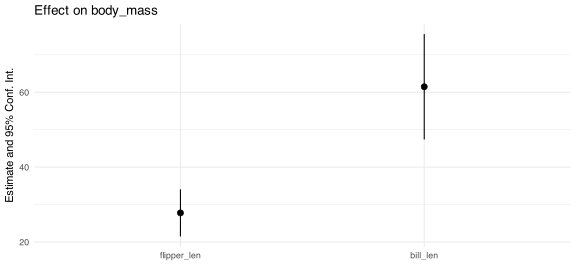
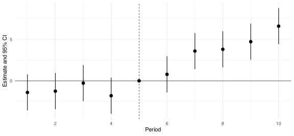
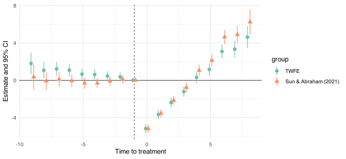

# 9  回帰分析

Code

## 9.1 表

論文や資料に載せる表は, 長らく `kableExtra` や `gt` で作るのが定番でした. しかし近年は, それらより軽量で扱いやすい [`tinytable`](https://vincentarelbundock.github.io/tinytable/) が標準になりつつあります. `tinytable` は base R だけで動く依存ゼロのパッケージでありながら, セルの結合や色付け, 数式の埋め込みといった凝った表現にも対応し, HTML・LaTeX・PDF・Typst のどの形式にも同じコードから書き出せます. 後で紹介する `modelsummary` の回帰表もそのまま `tinytable` のオブジェクトとして返ってくるため, 一度使い方を覚えれば表まわりはこれ一つで完結します.

ここでは R にに同包されている `penguins` データセットを使って, `tinytable` の基本的な使い方を紹介します.

### 基本: `tt()`

`tinytable` の出発点は `tt()` です. データフレーム (`data.frame`, `tibble`) を渡すだけで表になります. まずは種ごとの個体数と, くちばしの長さ・体重の平均をまとめてみましょう.

``` r
penguins_summary <- penguins |>
  summarize(
    n = n(),
    bill_len = mean(bill_len, na.rm = TRUE),
    body_mass = mean(body_mass, na.rm = TRUE),
    .by = species
  )

penguins_summary |>
  tt()
```

| species   | n   | bill_len | body_mass |
|-----------|-----|----------|-----------|
| Adelie    | 152 | 38.79139 | 3700.662  |
| Gentoo    | 124 | 47.50488 | 5076.016  |
| Chinstrap | 68  | 48.83382 | 3733.088  |

Table 9.1: ペンギンの種別の要約統計量

### 数値の整形: `format_tt()`

[Table tbl-penguins-basic](#tbl-penguins-basic) は平均値の桁数がばらばらで読みにくいです. `format_tt()` を使うと, 列を指定して桁数や区切り文字をそろえられます. `j` で対象の列を, `digits` で小数点以下の桁数を, `num_mark_big` で 3 桁ごとの区切り文字を指定します.

``` r
penguins_summary |>
  tt() |>
  format_tt(j = "bill_len", digits = 1, num_fmt = "decimal") |>
  format_tt(
    j = "body_mass",
    digits = 0,
    num_fmt = "decimal",
    num_mark_big = ","
  )
```

| species   | n   | bill_len | body_mass |
|-----------|-----|----------|-----------|
| Adelie    | 152 | 38.8     | 3,701     |
| Gentoo    | 124 | 47.5     | 5,076     |
| Chinstrap | 68  | 48.8     | 3,733     |

Table 9.2: 桁数をそろえた要約統計量

欠損値の扱いも `format_tt()` の仕事です. 集計の途中で生じた `NA` は, 表の上では空白やハイフンに置き換えたいことがほとんどです. その場合は `replace` 引数を使います. 例えば種ごと・島ごとの個体数をクロス集計すると, ペンギンの生息分布には偏りがあるため (Gentoo は Biscoe 島, Chinstrap は Dream 島にしかいません), 観測のない組み合わせが `NA` になります.

``` r
penguins |>
  summarize(n = n(), .by = c(species, island)) |>
  pivot_wider(names_from = island, values_from = n) |>
  tt() |>
  format_tt(replace = "-")
```

| species   | Torgersen | Biscoe | Dream |
|-----------|-----------|--------|-------|
| Adelie    | 52        | 44     | 56    |
| Gentoo    | \-        | 124    | \-    |
| Chinstrap | \-        | \-     | 68    |

Table 9.3: 種と島ごとの個体数

### スタイル: `style_tt()`

見出しを太字にする, 特定の行を強調する, セルに色を付けるといった装飾は `style_tt()` がまとめて引き受けます. 行は `i`, 列は `j` で指定し (`i = 0` はヘッダ行を指します), `bold`・`italic`・`color`・`background` などを組み合わせます. ここでは, 体重が 4000g を超える行に背景色を付けて目立たせてみます. 条件は R 側で計算して `i` に渡すのがポイントです.

``` r
penguins_summary |>
  tt() |>
  format_tt(j = "bill_len", digits = 1, num_fmt = "decimal") |>
  format_tt(
    j = "body_mass",
    digits = 0,
    num_fmt = "decimal",
    num_mark_big = ","
  ) |>
  style_tt(i = 0, bold = TRUE) |>
  style_tt(i = which(penguins_summary$body_mass > 4000), background = "#ffe9b3")
```

| species   | n   | bill_len | body_mass |
|-----------|-----|----------|-----------|
| Adelie    | 152 | 38.8     | 3,701     |
| Gentoo    | 124 | 47.5     | 5,076     |
| Chinstrap | 68  | 48.8     | 3,733     |

Table 9.4: 平均体重が大きい種を強調

### 行と列のグループ化: `group_tt()`

複数の列を一つの見出しでまとめたり (LaTeX の `multicolumn` に相当), 行をカテゴリごとに束ねたり (`multirow` に相当) するのが `group_tt()` です. 列方向のグループは `j` に, 行方向のグループは `i` に, それぞれ名前付きリストで「見出し = 範囲」を渡します.

まず列をまとめてみます. くちばし関連の指標と体格関連の指標を, それぞれ一つの見出しの下に置きます.

``` r
penguins |>
  summarize(
    bill_len = mean(bill_len, na.rm = TRUE),
    bill_dep = mean(bill_dep, na.rm = TRUE),
    flipper_len = mean(flipper_len, na.rm = TRUE),
    body_mass = mean(body_mass, na.rm = TRUE),
    .by = species
  ) |>
  tt() |>
  format_tt(j = 2:5, digits = 1, num_fmt = "decimal") |>
  group_tt(j = list("Bill (mm)" = 2:3, "Body" = 4:5))
```

|           | Bill (mm) |          | Body        |           |
|-----------|-----------|----------|-------------|-----------|
| species   | bill_len  | bill_dep | flipper_len | body_mass |
| Adelie    | 38.8      | 18.3     | 190         | 3700.7    |
| Gentoo    | 47.5      | 15       | 217.2       | 5076      |
| Chinstrap | 48.8      | 18.4     | 195.8       | 3733.1    |

Table 9.5: 指標をグループ化した要約統計量

次に行をまとめます. 性別ごとに種別の平均を並べ, 性別を行の見出しにします. `i` に渡す数値は「その行の直前に見出しを挿入する」位置を表すので, 雌が 1–3 行目, 雄が 4–6 行目なら `list("Female" = 1, "Male" = 4)` とします.

``` r
penguins |>
  filter(!is.na(sex)) |>
  summarize(
    bill_len = mean(bill_len),
    body_mass = mean(body_mass),
    .by = c(sex, species)
  ) |>
  arrange(sex, species) |>
  select(-sex) |>
  tt() |>
  format_tt(j = "bill_len", digits = 1, num_fmt = "decimal") |>
  format_tt(
    j = "body_mass",
    digits = 0,
    num_fmt = "decimal",
    num_mark_big = ","
  ) |>
  group_tt(i = list("Female" = 1, "Male" = 4))
```

| species   | bill_len | body_mass |
|-----------|----------|-----------|
| Female    | Female   | Female    |
| Adelie    | 37.3     | 3,369     |
| Chinstrap | 46.6     | 3,527     |
| Gentoo    | 45.6     | 4,680     |
| Male      | Male     | Male      |
| Adelie    | 40.4     | 4,043     |
| Chinstrap | 51.1     | 3,939     |
| Gentoo    | 49.5     | 5,485     |

Table 9.6: 性別で行をまとめた平均値

### キャプションと脚注

これまでの表ではキャプションを Quarto のチャンクオプション `#| tbl-cap:` で与えていました. こうしておくと番号付けと相互参照 (`@tbl-penguins-basic` のような書き方) が効くので, 文章中から表を参照する場合はこちらを使います. 一方で, 出典や注記を表の下に添えたいときは `tt()` の `notes` 引数を使います.

``` r
penguins_summary |>
  tt(notes = "Source: Palmer Station LTER. body_mass の単位はグラム.") |>
  format_tt(j = "bill_len", digits = 1, num_fmt = "decimal") |>
  format_tt(
    j = "body_mass",
    digits = 0,
    num_fmt = "decimal",
    num_mark_big = ","
  )
```

| species | n | bill_len | body_mass |
|----|----|----|----|
| Adelie | 152 | 38.8 | 3,701 |
| Gentoo | 124 | 47.5 | 5,076 |
| Chinstrap | 68 | 48.8 | 3,733 |
| Source: Palmer Station LTER. body_mass の単位はグラム. |  |  |  |

Table 9.7: 注を付けた表

### セル内の数式

列見出しやセルに数式を入れたいことはよくあります. `tinytable` ではセルの中に LaTeX を `$...$` で書けます. HTML 出力では MathJax で描画されるので, セットアップチャンクで `options(tinytable_html_mathjax = TRUE)` を有効にしておきます (この章の冒頭で設定済みです). 列名を後から付け替えるには `setNames()` を使うのが手軽です.

``` r
penguins_summary |>
  setNames(c(
    "Species",
    "$n$",
    "$\\bar{x}_{\\mathrm{bill}}$",
    "$\\bar{x}_{\\mathrm{mass}}$"
  )) |>
  tt() |>
  format_tt(j = 3, digits = 1, num_fmt = "decimal") |>
  format_tt(j = 4, digits = 0, num_fmt = "decimal", num_mark_big = ",")
```

| Species   | \$n\$ | \$\bar{x}\_{\mathrm{bill}}\$ | \$\bar{x}\_{\mathrm{mass}}\$ |
|-----------|-------|------------------------------|------------------------------|
| Adelie    | 152   | 38.8                         | 3,701                        |
| Gentoo    | 124   | 47.5                         | 5,076                        |
| Chinstrap | 68    | 48.8                         | 3,733                        |

Table 9.8: 列見出しに数式を使った表

### 出力形式とエクスポート

ここまで作った表は, Quarto上でレンダリングする文書の形式 (HTML / PDF / Typst) に合わせて `tinytable` が自動的に適切な出力へ変換してくれます. 同じコードがどの形式でも通用するのが `tinytable` の大きな利点です. 表を単体のファイルとして書き出したいときは `save_tt()` を使い, 拡張子から形式を判断させます (例: `save_tt("table.tex")` で LaTeX, `save_tt("table.png")` で画像). LaTeX 文書に貼り付けるためにスタイルを落とした素の `tabular` が欲しい場合は, 保存前に `theme_tt("tabular")` を挟みます.

## 9.2 回帰分析

R で回帰分析を行う方法は数えきれないほどあります. 標準誤差の頑健化には `sandwich` や `estimatr`, 高次元固定効果には `lfe`, 操作変数法には `AER`, 限界効果には `margins` や `mfx`, と用途ごとに別々のパッケージを覚えるのが従来の常識でした. しかし結論から言えば, いまや applied micro の実証で必要になる推定のほとんどは `fixest` ひとつでまかなえます. この節では `lm()` を出発点に, なぜ `fixest` だけ覚えればよいのか, そしてその使い方を見ていきます. 引き続き `penguins` データセットを使い, ペンギンの体重 (`body_mass`) を体格から説明する回帰を例にします.

### `lm()` による回帰

最も基本的な回帰は `lm()` です. 第一引数に `y ~ x1 + x2` という formula を, `data` に元データを渡します. 皆さんの多くはすでに使ったことがあるはずなので, ここでは formula 記法だけ手短に復習します.

``` r
fit_lm <- lm(body_mass ~ flipper_len + bill_len + species, data = penguins)
summary(fit_lm)
## 
## Call:
## lm(formula = body_mass ~ flipper_len + bill_len + species, data = penguins)
## 
## Residuals:
##     Min      1Q  Median      3Q     Max 
## -808.83 -230.35  -26.16  223.18 1050.37 
## 
## Coefficients:
##                   Estimate Std. Error t value Pr(>|t|)    
## (Intercept)      -3904.387    529.257  -7.377 1.27e-12 ***
## flipper_len         27.429      3.176   8.638 2.34e-16 ***
## bill_len            61.736      7.126   8.664  < 2e-16 ***
## speciesChinstrap  -748.562     81.534  -9.181  < 2e-16 ***
## speciesGentoo       90.435     88.647   1.020    0.308    
## ---
## Signif. codes:  0 '***' 0.001 '**' 0.01 '*' 0.05 '.' 0.1 ' ' 1
## 
## Residual standard error: 340.1 on 337 degrees of freedom
##   (2 observations deleted due to missingness)
## Multiple R-squared:  0.8222, Adjusted R-squared:  0.8201 
## F-statistic: 389.7 on 4 and 337 DF,  p-value: < 2.2e-16
```

formula の中ではいくつかの演算子が特別な意味を持ちます. 押さえておきたいのは次の 4 つです.

- `x1:x2` は交互作用項だけを, `x1 * x2` は主効果と交互作用項の両方 (`x1 + x2 + x1:x2`) を展開します.
- `as.factor(x)` や文字列・factor 型の変数は, 自動的にダミー変数に展開されます (上の例の `species` がそれです).
- `log(x)` や `poly(x, 2)` のように, formula の中で関数変換をそのまま書けます.
- `I(x^2)` のように, 算術演算をそのまま使いたいときは `I()` で囲みます.

例えば「フリッパー長の効果が種によって異なる」モデルは `flipper_len * species` と書けます.

``` r
lm(body_mass ~ flipper_len * species, data = penguins) |>
  coef()
##                  (Intercept)                  flipper_len 
##                 -2535.836802                    32.831690 
##             speciesChinstrap                speciesGentoo 
##                  -501.358972                 -4251.443811 
## flipper_len:speciesChinstrap    flipper_len:speciesGentoo 
##                     1.741704                    21.790812
```

### パッケージは `fixest` だけでよい

`lm()` は手軽ですが, 実証で必要になる頑健標準誤差・クラスター標準誤差・高次元固定効果・操作変数法・非線形モデルには対応していません. これらを補うために従来は用途ごとのパッケージを使い分けていましたが, [`fixest`](https://lrberge.github.io/fixest/) はそのすべてを単一の統一的なインターフェースで提供します. 対応関係を整理すると次のようになります.

| やりたいこと | 従来のパッケージ | `fixest` での書き方 |
|----|----|----|
| Robust SE | `estimatr`, `sandwich` | `feols(..., vcov = "hetero")` |
| Clustered SE | `estimatr`, `sandwich` | `feols(..., vcov = ~ id)` |
| 高次元固定効果 | `lfe::felm` | `feols(y ~ x \| fe1 + fe2)` |
| 操作変数法 (2SLS) | `AER::ivreg` | `feols(y ~ x \| fe \| d ~ z)` |
| ロジット・ポアソン | `glm` | `feglm()`, `fepois()` |
| イベントスタディ | (専用実装が必要) | `feols(y ~ i(t, treat))` + `iplot()` |

機能が豊富なだけではありません. `fixest` は固定効果の吸収アルゴリズムが非常に高速で, 同じ高次元固定効果モデルを `lfe` や Stata の `reghdfe` より速く推定できることがベンチマークで示されています[^1]. 数千万行規模のパネルでもストレスなく回せるため, 速度の面でも `fixest` を選ばない理由はほとんどありません.

### `fixest` の使い方

中心となる関数は `feols()` (線形回帰) です. 基本の書き方は `lm()` とほぼ同じで, formula に縦棒 `|` を加えると, その後ろに書いた変数を固定効果として吸収します. ここでは種 (`species`) と島 (`island`) を固定効果に入れてみます.

``` r
m_fe <- feols(
  body_mass ~ flipper_len + bill_len | species + island,
  data = penguins
)
m_fe
## OLS estimation, Dep. Var.: body_mass
## Observations: 342
## Fixed-effects: species: 3,  island: 3
## Standard-errors: IID 
##             Estimate Std. Error t value   Pr(>|t|)    
## flipper_len  27.7626     3.1996 8.67688  < 2.2e-16 ***
## bill_len     61.4634     7.1547 8.59063 3.3287e-16 ***
## ---
## Signif. codes:  0 '***' 0.001 '**' 0.01 '*' 0.05 '.' 0.1 ' ' 1
## RMSE: 337.1     Adj. R2: 0.819624
##               Within R2: 0.463456
```

出力の標準誤差に注目してください. `fixest` は固定効果モデルでは, 既定で最初の固定効果 (ここでは `species`) でクラスタリングした標準誤差を返します. 標準誤差の種類は `vcov` 引数で明示的に切り替えられます. 推定し直さずに `summary()` で変えることもできます.

``` r
# Heteroskedasticity-robust (HC1)
feols(body_mass ~ flipper_len | species, data = penguins, vcov = "hetero")
## OLS estimation, Dep. Var.: body_mass
## Observations: 342
## Fixed-effects: species: 3
## Standard-errors: Heteroskedasticity-robust 
##             Estimate Std. Error t value  Pr(>|t|)    
## flipper_len  40.7054    2.87211 14.1727 < 2.2e-16 ***
## ---
## Signif. codes:  0 '***' 0.001 '**' 0.01 '*' 0.05 '.' 0.1 ' ' 1
## RMSE: 373.3     Adj. R2: 0.780719
##               Within R2: 0.342011

# Clustered on island
feols(body_mass ~ flipper_len | species, data = penguins, vcov = ~island)
## OLS estimation, Dep. Var.: body_mass
## Observations: 342
## Fixed-effects: species: 3
## Standard-errors: Clustered (island) 
##             Estimate Std. Error t value Pr(>|t|)    
## flipper_len  40.7054    6.51467 6.24826  0.02467 *  
## ---
## Signif. codes:  0 '***' 0.001 '**' 0.01 '*' 0.05 '.' 0.1 ' ' 1
## RMSE: 373.3     Adj. R2: 0.780719
##               Within R2: 0.342011
```

操作変数法も同じ関数で書けます. formula の末尾に `| 内生変数 ~ 操作変数` を足すだけです (固定効果と併用する場合は `y ~ 外生変数 | 固定効果 | 内生変数 ~ 操作変数` の順). 非線形モデルは `feglm()` (一般化線形モデル) と `fepois()` (ポアソン回帰) が担当し, 引数は `glm()` とほぼ同じです.

``` r
# Logit: probability of being male
pen <- penguins |>
  filter(!is.na(sex)) |>
  mutate(is_male = as.integer(sex == "male"))

feglm(is_male ~ body_mass + bill_len | species, data = pen, family = binomial)
## GLM estimation, family = binomial, Dep. Var.: is_male
## Observations: 333
## Fixed-effects: species: 3
## Standard-errors: IID 
##           Estimate Std. Error z value   Pr(>|z|)    
## body_mass 0.007056   0.000970 7.27537 3.4547e-13 ***
## bill_len  0.642816   0.113466 5.66528 1.4678e-08 ***
## ---
## Signif. codes:  0 '***' 0.001 '**' 0.01 '*' 0.05 '.' 0.1 ' ' 1
## Log-Likelihood: -81.9   Adj. Pseudo R2: 0.627859
##            BIC: 192.8     Squared Cor.: 0.694077
```

推定したモデルをコンソールで手早く見比べたいだけなら, `fixest` 組み込みの `etable()` が便利です. 論文や資料に載せるきれいな回帰表は, 次の節で `modelsummary` を使って作ります.

### 回帰表を整える: `modelsummary`

複数のモデルを並べた回帰表は, 前節の `tinytable` がバックエンドの [`modelsummary`](https://modelsummary.com/) で作ります. 推定結果のリストを渡すだけで表になり, `output = "tinytable"` を指定すれば「表」の節で紹介したスタイリングがそのまま使えます. まずは何の加工もしていない既定の出力です.

``` r
models <- list(
  "(1)" = feols(body_mass ~ flipper_len + bill_len, data = penguins),
  "(2)" = feols(
    body_mass ~ flipper_len + bill_len,
    data = penguins,
    vcov = "hetero"
  ),
  "(3)" = feols(
    body_mass ~ flipper_len + bill_len | species,
    data = penguins
  ),
  "(4)" = feols(
    body_mass ~ flipper_len + bill_len | species + island,
    data = penguins
  )
)

modelsummary(models)
```

|                | \(1\)     | \(2\)     | \(3\)   | \(4\)   |
|----------------|-----------|-----------|---------|---------|
| (Intercept)    | -5736.897 | -5736.897 |         |         |
|                | (307.959) | (291.797) |         |         |
| flipper_len    | 48.145    | 48.145    | 27.429  | 27.763  |
|                | (2.011)   | (1.864)   | (3.176) | (3.200) |
| bill_len       | 6.047     | 6.047     | 61.736  | 61.463  |
|                | (5.180)   | (4.888)   | (7.126) | (7.155) |
| Num.Obs.       | 342       | 342       | 342     | 342     |
| R2             | 0.760     | 0.760     | 0.822   | 0.823   |
| R2 Adj.        | 0.759     | 0.759     | 0.820   | 0.820   |
| R2 Within      |           |           | 0.462   | 0.463   |
| R2 Within Adj. |           |           | 0.459   | 0.460   |
| AIC            | 5061.5    | 5061.5    | 4962.7  | 4965.7  |
| BIC            | 5073.0    | 5073.0    | 4981.9  | 4992.5  |
| RMSE           | 392.34    | 392.34    | 337.62  | 337.09  |
| FE: species    |           |           | X       | X       |
| FE: island     |           |           |         | X       |

Table 9.9: modelsummary の既定の出力

既定の表は変数名がそのまま並び, 統計量も載りすぎて雑然としています. 論文用に仕上げるには, 主に次の 3 つの引数を使います.

- `coef_map`: 表示する係数の選択・並べ替え・改名を, 名前付きベクトルで一度に行います. ここに挙げた係数だけが, 指定した順で表示されます.
- `gof_map`: 表の下部に並ぶ適合度統計量 (goodness-of-fit) を選んで改名します. `raw` (内部名)・`clean` (表示名)・`fmt` (小数桁数) の 3 列を持つ `tibble` で渡すのが柔軟です. 固定効果の有無を示す行 (`FE: species` など) もここで改名できます.
- `stars`: 有意水準のアスタリスクを定義します.

これらを適用したのが次の表です. さらに `modelsummary` の返り値は `tinytable` オブジェクトなので, `group_tt()` を継ぎ足してモデルをグループ分けする見出し (column spanner) を付けられます.

``` r
cm <- c(
  "flipper_len" = "Flipper length",
  "bill_len" = "Bill length"
)

gm <- tibble(
  raw = c("FE: species", "FE: island", "nobs", "r2.within"),
  clean = c("FE: Species", "FE: Island", "Observations", "Within R2"),
  fmt = c(0, 0, 0, 3)
)

modelsummary(
  models,
  output = "tinytable",
  stars = c("*" = .1, "**" = .05, "***" = .01),
  coef_map = cm,
  gof_map = gm
) |>
  group_tt(j = list("Pooled OLS" = 2:3, "Fixed effects" = 4:5))
```

|  | Pooled OLS |  | Fixed effects |  |
|----|----|----|----|----|
|  | \(1\) | \(2\) | \(3\) | \(4\) |
| Flipper length | 48.145\*\*\* | 48.145\*\*\* | 27.429\*\*\* | 27.763\*\*\* |
|  | (2.011) | (1.864) | (3.176) | (3.200) |
| Bill length | 6.047 | 6.047 | 61.736\*\*\* | 61.463\*\*\* |
|  | (5.180) | (4.888) | (7.126) | (7.155) |
| FE: Species |  |  | X | X |
| FE: Island |  |  |  | X |
| Observations | 342 | 342 | 342 | 342 |
| Within R2 |  |  | 0.462 | 0.463 |
| \* p \< 0.1, \*\* p \< 0.05, \*\*\* p \< 0.01 |  |  |  |  |

Table 9.10: 標準誤差と固定効果を変えた回帰の比較

LaTeX 文書に貼り付けたい場合は, 「表」の節で触れたように `theme_tt("tabular")` を挟んでから `save_tt("table_reg.tex")` で書き出します. 同じ回帰表のコードから HTML でも PDF でも同じ表が得られるのが, `tinytable` ベースで作ることの利点です.

### 係数のプロット: `ggfixest`

回帰係数を点と区間で並べた係数プロットは, 表よりも一目で大小と有意性が伝わります. `fixest` には `coefplot()` / `iplot()` という作図関数が組み込まれていますが, これらは base R グラフィックスを使うため `ggplot2` との相性がよくありません. そこで [`ggfixest`](https://grantmcdermott.com/ggfixest/) を使うと, 同じものを `ggplot` オブジェクトとして描けます (`ggcoefplot()` と `ggiplot()`).

``` r
ggcoefplot(m_fe) +
  theme_minimal()
```

[](regression_files/figure-html/fig-coefplot-1.svg "Figure 9.1: Coefficient plot for the two-way fixed-effects model.")

Figure 9.1: Coefficient plot for the two-way fixed-effects model.

`ggfixest` が特に活躍するのがイベントスタディです. `fixest` では formula の中に `i(time, treat, ref)` と書くと, 処置群について時点ごとの交互作用項 (= イベントスタディの係数) が一括で作られます. `ref` で基準時点を指定します. ここでは `fixest` に同梱されている擬似的な差分の差分 (difference-in-differences) データ `base_did` を使います.

``` r
data(base_did, package = "fixest")

est_did <- feols(
  y ~ x1 + i(period, treat, ref = 5) | id + period,
  data = base_did
)

ggiplot(est_did) +
  labs(x = "Period", y = "Estimate and 95% CI", title = NULL) +
  theme_minimal()
```

[](regression_files/figure-html/fig-event-study-1.svg "Figure 9.2: Event-study estimates around treatment (reference period = 5).")

Figure 9.2: Event-study estimates around treatment (reference period = 5).

処置が時点によってずれて始まる staggered な設定では, 単純な二元配置固定効果推定が誤った推定値を与えうることが知られています ([Sun and Abraham 2021](#ref-sun2021)). その場合は `i()` の代わりに `sunab()` を使うと, Sun and Abraham ([2021](#ref-sun2021)) の補正済み推定量がそのまま得られ, `ggiplot()` で同じように描けます.

## 9.3 演習問題

前半は理解度チェックのクイズ, 後半は回帰表とイベントスタディを実際に作る演習です. クイズは選択肢をクリックすると, その場で正誤が表示されます.

### クイズ

`lm(y ~ x1 * x2, data = df)` の formula は, どのように展開されるでしょうか.

x1 + x2 + x1:x2 (主効果と交互作用の両方)  
I(x1 \* x2) と同じ (積を1つの変数として扱う)  
x1:x2 (交互作用のみ)  
x1 + x2 (主効果のみ)  

`feols(body_mass ~ flipper_len | species + island, data = penguins)` が既定で返す標準誤差はどれでしょうか.

不均一分散に頑健な標準誤差  
species でクラスタリングした標準誤差  
通常の (iid を仮定した) 標準誤差  
species と island の two-way クラスター標準誤差  

賃金 (wage) を経験年数 (exper) と教育年数 (educ) に回帰します. educ は内生なので距離 (dist) を操作変数とし, 地域固定効果 (region) を入れます. `fixest` での正しい書き方はどれでしょうか.

feols(wage ~ exper \| region \| educ ~ dist, data = df)  
feols(wage ~ exper + educ ~ dist \| region, data = df)  
feols(wage ~ exper \| educ ~ dist \| region, data = df)  
feols(wage ~ exper + dist \| region, data = df)  

処置の開始時期が個体によって異なる (staggered) DiD では, `i()` を使った素朴な二元配置固定効果 (TWFE) のイベントスタディが誤った推定値を与えることがあります. 主な理由はどれでしょうか.

処置群のサンプルサイズが時点ごとに変わるから  
処置効果が異質だと, すでに処置を受けた個体が実質的な比較対象に混ざってしまうから  
クラスター標準誤差が正しく計算できなくなるから  
固定効果の数が多すぎて自由度が足りなくなるから  

### 回帰表の仕上げ

次の4本のモデルを推定します. このコードはそのまま使ってください.

``` r
models_ex <- list(
  "(1)" = feols(body_mass ~ flipper_len + bill_len, data = penguins),
  "(2)" = feols(
    body_mass ~ flipper_len + bill_len,
    data = penguins,
    vcov = "hetero"
  ),
  "(3)" = feols(
    body_mass ~ flipper_len + bill_len | species,
    data = penguins
  ),
  "(4)" = feols(
    body_mass ~ flipper_len + bill_len | species + island,
    data = penguins,
    vcov = ~island
  )
)
```

この4本を `modelsummary` で整形して, 下の [Table tbl-exercise-target](#tbl-exercise-target) とまったく同じ表を作るのが課題です.

|  | Pooled OLS |  | Fixed effects |  |
|----|----|----|----|----|
|  | \(1\) | \(2\) | \(3\) | \(4\) |
| Flipper length (mm) | 48.145\*\*\* | 48.145\*\*\* | 27.429\*\*\* | 27.763\*\* |
|  | (2.011) | (1.864) | (3.176) | (2.801) |
| Bill length (mm) | 6.047 | 6.047 | 61.736\*\*\* | 61.463\*\* |
|  | (5.180) | (4.888) | (7.126) | (8.074) |
| FE: Species |  |  | X | X |
| FE: Island |  |  |  | X |
| Observations | 342 | 342 | 342 | 342 |
| Within R2 |  |  | 0.462 | 0.463 |
| \* p \< 0.1, \*\* p \< 0.05, \*\*\* p \< 0.01 |  |  |  |  |

Table 9.11: 完成形の回帰表 (これを再現する)

[Table tbl-exercise-target](#tbl-exercise-target) を再現してください. 使うのは `coef_map`, `gof_map`, `stars` の3つの引数と, `tinytable` の `group_tt()` です. モデル (1) と (2), (3) と (4) は係数が同じで, 括弧内の標準誤差だけが違う点にも注目してください.

> **TIP:**
>
> ``` r
> cm_ex <- c(
>   "flipper_len" = "Flipper length (mm)",
>   "bill_len" = "Bill length (mm)"
> )
>
> gm_ex <- tibble(
>   raw = c("FE: species", "FE: island", "nobs", "r2.within"),
>   clean = c("FE: Species", "FE: Island", "Observations", "Within R2"),
>   fmt = c(0, 0, 0, 3)
> )
>
> modelsummary(
>   models_ex,
>   output = "tinytable",
>   stars = c("*" = .1, "**" = .05, "***" = .01),
>   coef_map = cm_ex,
>   gof_map = gm_ex
> ) |>
>   group_tt(j = list("Pooled OLS" = 2:3, "Fixed effects" = 4:5))
> ```
>
> |  | Pooled OLS |  | Fixed effects |  |
> |----|----|----|----|----|
> |  | \(1\) | \(2\) | \(3\) | \(4\) |
> | Flipper length (mm) | 48.145\*\*\* | 48.145\*\*\* | 27.429\*\*\* | 27.763\*\* |
> |  | (2.011) | (1.864) | (3.176) | (2.801) |
> | Bill length (mm) | 6.047 | 6.047 | 61.736\*\*\* | 61.463\*\* |
> |  | (5.180) | (4.888) | (7.126) | (8.074) |
> | FE: Species |  |  | X | X |
> | FE: Island |  |  |  | X |
> | Observations | 342 | 342 | 342 | 342 |
> | Within R2 |  |  | 0.462 | 0.463 |
> | \* p \< 0.1, \*\* p \< 0.05, \*\*\* p \< 0.01 |  |  |  |  |
>
> ポイントは次の3つです.
>
> - `coef_map` に挙げた係数だけが, 指定した順序と名前で表示されます (切片は自動的に落ちます).
> - `gof_map` は `raw`, `clean`, `fmt` の3列の tibble で渡します. ここに挙げた統計量だけが表示されるので, 既定の雑然とした統計量の一覧がすっきりします.
> - `modelsummary` の返り値は `tinytable` オブジェクトなので, `group_tt()` をパイプで継ぎ足すだけで column spanner を付けられます.

### Staggered な処置のイベントスタディ

本文のイベントスタディで使った `base_did` は, 処置群の全員が同じ時点で処置を受けるデータでした. `fixest` にはもう一つ, 処置の開始年が個体ごとに異なる staggered 設定の擬似データ `base_stagg` が同梱されています. 処置を一度も受けない個体は `year_treated = 10000` (したがって `time_to_treatment = -1000`) と記録されています.

``` r
data(base_stagg, package = "fixest")
head(base_stagg)
```

`base_stagg` を使って, 次の2通りのイベントスタディを推定し, `ggiplot()` で1つの図に重ねて比較してください. 固定効果はどちらも `id` と `year` です.

1.  素朴な TWFE: `i(time_to_treatment, ...)` を使う. 基準時点の `-1` に加えて, never-treated 群を表す `-1000` も `ref` に入れる必要があります.
2.  Sun and Abraham ([2021](#ref-sun2021)) の補正: `sunab(year_treated, year)` を使う.

2つの推定値はどこで乖離するでしょうか. クイズで問うた「素朴な TWFE の問題」が図にどう表れているか確認してください.

> **TIP:**
>
> ``` r
> es_twfe <- feols(
>   y ~ x1 + i(time_to_treatment, ref = c(-1, -1000)) | id + year,
>   data = base_stagg
> )
>
> es_sunab <- feols(
>   y ~ x1 + sunab(year_treated, year) | id + year,
>   data = base_stagg
> )
>
> ggiplot(
>   list("TWFE" = es_twfe, "Sun & Abraham (2021)" = es_sunab),
>   ref.line = -1
> ) +
>   labs(x = "Time to treatment", y = "Estimate and 95% CI", title = NULL) +
>   theme_minimal()
> ```
>
> [](regression_files/figure-html/fig-exercise-es-solution-1.svg "Figure 9.3: Event-study estimates on staggered data: naive TWFE versus Sun and Abraham (2021).")
>
> Figure 9.3: Event-study estimates on staggered data: naive TWFE versus Sun and Abraham (2021).
>
> `base_stagg` は処置効果がコホートと経過時間で異なるように作られているため, 素朴な TWFE の係数は Sun and Abraham の補正済み推定量から乖離します. 処置前の係数もゼロから外れており, 実際にはプレトレンドがないのに「あるように見える」推定値が出てしまう点に注目してください. `sunab()` は書き方を1行変えるだけなので, staggered な設定ではまずこちらを既定にするのが安全です.

Bergé, Laurent R., Kyle Butts, and Grant McDermott. 2026. *Fixest: A Fast and Feature-Rich Framework for Econometric Estimations in R*. arXiv:2601.21749. arXiv. <https://doi.org/10.48550/arXiv.2601.21749>.

Sun, Liyang, and Sarah Abraham. 2021. “Estimating Dynamic Treatment Effects in Event Studies with Heterogeneous Treatment Effects.” *Journal of Econometrics* 225 (2): 175–99. <https://doi.org/10.1016/j.jeconom.2020.09.006>.

[^1]: ベンチマークは `fixest` の公式ドキュメント ([Benchmarking](https://lrberge.github.io/fixest/articles/fixest_walkthrough.html)) と Bergé et al. ([2026](#ref-berge2026)) を参照してください.
