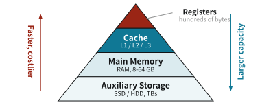
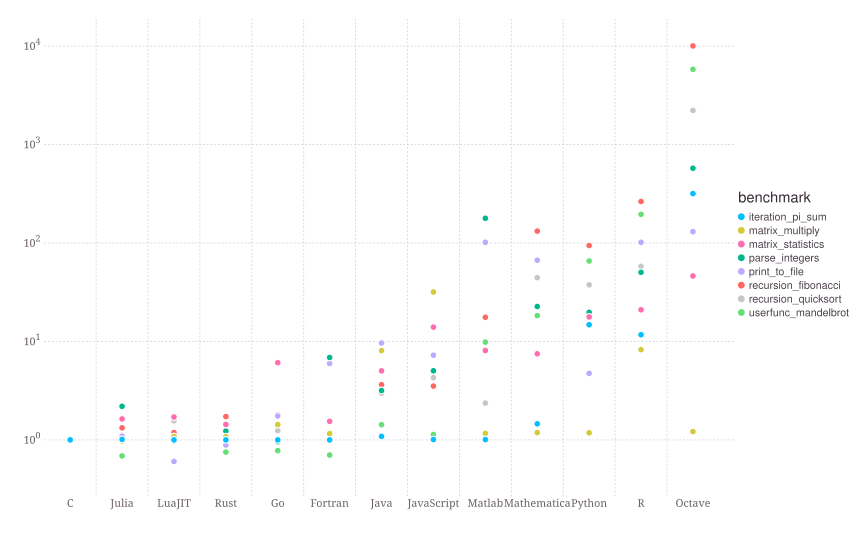

# 4  高速化

Code

## 4.1 計算量

アルゴリズムの効率性を評価する尺度として, 計算時間とメモリ使用量があります. ここでいう計算時間とは, アルゴリズムが終了するまでにかかるステップ数 (**時間計算量**, time complexity) のことをいい, 実際のPC上での実行時間とは異なります. より高いスペックのPCを使えば, 同じアルゴリズムでも実行時間は短くなる一方で, ステップ数の次元が異なるアルゴリズムはマシンの性能に関わらず効率的と言えます. また, メモリ使用量とはアルゴリズムが終了するまでに必要なメモリの量 (**領域計算量**, space complexity) のことをいいます.

### 時間計算量

時間計算量は, 入力の大きさ \\n\\ に対するステップ数 \\T(n)\\ の関数として表されます. 例えば, 配列の要素数が \\n\\ のときに, すべての要素を1回ずつ見るアルゴリズムは, \\T(n) = n\\ となります. また, 2重ループで配列のすべての組み合わせを調べるアルゴリズムは, \\T(n) = n^2\\ となります. このように, アルゴリズムの時間計算量は, 入力の大きさに対するステップ数の増加率によって特徴づけられます.

時間計算量を評価する際, 重要なのは支配的な項の次元数になります. 例えば, \\T(n) = 3n^2 + 2n + 1\\ の場合, \\n\\ が大きくなると \\3n^2\\ の項が支配的になるため, \\n^2\\ に着目すれば十分です. この考え方に従ったとき, 計算量を \\O(n^2)\\ と表記します. より厳密に表現すると以下のようになります.

> **NOTE:**
>
> \\f(n)\\ が \\O(g(n))\\ とは, 任意の \\n \ge 0\\ に対して, ある定数 \\C \> 0\\ が存在して, 以下の不等式が成り立つことをいう.
>
> \\ \|f(n)\| \le C \|g(n)\|. \\

定量モデルで気にする必要があるのは, ほとんどの場合, グリッド数によるオーダーです. 例えば, \\V(k, z)\\ のような2次元の価値関数をグリッド上で計算する場合, \\k\\ のグリッド数 \\n_k\\ と \\z\\ のグリッド数 \\n_z\\ に対して, 計算量は \\n_k n_z\\ の関数となります.

### 領域計算量

領域計算量は, アルゴリズムが終了するまでに必要なメモリの量を, 入力の大きさ \\n\\ に対する関数として表します. 例えば, 配列の要素数が \\n\\ のときに, すべての要素を保存するアルゴリズムは, 領域計算量が \\O(n)\\ となります. また, 2次元配列を保存するアルゴリズムは, 領域計算量が \\O(n^2)\\ となります.

**メモリのヒエラルキー**

なぜメモリの使用量が重要なのでしょうか. 近年のPCは何百GBもの容量があるし, いくら使おうと問題ではないのではないか, と思うかもしれません. しかし, 実際には, メモリのヒエラルキー (memory hierarchy) によって, メモリの速度と容量が大きく異なります.

一般に, 高速なメモリは高価であるため搭載量が少なく, 低速なメモリは安価であるため搭載量が多いです. それらを合わせると, [Figure fig-memory-hierarchy](#fig-memory-hierarchy) のようなピラミッド型のヒエラルキーが形成されます.

[](../static/cetz/memory-hierarchy.svg "Figure 4.1: メモリのヒエラルキー. 上にいくほど高速だが容量は小さい.")

Figure 4.1: メモリのヒエラルキー. 上にいくほど高速だが容量は小さい.

- レジスタ (Registers): CPU内部にある最も高速なメモリ
- キャッシュ (Cache): (近年では) CPU内部にある高速なメモリ. L1, L2, L3 などのレベルがある. ここまでCPU内部にある.
- 主記憶 (Main Memory): RAM (Random Access Memory)
- 補助記憶 (Auxiliary Storage): SSD (Solid State Drive) やHDD (Hard Disk Drive)

たとえば, AMDの [Ryzen 5 9600](https://www.amd.com/en/products/processors/desktops/ryzen/9000-series/amd-ryzen-5-9600.html) (Zen 5世代) の場合, L1キャッシュは480KB, L2キャッシュは6MB, L3キャッシュは32MBです. レジスタはサイズで表現することはあまりありませんが, ざっくり数百B程度と考えてください. 一方で, 一般にメモリと呼ばれる RAM は8GBから64GB 程度が一般的です. さらに, 一般にストレージとよばれるSSDやHDDは数百GBから数TBの容量があります.

各層は容量だけでなく速度も桁違いに異なります. CPU がレジスタやキャッシュ上のデータを読むのは数クロックで済む一方, RAM へのアクセスはその数十倍から数百倍かかり, SSD ではさらに桁が変わります. そのため, アルゴリズムが繰り返し参照するデータ (作業セット) がキャッシュに収まるかどうかで, たとえ計算回数が同じでも実行時間は大きく変わります. とくに連続したアドレスを順にたどるアクセスは, CPU が先読みしてまとめてキャッシュに載せられるため高速で, 逆に飛び飛びのアクセスはキャッシュミスを頻発させ, そのたびに低速な RAM を待つことになります. この「メモリ上での近さ」を局所性 (locality) と呼び, 後のベクトル化が速い理由の一つも, データが連続したメモリに並んでこの局所性を活かせる点にあります.

## 4.2 計算量の実践

実際の推定を例に, 計算量を測定してみましょう. ここでは処置効果の推定で広く使われる**最近傍マッチング** (nearest-neighbor matching) を考えます. 処置群の各個体について, 共変量 \\x\\ (傾向スコアなど) が最も近い対照群の個体を1人見つけ, その個体を対応させることで ATT を推定する方法です.

**最近傍マッチング**

処置群を \\n_t\\ 人, 対照群を \\n_c\\ 人とします. ナイーブに実装すると, 処置群の各個体について対照群の全員との距離を計算し, 最も近い個体を探すことになります. コードで表すと次の `match_nn` 関数のようになります.

``` r
match_nn <- function(n_t, n_c, seed = 42L) {
  set.seed(seed)
  x_t <- rnorm(n_t) # covariate of treated units
  x_c <- rnorm(n_c) # covariate of control units

  matched <- integer(n_t)
  for (i in 1:n_t) {
    best_dist <- Inf
    best_j <- 0L
    for (j in 1:n_c) {
      d <- abs(x_t[i] - x_c[j])

      if (d < best_dist) {
        best_dist <- d
        best_j <- j
      }
    }

    matched[i] <- best_j
  }

  matched
}
```

時間計算量の数え方として, 四則演算, 比較 (`<` など), 代入, 配列へのアクセスは \\O(1)\\ とします. すると, 計算回数の主要部は二重ループ, つまり \\O(n_t n_c)\\ です. 以下では簡単のため \\n_t = n_c = n\\ とするので, 時間計算量は \\O(n^2)\\ になります. 一方で保存しているのはマッチング結果 `matched` (長さ \\n_t\\) と共変量ベクトルだけなので, 領域計算量は \\O(n)\\ です. では, \\n\\ を変化させたときの計算時間を測定してみましょう.

**bench パッケージ**

Rでは, `bench` パッケージを使うと実際の計算時間を測定できます.[^1]

``` r
bm <- bench::mark(
  "n = 100" = match_nn(100L, 100L),
  "n = 1000" = match_nn(1000L, 1000L),
  check = FALSE,
  filter_gc = FALSE
)
```

| \$n\$ | 中央値 (ms) | メモリ  |
|-------|-------------|---------|
| 100   | 0.9         | 2.1 KB  |
| 1000  | 87.2        | 19.7 KB |

Table 4.1: 観測数を変えたときのマッチングの計算時間とメモリ使用量

\\n\\ を 100 から 1000 へ 10 倍にすると, 計算時間は約 98 倍になる一方で, メモリ使用量は約 9 倍にしかなっていないことがわかります. これは, 計算時間が \\O(n^2)\\, 領域計算量が \\O(n)\\ であることと一致しています.

## 4.3 高速化

### プログラミング言語の選択

プログラミング言語には, 明確に計算速度の壁があります. 経済学の分野で使われている言語だと, 次のような関係にあります.

\\ \text{C/C++, Fortran, Julia} \gg \text{Python, Matlab} \> \text{R} \\

[](../static/img/benchmarks.svg "Figure 4.2: Julia Micro Benchmarks")

Figure 4.2: [Julia Micro Benchmarks](https://julialang.org/benchmarks/)

おおむね, C/C++, Fortran, Juliaは10-100倍ほどPython, Matlab, Rより速く計算が可能です. なおベクトル化というテクニックやPythonの[Numba](https://numba.pydata.org)を用いることで, Python, Matlab, Rでも同様の速度も出すことが可能ですが, C/C++, Fortran, Juliaなどの言語とはそもそも質的に異なるという事実は頭に入れておいた方が良いでしょう.

### ベクトル化

Python, Matlab, Rなどの言語ではベクトル化することで計算速度が改善されます. しかし, これは [sec-computation-theory](#sec-computation-theory) から考えると矛盾しています. ベクトル化そのものは計算回数は変えませんし, ベクトル化することで確保されるメモリの量は増えるはずです. この矛盾はどこからくるのでしょう.

これは主には型推定の問題です. Pythonなどのスクリプト言語は変数の型を実行時に確定させるため,[^2] forループの中で型推定を行う必要があります. ベクトル化とは, 型が定まったベクトル同士の計算を行うという性質上, この型推定にかかる時間を削減しています.

先ほどの `match_nn` を題材に, ベクトル化で実際に速くなるかを確かめてみましょう. `match_nn` のボトルネックは, 処置群の各個体について対照群すべてとの距離を1つずつ計算する内側ループでした. 共変量の生成は計測から外したいので, 以下では共変量ベクトル `x_t`, `x_c` を引数に取る3通りの実装を比較します.

まずは, 内側も外側も `for` で回す二重ループ版です.

``` r
match_nn_loop <- function(x_t, x_c) {
  matched <- integer(length(x_t))
  for (i in seq_along(x_t)) {
    best_dist <- Inf
    best_j <- 0L
    for (j in seq_along(x_c)) {
      d <- abs(x_t[i] - x_c[j])

      if (d < best_dist) {
        best_dist <- d
        best_j <- j
      }
    }

    matched[i] <- best_j
  }

  matched
}
```

次に, 内側ループだけをベクトル化します. 対照群すべてとの距離 `abs(xi - x_c)` を一度に計算し, `which.min()` で最も近い個体を選びます. 処置群についての外側ループは, `for` の代わりに `purrr::map_int()` を使うと簡潔に書けます.[^3]

``` r
match_nn_map <- function(x_t, x_c) {
  purrr::map_int(x_t, \(xi) which.min(abs(xi - x_c)))
}
```

最後に, 外側ループも消した完全ベクトル化版です. `outer()` で全ペアの距離を \\n_t \times n_c\\ の行列に一度に計算し, 各行の最小値の位置を `max.col()` で取り出します.

``` r
match_nn_outer <- function(x_t, x_c) {
  d <- abs(outer(x_t, x_c, "-"))
  max.col(-d, ties.method = "first")
}
```

3通りの実装を比較してみましょう. `bench::mark()` はデフォルトで返り値の一致を確認するので, 3つが同じ結果を返すことも同時に検証されます.

``` r
n <- 1000L
x_t <- rnorm(n) # covariate of treated units
x_c <- rnorm(n) # covariate of control units

mb_vec <- bench::mark(
  loop = match_nn_loop(x_t, x_c),
  map = match_nn_map(x_t, x_c),
  outer = match_nn_outer(x_t, x_c),
  filter_gc = FALSE
)
```

| 手法                        | 中央値 (ms) | メモリ割り当て |
|-----------------------------|-------------|----------------|
| 二重ループ                  | 89.3        | 54.9 KB        |
| 内側ベクトル化 (purrr::map) | 4           | 8.4 MB         |
| 完全ベクトル化              | 4.6         | 30.6 MB        |

Table 4.2: match_nn の実装による実行時間とメモリ割り当て (\\n = 1000\\)

内側ループをベクトル化するだけで, 二重ループの約 22 倍高速になりました. `abs(xi - x_c)` のように型が定まったベクトル同士の演算にまとめることで, 対照群1人ずつに対して行っていた型推定のオーバーヘッドを取り除けるためです. 外側ループを `purrr::map_int()` に変えても速度はほとんど変わりません. 速くなったのはあくまで内側のベクトル化によるものです.

一方で, 完全ベクトル化はさらに速くなるわけではありません. むしろ [Table tbl-vectorize](#tbl-vectorize) のとおり, メモリ割り当てが桁違いに大きくなっています. これは `outer()` が \\n \times n\\ の距離行列 (\\8 n^2\\ バイト) を一度に確保するためで, [sec-computation-theory](#sec-computation-theory) でみた領域計算量そのものです. 内側ベクトル化も延べの割り当て量は大きいですが, 同時に保持するのは長さ \\n\\ の距離ベクトル1本だけ (\\O(n)\\) なのに対し, 完全ベクトル化は行列全体を保持し続ける (\\O(n^2)\\) ため, \\n\\ が大きいと RAM に収まらなくなります.

### Rcpp

Rcppは, RからC++のコードを呼び出すためのパッケージです. C++で書いた関数をRから呼び出すことができるため, 計算速度を大幅に改善することができます. 例えば, 先ほどの `match_nn` 関数のボトルネックである二重ループを, C++で書き直すと次のようになります.

``` cpp
#include <Rcpp.h>
using namespace Rcpp;

// [[Rcpp::export]]
IntegerVector match_nn_cpp(NumericVector x_t, NumericVector x_c) {
  int n_t = x_t.size();
  int n_c = x_c.size();
  IntegerVector matched(n_t);

  for (int i = 0; i < n_t; i++) {
    double best_dist = R_PosInf;
    int best_j = 0;
    for (int j = 0; j < n_c; j++) {
      double d = std::abs(x_t[i] - x_c[j]);

      if (d < best_dist) {
        best_dist = d;
        best_j = j + 1;  // 1-based index for R
      }
    }
    matched[i] = best_j;
  }

  return matched;
}
```

`// [[Rcpp::export]]` を付けた関数は, コンパイル後にRから呼び出せるようになります. 比較対象のR実装には, ベクトル化の節で定義した二重ループ版 `match_nn_loop` をそのまま使います.

では, R版とRcpp版で実行時間を比較してみましょう. ここでは共変量の生成 (`rnorm`) を計測の外で行い, 二重ループそのものだけを測ります.[^4] `bench::mark()` はデフォルトで両者の返り値が一致するかも確認するので, 書き直しても結果が変わっていないことを同時に検証できます.

``` r
bm_cpp <- bench::press(
  n = c(100L, 1000L),
  {
    x_t <- rnorm(n) # covariate of treated units
    x_c <- rnorm(n) # covariate of control units
    bench::mark(
      R = match_nn_loop(x_t, x_c),
      Rcpp = match_nn_cpp(x_t, x_c),
      filter_gc = FALSE
    )
  }
)
```

|       | R           |         | Rcpp        |         |
|-------|-------------|---------|-------------|---------|
| \$n\$ | 中央値 (ms) | メモリ  | 中央値 (ms) | メモリ  |
| 100   | 0.88        | 2.1 KB  | 0.0068      | 2.1 KB  |
| 1000  | 90.07       | 19.7 KB | 0.6325      | 19.7 KB |

Table 4.3: R と Rcpp によるマッチングの計算時間と領域計算量

同じ \\O(n^2)\\ のアルゴリズムでも, C++で書き直すことで \\n = 100\\ で約 130 倍, \\n = 1000\\ で約 142 倍高速になりました. 速度向上の倍率が \\n\\ によらずほぼ一定であることに注目してください. これは, Rcppが計算量のオーダー (\\O(n^2)\\) を変えているわけではなく, 1ステップあたりの定数項を小さくしているためです. [sec-computation-theory](#sec-computation-theory) のベクトル化と同様に, Rが各演算のたびに行う型推定などのオーバーヘッドを取り除いているのです. オーダーが同じである以上, \\n\\ を10倍にすれば計算時間はやはり約100倍になります. アルゴリズム自体の計算量を下げられないボトルネックに対しては, このようにRcppで定数項を削るのが有効な高速化の手段になります.

一方で領域計算量に注目すると, RでもRcppでも保存するのはマッチング結果と共変量だけなので \\O(n)\\ のまま変わりません. 完全ベクトル化が距離行列で \\O(n^2)\\ のメモリを消費したのとは対照的に, Rcppは自然な二重ループのまま, メモリを増やさずに速度だけを引き上げられるのです.

## 4.4 並列化

現代のCPUは複数のコアを持っており, 独立な計算を同時に走らせることで実時間を短縮できます. これを並列化 (parallelization) といいます. `match_nn` の外側ループ, つまり処置群の各個体について最も近い対照群を探す処理は, 個体ごとに独立しています. このように各反復が互いに依存しない計算は並列化と相性がよく, embarrassingly parallel と呼ばれます.

### コア数の確認

まず, 自分のPCが何コア使えるかを確認します. `future::availableCores()` が, 実際に利用可能なコア数を返してくれます.[^5]

``` r
future::availableCores()
## system 
##     16
```

コア数には物理コアと論理コアの2種類がある点にも注意しましょう. 物理コアは実際に搭載された演算ユニットの数で, 論理コアは OS から見かけ上使えるコアの数です. Intel や AMD の多くの CPU は, ハイパースレッディング (SMT, simultaneous multithreading) によって1つの物理コアを2つの論理コアに見せるため, 論理コア数は物理コア数の2倍になります. `parallel::detectCores()` が既定で返すのはこの論理コア数です. ただし論理コアは1つの物理コアを分け合っているだけなので, CPU をめいっぱい使う計算では, 論理コアの数だけワーカーを立てても物理コアの数ぶんほどの速度向上は得られないことが多いです. 一方, Apple Silicon の Mac は SMT を採用していないため物理コアと論理コアが一致し, どちらを数えても同じ値になります.

以下では `future` と `furrr` を使って並列化します. `furrr::future_map()` は `purrr::map()` の並列版で, ほぼ同じ書き方のまま処理を複数コアに分散できます.

### 並列化とベンチマーク

逐次版には, ベクトル化の節で定義した `match_nn_map` をそのまま使います. 並列版は, `purrr::map_int()` を `furrr::future_map_int()` に置き換えるだけです.

``` r
library(future)
library(furrr)

match_nn_future <- function(x_t, x_c) {
  furrr::future_map_int(x_t, \(xi) which.min(abs(xi - x_c)))
}
```

並列化のバックエンドは `future::plan()` で指定します. `multisession` は複数のRプロセスを立ち上げ, それぞれにタスクを割り当てます. ここでは4コアを使い, \\n = 1000\\ と \\n = 30000\\ で逐次版と比較します.

``` r
plan(multisession, workers = 4)

bm_par <- bench::press(
  n = c(1000L, 30000L),
  {
    x_t <- rnorm(n) # covariate of treated units
    x_c <- rnorm(n) # covariate of control units
    bench::mark(
      serial = match_nn_map(x_t, x_c),
      parallel = match_nn_future(x_t, x_c),
      filter_gc = FALSE
    )
  }
)

plan(sequential)
```

| \$n\$ | 逐次 (ms) | 並列 (ms) | 速度向上 (倍) |
|-------|-----------|-----------|---------------|
| 1000  | 4         | 12        | 0.32          |
| 30000 | 3563      | 876       | 4.07          |

Table 4.4: 逐次処理と4コア並列処理の計算時間

\\n = 1000\\ では, 並列版の方がむしろ約 3 倍遅くなっています. 各コアにデータとタスクを送り, 結果を集める通信のオーバーヘッドが, 計算そのものより大きいためです. 一方 \\n = 30000\\ では, 並列版が約 4.1 倍速くなりました.

ここで重要なのは2点です. 第一に, 並列化はタダではありません. タスクの分配と結果の集約にオーバーヘッドがかかるため, 1つ1つの計算が軽い場合や問題が小さい場合には, かえって遅くなります. 第二に, 速度向上のおおよその目安はコア数 (ここでは4) で, データの分配や集約のオーバーヘッドのぶん前後します. それでも, 各反復が独立で計算が十分重い場合には, 並列化はコア数に近い高速化をもたらす有効な手段です.

### C++コードの並列化

Rcppで書いたコードも並列化できます. 先ほどの `furrr` は独立したRプロセスを複数立ち上げる方式でしたが, ここでは [`RcppParallel`](https://rcppcore.github.io/RcppParallel/) を使い, 1つのプロセス内で軽量なスレッドを並列に走らせます.[^6]

並列化したい処理を `Worker` を継承した構造体の `operator()` に書き, `parallelFor()` で範囲を分割して各スレッドに割り当てます. 中身は逐次版 `match_nn_cpp` の二重ループと同じで, 処置群についての外側ループを `begin` から `end` までに区切って担当します.

``` cpp
#include <Rcpp.h>
#include <RcppParallel.h>
using namespace Rcpp;
using namespace RcppParallel;

// [[Rcpp::depends(RcppParallel)]]

struct MatchWorker : public Worker {
  const RVector<double> x_t;
  const RVector<double> x_c;
  RVector<int> matched;

  MatchWorker(const NumericVector x_t, const NumericVector x_c, IntegerVector matched)
    : x_t(x_t), x_c(x_c), matched(matched) {}

  void operator()(std::size_t begin, std::size_t end) {
    std::size_t n_c = x_c.length();
    for (std::size_t i = begin; i < end; i++) {
      double best_dist = R_PosInf;
      int best_j = 0;
      for (std::size_t j = 0; j < n_c; j++) {
        double d = std::abs(x_t[i] - x_c[j]);

        if (d < best_dist) {
          best_dist = d;
          best_j = j + 1;  // 1-based index for R
        }
      }
      matched[i] = best_j;
    }
  }
};

// [[Rcpp::export]]
IntegerVector match_nn_cpp_par(NumericVector x_t, NumericVector x_c) {
  IntegerVector matched(x_t.size());
  MatchWorker worker(x_t, x_c, matched);
  parallelFor(0, x_t.size(), worker);
  return matched;
}
```

`RcppParallel::setThreadOptions()` でスレッド数を指定できます (既定では利用可能なすべてのコアを使います). `furrr` と揃えて4スレッドにし, 逐次版 `match_nn_cpp` と比較します.

``` r
library(RcppParallel)
setThreadOptions(numThreads = 4)

bm_cpp_par <- bench::press(
  n = c(1000L, 30000L),
  {
    x_t <- rnorm(n) # covariate of treated units
    x_c <- rnorm(n) # covariate of control units
    bench::mark(
      serial = match_nn_cpp(x_t, x_c),
      parallel = match_nn_cpp_par(x_t, x_c),
      filter_gc = FALSE
    )
  }
)
```

| \$n\$ | 逐次 (ms) | 並列 (ms) | 速度向上 (倍) |
|-------|-----------|-----------|---------------|
| 1000  | 0.6       | 0.2       | 3.2           |
| 30000 | 556.4     | 123.2     | 4.5           |

Table 4.5: 逐次Rcppと4スレッド並列Rcppの計算時間

同じ4コアでも, `furrr` が \\n = 1000\\ で逆に遅くなったのとは対照的に, `RcppParallel` は \\n = 1000\\ でも約 3.2 倍, \\n = 30000\\ で約 4.5 倍速くなりました. スレッドは同じプロセス内でメモリを共有するため, プロセスの起動やデータのコピーがなく, オーバーヘッドがずっと小さいからです. このように, Rcppで定数項を削り (オーダーは \\O(n^2)\\ のまま), さらに並列化でコア数ぶん速くする, という2つの高速化を重ねがけできます.

なお, すべての計算が並列化できるわけではありません. 例えば後ろ向き帰納法で解く動的計画問題のように, 次の反復が前の反復の結果に依存する計算は, その方向には並列化できません.

## 演習問題

前半は計算量と高速化の考え方に関するクイズ, 後半は実際に測って確かめる演習です. クイズは選択肢をクリックすると, その場で正誤が表示されます.

### クイズ

時間計算量が \\O(n^2)\\, 領域計算量が \\O(n)\\ のアルゴリズムがあります. \\n\\ を10倍にすると, 計算時間とメモリ使用量はどうなるでしょうか.

計算時間もメモリも約100倍になる\
計算時間は約100倍, メモリは約10倍になる\
計算時間は約10倍, メモリは約100倍になる\
計算時間もメモリも約10倍になる\

メモリを速い順に並べたものはどれでしょうか.

レジスタ \> RAM \> キャッシュ \> SSD\
キャッシュ \> レジスタ \> RAM \> SSD\
レジスタ \> キャッシュ \> RAM \> SSD\
RAM \> キャッシュ \> レジスタ \> SSD\

R でベクトル化するとループより速くなるのはなぜでしょうか.

メモリ使用量が減るから\
要素ごとに繰り返していた型推定などのオーバーヘッドがなくなるから\
計算回数 (ステップ数) が減るから\
複数の CPU コアを同時に使うようになるから\

\\O(n^2)\\ の関数を Rcpp で書き直したら30倍速くなりました. このとき \\n\\ を10倍にすると, Rcpp 版の実行時間はどうなるでしょうか.

ほとんど変わらない\
約100倍になる\
約30倍になる\
約10倍になる\

次のうち, 並列化に最も向いている計算はどれでしょうか.

前の反復の結果を使う不動点反復\
1本の MCMC チェーンの逐次的な更新\
後ろ向き帰納法で解く動的計画問題の時間方向のループ\
ブートストラップの各リサンプルでの推定\

### ジニ係数で計算量を体感する

所得分布の不平等度を測るジニ係数は, 所得ベクトル \\x\\ の平均絶対差を使って次のように書けます.

\\ G = \frac{1}{2 n^2 \bar{x}} \sum\_{i=1}^{n} \sum\_{j=1}^{n} \left\| x_i - x_j \right\| \\

対数正規分布に従う所得データ `x <- rlnorm(n)` に対してジニ係数を計算します.

1.  定義式のとおり二重ループで計算する `gini_loop` を書いてください. この実装の時間計算量と領域計算量はいくつでしょうか.
2.  `bench::mark()` で \\n = 100\\ と \\n = 1000\\ の計算時間を測り, 倍率がオーダーの予測と合っているか確かめてください.
3.  内側のループをベクトル化した `gini_vec` と, `outer()` で全ペアの差を一度に計算する `gini_outer` を書き, \\n = 1000\\ で3つの実装の速度とメモリ割り当てを比べてください.
4.  昇順に並べ替えた値 \\x\_{(1)} \le \dots \le x\_{(n)}\\ を使うと, ジニ係数は \\G = \frac{2 \sum\_{i=1}^{n} i \\ x\_{(i)}}{n^2 \bar{x}} - \frac{n+1}{n}\\ とも書けます. この式で `gini_sort` を書いて比較に加え, 結果を解釈してください.

> **TIP:**
>
> まず二重ループ版です. 二重ループなので時間計算量は \\O(n^2)\\, 保持するのは途中経過のスカラーだけなので追加の領域計算量は \\O(1)\\ です (入力を含めれば \\O(n)\\).
>
> ``` r
> gini_loop <- function(x) {
>   n <- length(x)
>   s <- 0
>   for (i in 1:n) {
>     for (j in 1:n) {
>       s <- s + abs(x[i] - x[j])
>     }
>   }
>   s / (2 * n^2 * mean(x))
> }
>
> x100 <- rlnorm(100)
> x1000 <- rlnorm(1000)
>
> bm_gini <- bench::mark(
>   "n = 100" = gini_loop(x100),
>   "n = 1000" = gini_loop(x1000),
>   check = FALSE,
>   filter_gc = FALSE
> )
>
> bm_gini |>
>   mutate(expression = as.character(expression)) |>
>   select(expression, median, mem_alloc)
> ```
>
> \\n\\ を10倍にすると計算時間はおよそ100倍になっており, \\O(n^2)\\ の予測と合っています.
>
> `mem_alloc` の列が2行目で 0B になるのはバグではありません. `bench` が測るのは R が新しく確保したヒープメモリで, スカラー1つを更新するだけの二重ループは, 関数が一度バイトコンパイルされた後は新しいメモリをほとんど確保しないのです (1行目の数十 KB は, 初回呼び出し時のコンパイルなどのオーバーヘッドです). 追加の領域計算量が \\O(1)\\ であることが, 測定にもそのまま表れています.
>
> 次に, ベクトル化した2つの実装と, ソートを使った実装です.
>
> ``` r
> gini_vec <- function(x) {
>   s <- sum(purrr::map_dbl(x, \(xi) sum(abs(xi - x))))
>   s / (2 * length(x)^2 * mean(x))
> }
>
> gini_outer <- function(x) {
>   sum(abs(outer(x, x, "-"))) / (2 * length(x)^2 * mean(x))
> }
>
> gini_sort <- function(x) {
>   n <- length(x)
>   xs <- sort(x)
>   2 * sum(seq_len(n) * xs) / (n^2 * mean(x)) - (n + 1) / n
> }
>
> bm_gini2 <- bench::mark(
>   loop = gini_loop(x1000),
>   vec = gini_vec(x1000),
>   outer = gini_outer(x1000),
>   sort = gini_sort(x1000),
>   filter_gc = FALSE
> )
>
> bm_gini2 |>
>   mutate(expression = as.character(expression)) |>
>   select(expression, median, mem_alloc)
> ```
>
> `bench::mark()` は既定で4つの返り値が一致することも確認してくれます. 結果は本文で見た構図の総復習になっています.
>
> - `vec` は `loop` の数十倍速くなりますが, これは型推定のオーバーヘッドを削っただけで, オーダーは \\O(n^2)\\ のままです.
> - `outer` は `vec` よりさらに速くなるわけではなく, \\n \times n\\ の行列を丸ごと確保するためメモリ割り当てが桁違いに大きくなります (領域計算量 \\O(n^2)\\).
> - `sort` は桁違いに速くなっています. ソートの時間計算量は \\O(n \log n)\\ なので, これはアルゴリズムそのものの改善であり, \\n\\ が大きくなるほど差は開きます.
>
> ベクトル化や Rcpp が削れるのは定数項だけです. 最も強力な高速化は, このようにアルゴリズムを変えてオーダー自体を下げることです.

### ブートストラップを並列化する

OLS 係数のブートストラップ標準誤差を計算し, 並列化の効果を測ります. まず擬似データを作ります.

``` r
n_obs <- 10000
df_boot <- tibble(x = rnorm(n_obs)) |>
  mutate(y = 1 + 2 * x + rnorm(n_obs))
B <- 500
```

1.  行を復元抽出して `lm(y ~ x)` を推定し, `x` の係数を返す, という操作を \\B\\ 回繰り返す `boot_ols` を `purrr::map_dbl()` で書いてください.
2.  `furrr::future_map_dbl()` に置き換えた並列版 `boot_ols_par` を書いてください. 並列で乱数を使うために必要なオプションがあります.
3.  `plan(multisession, workers = 4)` のもとで, `bench::mark()` で逐次版と並列版を比較してください (`check = FALSE` が必要です. なぜでしょうか). 速度向上は4ワーカーに見合ったものになっているでしょうか.
4.  ブートストラップ標準誤差 (係数の標準偏差) を, `lm()` の解析的な標準誤差と比べてください.

> **TIP:**
>
> ``` r
> boot_ols <- function(df, B) {
>   purrr::map_dbl(1:B, \(b) {
>     idx <- sample(nrow(df), replace = TRUE)
>     coef(lm(y ~ x, data = df[idx, ]))[["x"]]
>   })
> }
>
> boot_ols_par <- function(df, B) {
>   furrr::future_map_dbl(
>     1:B,
>     \(b) {
>       idx <- sample(nrow(df), replace = TRUE)
>       coef(lm(y ~ x, data = df[idx, ]))[["x"]]
>     },
>     .options = furrr_options(seed = TRUE)
>   )
> }
> ```
>
> `furrr_options(seed = TRUE)` は, 並列でも統計的に健全で再現可能な乱数列 (L’Ecuyer-CMRG) を各ワーカーに配るためのオプションです. これを付けずに乱数を使うと furrr は警告を出します.
>
> ``` r
> plan(multisession, workers = 4)
>
> bm_boot <- bench::mark(
>   serial = boot_ols(df_boot, B),
>   parallel = boot_ols_par(df_boot, B),
>   check = FALSE,
>   iterations = 3,
>   filter_gc = FALSE
> )
>
> plan(sequential)
>
> bm_boot |>
>   mutate(expression = as.character(expression)) |>
>   select(expression, median)
> ```
>
> `check = FALSE` が必要なのは, 逐次版と並列版で乱数の発生順序が異なり, リサンプルされる行が同じにならないためです. 返り値は一致しませんが, どちらも同じ分布からのブートストラップ標本なので, 標準誤差の推定値としてはどちらも正しいものです.
>
> 各リサンプルの推定は互いに独立 (embarrassingly parallel) なので, ブートストラップは原理的には並列化に理想的な計算です. ところが結果を見ると, 並列版は多少速くなる程度で, コア数の4倍にはほど遠いはずです (環境やそのときの負荷によっては, 逆に遅くなることもあります). `lm()` 1回は 1ms 程度と軽いため, 別プロセスにデータ・タスク・乱数シードを配って結果を回収する `multisession` のオーバーヘッドが, 並列化の利得の大部分を食いつぶしてしまうのです. 本文の `match_nn` (\\n = 30000\\) がコア数に近い速度向上を得られたのは, 計算全体が十分重かったからでした.
>
> このオーバーヘッドを小さくするには, プロセスを新しく立てる代わりにメモリを共有する仕組みを使う方法があります. 本文の `RcppParallel` (スレッド) がその一例でした. `future` にも, プロセスをフォークしてメモリを共有する `plan(multicore)` というバックエンドがあり (macOS / Linux で, RStudio 以外から実行する場合に使えます), この例でも `multisession` よりはっきり速くなります. 「並列化はタダではない」という本文の教訓が, 実際の推定でも確認できました.
>
> ``` r
> draws <- boot_ols(df_boot, B)
> fit <- lm(y ~ x, data = df_boot)
>
> c(
>   bootstrap = sd(draws),
>   analytic = summary(fit)$coefficients["x", "Std. Error"]
> )
> ##  bootstrap   analytic 
> ## 0.01053126 0.01021593
> ```
>
> ブートストラップ標準誤差は解析的な標準誤差とほぼ一致します. この例では `lm()` が正しい標準誤差を返すので比較のためのデモにすぎませんが, 解析的な標準誤差が手に入らない複雑な推定量でも, ブートストラップなら同じ手順で標準誤差を得られます.

[^1]: `system.time()` でも簡易的に測定できますが, 1回の実行時間しか測れず, OSのスケジューリングなどの影響でばらつきます. `bench::mark()` は実行時間に応じて試行回数を自動で調整し, 実行時間の分布とメモリ割り当て量を返してくれるため, 関数の実行速度を正確に測定するのに適しています.

[^2]: Juliaでは関数を定義する際に型を推定するため, 関数を実行時にはすでに型が確定しているため, スクリプト言語ではあるものの計算速度はC/C++やFortranに匹敵するほど速いです.

[^3]: `purrr::map_int()` は各要素に関数を適用して整数ベクトルを返す関数で, `for` ループとほぼ同じ速度です. 後の並列化でこの形がそのまま活きてきます.

[^4]: `rnorm` によるデータ生成は \\O(n)\\ なので, 二重ループ (\\O(n^2)\\) と一緒に計測すると, 特に \\n\\ が小さいときに純粋なアルゴリズムの比較になりません. `bench::press()` はパラメータごとにブロックを評価し, 内側の `bench::mark()` の式だけを計測するため, 生成部分を計測から除外できます.

[^5]: `parallel::detectCores()` でも取得できますが, こちらは論理コア数 (ハイパースレッディングを含む) を返すだけで, コンテナやHPCのジョブスケジューラによるCPU制限を無視します. `future::availableCores()` はそうした制限を反映した「本当に使える数」を返し, `plan()` の既定のワーカー数にもこの値が使われるため, 並列化ではこちらを見るのが安全です.

[^6]: macOSの標準コンパイラ (Apple clang) はOpenMPを標準では使えないため, ここでは移植性の高い `RcppParallel` を使います. なお, スレッドはメモリを共有するため, ワーカー内ではRのオブジェクトを直接触らず, スレッドセーフな `RVector` / `RMatrix` 経由でアクセスする必要があります.
