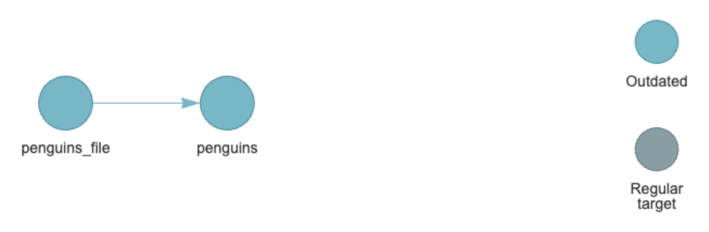
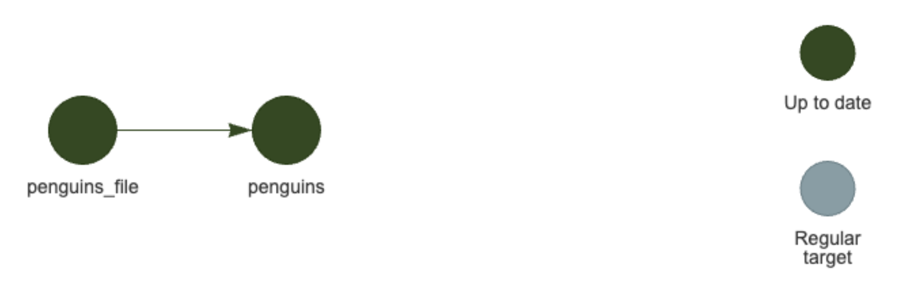
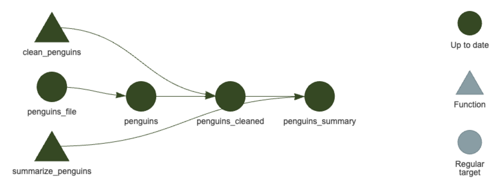
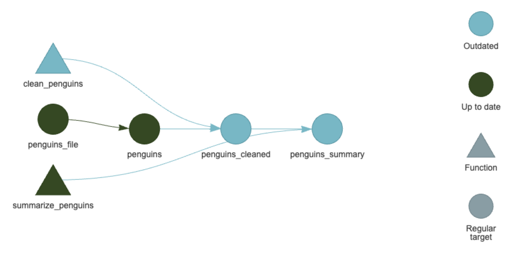
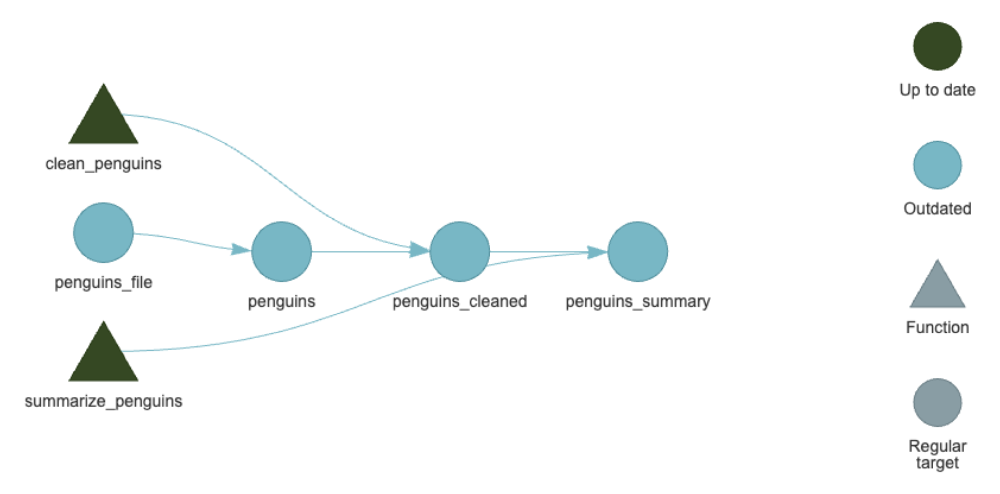
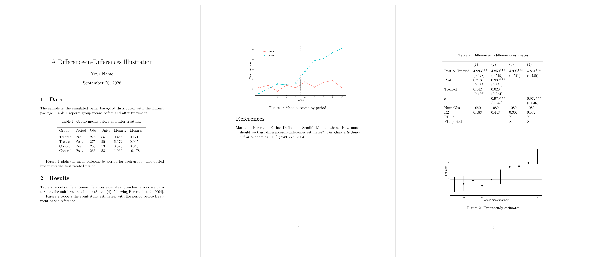

[`{targets}`](https://books.ropensci.org/targets/) は, 研究のワークフローを構築する R のパッケージです. 最大の特徴は, データ, 関数, 結果を R のオブジェクトとしてその依存関係を管理し, 上流のオブジェクトが変更されたときに, それに依存する下流のオブジェクトを自動的に再計算してくれることです. これにより, 再現性を保ち続けたまま研究を進めることができます.

さらに [Quarto](https://quarto.org/) と組み合わせることで, 試行錯誤のノート, 発表スライド, 論文の執筆まで, 研究のワークフロー全体を一つのプロジェクトの中で管理できます. この章では, まず小さなパイプラインを組んで `{targets}` の基本を確認し, その後に Quarto + `{targets}` を用いた研究のワークフローを解説します. 研究は直線的に進むものではなく, 試行錯誤を繰り返しながら道を見つけていくものです. そのため, このワークフローでは, 論文を書き始める前の試行錯誤の段階に, ある程度の自由度を持たせています.

後半で説明するワークフローは, そのまま使えるテンプレート [`kazuyanagimoto/template-research`](https://github.com/kazuyanagimoto/template-research) にまとめてあります. GitHub の「Use this template」から自分のリポジトリを作り, 手元で動かしながら読むと理解しやすいはずです. このテンプレートを AI と一緒に使う方法は @sec-ai-research で扱います.

## `{targets}` の基本

`{targets}` の基本を学ぶには公式の[チュートリアル](https://books.ropensci.org/targets/)が良いですが, 実用上は `{targets}` を拡張した `{tarchetypes}` の文法を使うことが多いです. そのため, ここでは `{tarchetypes}` の文法に基づいて, 小さなパイプラインを実際に組みながら最低限の使い方を解説します. この `{targets}` から `{tarchetypes}` への移行に関しては, この[チュートリアル](https://carpentries-incubator.github.io/targets-workshop/index.html)が参考になりました.

### 基本の3つの要素

`{targets}` の哲学は, 研究のワークフローを三つの要素に分けて考えることです. それは, ファイル, 関数, オブジェクト です.

- **ファイル**: `tar_file()` で定義される, ファイルのパス名を持つオブジェクト. ファイルのサイズやタイムスタンプも保存されているため, ファイルのパスが変更されていなくても, ファイルの中身が変更されていれば, 依存するパイプラインが再計算される
- **オブジェクト**: 変数やデータフレームなどの R のオブジェクト
- **関数**: R の関数. ただし, インプットには依存する全てのオブジェクトを指定する必要があり, アウトプットがファイルまたはオブジェクトである必要がある. これにより, 依存関係を明示的にすることができる

イメージとしては, ファイルから始まり, それを読み込んでオブジェクトを作成し, そのオブジェクトを使って関数を実行して新しいオブジェクトを作成するという流れです. 以下では, 実際に手を動かしてこの流れを作ってみます.

### パイプライン

ここでは実際にパイプラインを作りながら `{targets}` の基本を確認します. まず次のようなファイル構成を作ります. ここではデータとして `penguins` データを使うため, `write.csv(penguins, "data/penguins.csv", row.names = FALSE)` を R のコンソールで一度だけ実行して, `data/penguins.csv` を作っておいてください.

```bash
.
├── _targets.R
├── data/
│   └── penguins.csv
└── R/
    └── functions.R
```

次に, `_targets.R` にパイプラインを定義していきます.

```{.r filename="_targets.R"}
library(targets)
library(tarchetypes)
suppressPackageStartupMessages(library(dplyr))

tar_source() # Source all R files in R/ directory

tar_plan(
  # Write pipeline here
)
```

- `targets`, `tarchetypes` はパイプラインを定義するためのパッケージです. `dplyr` はデータの操作に使います
- `tar_source()` は, `R/` ディレクトリにある R ファイルをすべて読み込みます. ここでは `R/functions.R` に, パイプラインで使う関数を定義しておきます
- `tar_plan()` の中に, パイプラインのターゲットを定義していきます. ここではまだ空です

ここから, `tar_plan()` の中にパイプラインを定義していきます.

**ファイルを定義する**

`tar_file()` を使って, ファイルを定義します. これは, ファイルのパス名を持つオブジェクトです. 例えば, `data/penguins.csv` を定義するには次のようにします.

```{.r filename="_targets.R"}
tar_plan(
  tar_file(penguins_file, "data/penguins.csv")
)
```

この時, `penguins_file` は, ファイルのパス名を持つオブジェクトです. さらに, このファイルを読み込んでオブジェクトを作るには, `readr::read_csv()` を使います.

```{.r filename="_targets.R"}
tar_plan(
  tar_file(penguins_file, "data/penguins.csv"),
  penguins = readr::read_csv(penguins_file, show_col_types = FALSE)
)
```

今, パイプラインの状態を確認します. まだ計画を立てている段階なので, コードは実行されていません. Rコンソールで次のコマンドを実行すると, 依存関係の図がブラウザに表示されます. なお初めの1回は必要なパッケージのインストールの同意を求められる場合があります.

```{.r}
targets::tar_visnetwork()
```

{#fig-tar-visnetwork-read}

水色のノードはまだ実行されていないファイルやオブジェクトを表しています. これを実行するには次のコマンドを実行します.

```{.r}
targets::tar_make()
```

```text
+ penguins_file dispatched
✔ penguins_file completed [0ms, 17.28 kB]
+ penguins dispatched
✔ penguins completed [76ms, 3.16 kB]
✔ ended pipeline [138ms, 2 completed, 0 skipped]
```

`dispatched` はそのターゲットの計算を始めたこと, `completed` は計算が終わって結果を保存したことを表します. 角括弧の中は, かかった時間と保存されたオブジェクトのサイズです. 最後の行はパイプライン全体の要約で, ここでは2つのターゲットを計算し, 飛ばしたものは1つも無かったことが分かります. 状態を確認します. 

```{.r}
targets::tar_visnetwork()
```

{#fig-tar-visnetwork-uptodate}

なお, 実務的にはこの二つのパイプラインを統合する一つのコマンドにまとめます.

```{.r filename="_targets.R"}
tar_plan(
  tar_file_read(
    penguins,
    "data/penguins.csv",
    readr::read_csv(!!.x, show_col_types = FALSE)
  )
)
```

```{.r}
targets::tar_make()
targets::tar_visnetwork()
```

{#fig-tar-visnetwork-fileread}

`tar_file_read()` は, `tar_file()` と何らかの読み込み関数を組み合わせたものになります. 指定したオブジェクト名 (`penguins`) が読み込まれたオブジェクトになり, それに `_file` がついたものがファイルのターゲットになります.

**関数で処理をする**

`penguins` をクリーニングし, 種ごとの平均くちばし長を計算する関数を定義します. これらの関数は, `R/functions.R` に書きます.

```{.r filename="R/functions.R"}
clean_penguins <- function(penguins) {
  penguins |>
    filter(!is.na(bill_len))
}

summarize_penguins <- function(penguins_cleaned) {
  penguins_cleaned |>
    summarize(bill_len = mean(bill_len), .by = species)
}
```

```{.r filename="_targets.R"}
tar_plan(
  tar_file_read(
    penguins,
    "data/penguins.csv",
    readr::read_csv(!!.x, show_col_types = FALSE)
  ),
  penguins_cleaned = clean_penguins(penguins),
  penguins_summary = summarize_penguins(penguins_cleaned)
)
```

```{.r}
targets::tar_make()
targets::tar_visnetwork()
```

{#fig-tar-visnetwork-functions}

関数とオブジェクトの依存関係が図示されました. ここで, `penguins_cleaned` は `penguins` に依存し, `penguins_summary` は `penguins_cleaned` に依存しています. そのため, もし `penguins` が変更された場合は, それに依存する `penguins_cleaned` と `penguins_summary` が再計算されます.

### 再計算

パイプラインが力を発揮するのは, 関数やデータを変更した時です.

**関数を変更**

`clean_penguins()` に, 性別が欠損している個体を除く処理を追加します.

```{.r}
clean_penguins <- function(penguins) {
  penguins |>
    filter(!is.na(bill_len), !is.na(sex))
}
```

この時の状態を確認すると, 変更の影響を受けるターゲットだけが古くなっていることが分かります.

```{.r}
targets::tar_visnetwork()
```

{#fig-tar-visnetwork-fn-outdated}

パイプラインを実行すると, 変更の影響を受けるターゲットだけが再計算されます.

```{.r}
targets::tar_make()
```

```text
+ penguins_cleaned dispatched
✔ penguins_cleaned completed [2ms, 3.03 kB]
+ penguins_summary dispatched
✔ penguins_summary completed [3ms, 202 B]
✔ ended pipeline [69ms, 2 completed, 2 skipped]
```

```{.r}
targets::tar_visnetwork()
```

{#fig-tar-visnetwork-recomputed}

**データを変更**

生データが更新された状況を再現するために, 2008年以降の観測だけを残した CSV で上書きします. これもパイプラインの外, R のコンソールから実行します.

```{.r}
write.csv(subset(penguins, year >= 2008), "data/penguins.csv", row.names = FALSE)
```

ファイルのパスは変わっていませんが, `tar_file()` はファイルの中身も記録しているので, 変更が検知されます.

```{.r}
targets::tar_visnetwork()
```

{#fig-tar-visnetwork-data-outdated}

今度は `penguins_file` を起点に, その下流のターゲットがすべて古くなりました. 一方で `clean_penguins()` と `summarize_penguins()` は変更していないので, 関数のノードは水色のままです. 関数を変更した @fig-tar-visnetwork-fn-outdated とちょうど裏返しの関係になっています.

```{.r}
targets::tar_make()
```

```text
+ penguins_file dispatched
✔ penguins_file completed [0ms, 11.78 kB]
+ penguins dispatched
✔ penguins completed [75ms, 2.36 kB]
+ penguins_cleaned dispatched
✔ penguins_cleaned completed [3ms, 2.31 kB]
+ penguins_summary dispatched
✔ penguins_summary completed [3ms, 199 B]
✔ ended pipeline [152ms, 4 completed, 0 skipped]
```

```{.r}
targets::tar_visnetwork()
```

{#fig-tar-visnetwork-data-recomputed}

## LaTeX + `{targets}` のワークフロー

次はより実践的な例を考えてみます. データのクリーニングから, 図表の作成, 論文のコンパイルまでを1本のパイプラインにまとめます. このようなパイプラインを組むことができたら, かなり再現性の高い Replication Package になりますし, パイプラインから分析の意図を読み取ることが可能になります.

ここでは, `fixest` に同梱されている疑似パネルデータ `base_did` を使って, 記述統計とDiDの分析を載せた短い論文を執筆することにします. 以下では要所のコードだけを示しますが, 完成したパイプラインを1つのフォルダにまとめて配布しているので, 先にダウンロードして手元で動かしながら読み進めてください.

- [targets-latex.zip](https://kazuyanagimoto.com/workshop-graduate-2026/static/data/targets-latex.zip)

展開してできる `targets-latex/` を作業ディレクトリにして `targets::tar_make()` を実行すると, 生データから `manuscript/main.pdf` までが一度に作られます. 必要な R パッケージと動かし方は, フォルダの中の `README.md` にまとめてあります.

### フォルダ構成

```{.bash}
.
├── README.md
├── _targets.R
├── R/
│   ├── utils.R
│   ├── tar_data.R
│   ├── tar_analysis.R
│   └── tar_manuscript.R
├── data/
│   └── base_did.csv
├── output/
│   ├── img/
│   └── table/
└── manuscript/
    ├── main.tex
    └── references.bib
```

- `R/`: `tar_data`, `tar_analysis`, `tar_manuscript` の3つのサブプランを置き, データの準備, 図表の作成, 原稿のコンパイルに役割を分けます.
- `data/`: 元データを格納するフォルダです. ここに格納されたデータは, パイプラインから読み込まれて処理されます. 基本的には Git の管理対象から外します.
- `output/`: パイプラインが書き出す図表の置き場です

`_targets.R` は3つのサブプランを並べるだけです.

```{.r filename="_targets.R"}
library(targets)
library(tarchetypes)

tar_option_set(
  packages = c(
    "dplyr", "ggplot2", "fixest", "modelsummary", "tinytable", "fs"
  )
)

tar_source()

tar_plan(
  tar_data,
  tar_analysis,
  tar_manuscript
)
```

### データクリーニング

`R/tar_data.R` は基本の節と同じ形です. `base_did` を CSV として `data/` に置いてあるものとし, `tar_file_read()` で登録して読み込みます.

```{.r filename="R/tar_data.R"}
tar_data <- tar_plan(
  tar_file_read(
    did_raw,
    here_rel("data", "base_did.csv"),
    readr::read_csv(!!.x, show_col_types = FALSE)
  ),
  did = clean_did(did_raw)
)

clean_did <- function(did_raw) {
  period_treated <- min(did_raw$period[did_raw$post == 1])

  did_raw |>
    mutate(
      group = if_else(treat == 1, "Treated", "Control"),
      rel_period = period - period_treated
    )
}
```

### 図表をファイルに書き出す

`R/tar_analysis.R` が Quarto 版と一番違うところです. 図と表のターゲットが `tar_file()` になり, 関数は保存先のパスを返します.

```{.r filename="R/tar_analysis.R"}
tar_analysis <- tar_plan(
  tab_balance = summarize_did(did),
  tar_file(
    tab_balance_file,
    tabular_balance(
      tab_balance,
      here_rel("output", "table", "tab_balance.tex")
    )
  ),
  tar_file(
    fig_trends_file,
    plot_trends(did, here_rel("output", "img", "fig_trends.pdf"))
  ),
  models_did = estimate_did(did),
  tar_file(
    tab_did_file,
    tabular_did(models_did, here_rel("output", "table", "tab_did.tex"))
  ),
  model_event = estimate_event(did),
  tar_file(
    fig_event_file,
    plot_event(model_event, here_rel("output", "img", "fig_event.pdf"))
  )
)
```

図を描く関数は, `ggsave()` で保存したあとにパスを返します. 返り値がパスであることが `tar_file()` の要件です.

```{.r filename="R/tar_analysis.R"}
plot_trends <- function(did, path) {
  cutoff <- min(did$period[did$post == 1]) - 0.5

  p <- did |>
    summarize(mean_y = mean(y), .by = c(period, group)) |>
    ggplot(aes(x = period, y = mean_y, color = group,
               linetype = group, shape = group)) +
    geom_vline(xintercept = cutoff, linetype = "dotted", color = "grey40") +
    geom_line() +
    geom_point(size = 2) +
    scale_x_continuous(breaks = seq_len(max(did$period))) +
    labs(x = "Period", y = "Mean outcome",
         color = NULL, linetype = NULL, shape = NULL) +
    theme_classic(base_size = 11) +
    theme(legend.position = "inside",
          legend.position.inside = c(0.15, 0.85))

  ggsave(path, p, width = 6, height = 3.5)
  path
}
```

回帰表も同じ形です. `modelsummary()` の結果を `tinytable` のオブジェクトとして受け取り, LaTeX のファイルに書き出します.

```{.r filename="R/tar_analysis.R"}
tabular_did <- function(models_did, path) {
  tab <- modelsummary(
    models_did,
    output = "tinytable",
    escape = FALSE,
    coef_map = c(
      "post:treat" = "Post $\\times$ Treated",
      "post::1:treat" = "Post $\\times$ Treated",
      "post" = "Post",
      "treat" = "Treated",
      "x1" = "$x_1$"
    ),
    gof_map = c("nobs", "r.squared", "FE: id", "FE: period"),
    stars = c("*" = 0.1, "**" = 0.05, "***" = 0.01)
  )

  tab |>
    theme_latex(environment_table = FALSE) |>
    save_tt(path, overwrite = TRUE)
  path
}
```

`theme_latex(environment_table = FALSE)` を付けて, 表を囲む `table` 環境を出さないのがポイントです. キャプション, ラベル, 配置は原稿の側が決めるべきものなので, パイプラインが書き出すのは表の中身だけにしておきます. 図と同じく, `save_tt()` で保存したあとにパスを返します.

原稿では表を描画するために次のパッケージが必要です.

```{.tex filename="manuscript/main.tex"}
\usepackage[T1]{fontenc}
\usepackage{lmodern}
\usepackage{xcolor}
\usepackage{tabularray}
```

本文では, 表の置き場所を `table` 環境で用意して読み込みます.

```{.tex filename="manuscript/main.tex"}
\begin{table}[ht]
\centering
\caption{Difference-in-differences estimates}
\label{tab:did}
\input{../output/table/tab_did.tex}
\end{table}

\begin{figure}[ht]
\centering
\includegraphics[width=0.8\textwidth]{../output/img/fig_event.pdf}
\caption{Event-study estimates}
\label{fig:event}
\end{figure}
```

### 論文をコンパイルする

`R/tar_manuscript.R` で `main.tex` と `references.bib` をファイルとして登録し, `tinytex` でコンパイルします.

```{.r filename="R/tar_manuscript.R"}
tar_manuscript <- tar_plan(
  tar_file(main_tex_file, here_rel("manuscript", "main.tex")),
  tar_file(bib_file, here_rel("manuscript", "references.bib")),
  tar_file(
    manuscript_pdf_file,
    compile_manuscript(
      main_tex_file,
      bib_file,
      tab_balance_file,
      tab_did_file,
      fig_trends_file,
      fig_event_file
    )
  )
)

compile_manuscript <- function(main_tex_file, ...) {

  withr::with_dir(
    fs::path_dir(main_tex_file),
    tinytex::pdflatex(fs::path_file(main_tex_file))
  )
  fs::path_ext_set(main_tex_file, "pdf")
}
```

ポイントは2つあります. 一つは, 論文の中で参照している全てのファイルを, `compile_manuscript()` の引数として渡すことです. これのおかげで, 図表を修正した場合, パイプラインが自動で論文のコンパイルまでやってくれます. もう一つは, `withr::with_dir()` を使って作業ディレクトリを `main.tex` のあるディレクトリに移している点です. これを行わないと, `main.tex` からの相対パスが正しく解釈されず, コンパイルに失敗します.

### パイプラインを実行する

`tar_make()` を実行すると, データの読み込みから図表の書き出しを経て, PDF のコンパイルまでが一度に走ります.

```{.r}
targets::tar_make()
```

できあがった PDF が @fig-latex-manuscript です.

{#fig-latex-manuscript}

パイプラインを図解すると @fig-latex-pipeline のようになります. 四角いノードが R のオブジェクトを持つターゲット, 角の丸いノードが `tar_file()` で定義したファイルのターゲットで, 3つのサブプランを囲みで示しています.

```{mermaid}
%%| label: fig-latex-pipeline
%%| fig-cap: LaTeX パイプラインの依存関係
%%| fig-width: 6.5
%%| column: page-right
%%{init: {"flowchart": {"diagramPadding": 40, "nodeSpacing": 20, "rankSpacing": 30, "padding": 6}}}%%
graph LR
  subgraph tar_data
    did_raw_file(["did_raw_file"]):::filetarget --> did_raw["did_raw"]:::regular
    did_raw --> did["did"]:::regular
  end
  subgraph tar_analysis
    tab_balance["tab_balance"]:::regular --> tab_balance_file(["tab_balance_file"]):::filetarget
    fig_trends_file(["fig_trends_file"]):::filetarget
    models_did["models_did"]:::regular --> tab_did_file(["tab_did_file"]):::filetarget
    model_event["model_event"]:::regular --> fig_event_file(["fig_event_file"]):::filetarget
  end
  subgraph tar_manuscript
    main_tex_file(["main_tex_file"]):::filetarget
    bib_file(["bib_file"]):::filetarget
    manuscript_pdf_file(["manuscript_pdf_file"]):::filetarget
  end
  did --> tab_balance
  did --> fig_trends_file
  did --> models_did
  did --> model_event
  main_tex_file --> manuscript_pdf_file
  bib_file --> manuscript_pdf_file
  tab_balance_file --> manuscript_pdf_file
  tab_did_file --> manuscript_pdf_file
  fig_trends_file --> manuscript_pdf_file
  fig_event_file --> manuscript_pdf_file
  style tar_data fill:#FFFFFF00,stroke:#131516;
  style tar_analysis fill:#FFFFFF00,stroke:#131516;
  style tar_manuscript fill:#FFFFFF00,stroke:#131516;
  classDef regular stroke:#107895,stroke-width:2px,color:#107895,fill:#ffffff;
  classDef filetarget stroke:#9a2515,stroke-width:2px,color:#9a2515,fill:#ffffff;
```

## Quarto + `{targets}` のワークフロー

ここからは, 基本で作った小さなパイプラインを, ノート, スライド, 論文を含む研究プロジェクト全体に広げていきます.

### フォルダ構成

テンプレートは, 次のようなフォルダ構成になっています.

```default
template-research/
├── _targets.R        # pipeline composition
├── R/                # pipeline code: tar_data.R, tar_analysis.R, ...
├── data/             # raw data (gitignored)
├── notes/            # exploratory Quarto notes (NN-name/)
├── slides/           # presentation decks (YYMMDD_venue/)
├── manuscript/       # paper: Quarto Book + Typst
├── references.bib    # bibliography
├── rproject.toml     # R version + packages (managed by rv)
└── CLAUDE.md         # project conventions for the AI assistant
```

中心にあるのは, `_targets.R` と `R/tar_*.R` で定義するパイプラインです. パイプラインは `data/` の生データを読み込み, クリーニングし, 推定値や集計表といったデータオブジェクトを作ります. 図は作りません. 図は, そのデータオブジェクトを受け取った Quarto 文書の中で, その場で描きます.

パイプラインの結果を使う Quarto 文書は3種類あり, それぞれパイプラインとの付き合い方が違います.

| フォルダ | 役割 | パイプラインの結果 | 上流が変わったとき |
|:--|:--|:--|:--|
| `notes/` | 試行錯誤のノート | `tar_read()` で読む | 手動でレンダリングし直したときだけ反映される |
| `slides/` | 発表スライド | 読まない (必要なデータを自分で持つ) | 反映されない |
| `manuscript/` | 論文 | `tar_load()` で読む | `tar_make()` で PDF まで作り直される |

論文は常に最新の結果を反映すべきなのでパイプラインに組み込み, ノートやスライドは試行錯誤の記録なのでパイプラインの外に置く, というのが基本的な考え方です. 詳しい理由は各ステップで説明します.

### 手順

研究の進み具合に合わせて, 次の順にステップを進めます.

1. テンプレートからプロジェクトを作る (`_targets.R`)
2. 生データを登録し, クリーニングを定義する (`R/tar_data.R`)
3. 図の見た目を1か所で定義する (`R/tar_figure.R`)
4. ノートで試行錯誤する (`notes/NN-name/index.qmd`)
5. 途中結果をスライドにまとめる (`slides/YYMMDD_venue/index.qmd`)
6. 4-5 を繰り返し, 固まった結果をパイプラインに昇格させる (`R/tar_analysis.R`)
7. 論文を執筆する (`manuscript/`, `R/tar_manuscript.R`)

論文を書き終えた頃には, @fig-pipeline-overview のようなパイプラインができあがっているはずです. ノートとスライドはパイプラインの外にあるので, この図には現れません.

{#fig-pipeline-overview width="100%"}

以下では, このステップを順に解説します.

### 1. テンプレートからプロジェクトを作る

GitHub でテンプレートから自分のリポジトリを作り, クローンします. R のバージョンとパッケージは `rproject.toml` に書かれており, `rv sync` で手元に再現できます (R の環境の揃え方は @sec-environment を参照してください). そのうえで R から `targets::tar_make()` を実行すると, サンプルのパイプラインが最後まで動きます.

プロジェクト全体の入り口になるのが `_targets.R` です.

```{.r filename="_targets.R"}
library(targets)
library(tarchetypes)
suppressPackageStartupMessages(library(dplyr))

tar_config_set(
  store = here::here("_targets"),
  script = here::here("_targets.R")
)

tar_option_set(
  packages = c("dplyr", "tidyr", "forcats", "stringr", "readr", "ggplot2")
)

tar_source()
tar_plan(
  tar_figure,
  tar_data,
  tar_analysis,
  tar_manuscript
)
```

#### `tar_source()` とサブプラン

`tar_source()` は, `R/` ディレクトリにある R ファイルをすべて読み込みます. テンプレートでは, `R/tar_data.R` や `R/tar_analysis.R` のそれぞれで, `tar_data <- tar_plan(...)` のようにパイプラインの一部 (サブプラン) を名前付きのオブジェクトとして定義しています. `_targets.R` の `tar_plan()` にはその名前を並べるだけで, 全体のパイプラインになります.

こうしておくと, `_targets.R` は短いまま保たれ, 「データの準備」「分析」「論文」といった段階ごとにファイルを分けて管理できます. `tar_plan()` の中に書く順番は実行順とは関係ありません. どのターゲットを先に計算するかは, `{targets}` が依存関係から自動で決めます.

#### `tar_config_set()` と `tar_option_set()`

`tar_make()` で計算した結果は, プロジェクトのルートにある `_targets/` ディレクトリ (ストア) に保存されます. `tar_config_set()` は, パイプラインの定義 (`_targets.R`) とストアの場所を, プロジェクトのルートに固定する設定です. ノートや論文はサブディレクトリの中でレンダリングされるので, どこから呼ばれても同じストアを参照できるようにしておきます.

`tar_option_set(packages = ...)` には, パイプラインの計算で使うパッケージを並べます. 各ターゲットの計算の前に, これらのパッケージが読み込まれます.

#### `here_rel()`

パイプラインでファイルのパスを指定するときは, `R/utils.R` で定義されている `here_rel()` を使います.

```{.r filename="R/utils.R"}
here_rel <- function(...) {
  fs::path_rel(here::here(...))
}
```

`here::here()` は, プロジェクトのルートディレクトリを基準にしたパスを作る関数です. これを使うことで, どのディレクトリから実行してもパスを書き換える必要がなくなります. ただし, `here::here()` が返すのは絶対パス (`/Users/yourname/...`) なので, そのままパイプラインで使うとストアに絶対パスが保存され, 他者と共有した場合に問題が発生します. そこで, `here::here()` の利便性を保ちつつ, ルートからの相対パス (`data/survey.csv`) に直してから保存する関数を使います. この部分は Andrew Heiss さんの[コード](https://github.com/andrewheiss/lemon-lucifer/blob/main/_targets.R)を参考にしています.

### 2. 生データを登録し, クリーニングを定義する

データの準備は `R/tar_data.R` に定義します. 生データのファイルは `data/` に置き, パイプラインではファイルとして登録します.

```{.r filename="R/tar_data.R"}
tar_data <- tar_plan(
  tar_file_read(
    survey_raw,
    here_rel("data", "survey.csv"),
    readr::read_csv(!!.x)
  ),
  survey = clean_survey(survey_raw)
)

clean_survey <- function(survey_raw) {
  survey_raw |>
    filter(!is.na(wage))
}
```

`tar_file_read()` は, `{targets}` の基本で見た「`tar_file()` でファイルを登録する」と「そのファイルを読み込む」の2つのステップを1つにまとめたものです. 第1引数がターゲット名, 第2引数がファイルのパス, 第3引数が読み込み方で, `!!.x` の部分に第2引数のパスが入ります. ファイルとして登録されているので, `survey.csv` の中身が変われば, それに依存するクリーニング以降が再計算されます.

ポイントは次の3つです.

- 生データは `data/` に置き, `tar_file()` や `tar_file_read()` でファイルとして登録する. `data/` は Git の管理対象から外しておく.
- クリーニングの関数は, 生データを引数に取り, クリーニング後のデータを返す.
- クリーニング後のデータは CSV などのファイルに書き出さない. ストアの中にだけ存在し, 後の工程では `tar_read()` や `tar_load()` で読み込む.

オンライン上のファイルをダウンロードして `tar_file()` で登録したい場合は,

```r
download_file <- function(url, destfile) {
  if (!file.exists(destfile)) {
    download.file(url, destfile)
  }
  return(destfile)
}
```

といった関数を定義して, `tar_file()` の中で呼び出すことができます. 保存先のパスを返す関数を定義するというのがポイントです.

### 3. 図の見た目を1か所で定義する

ノート, スライド, 論文で図の見た目がばらばらにならないように, ggplot のテーマや色は `R/tar_figure.R` の1か所で定義します.

```{.r filename="R/tar_figure.R"}
tar_figure <- tar_plan(
  fn_figure = list(
    theme_proj = theme_proj,
    color_accent = color_accent
  )
)

theme_proj <- function(size_base = 11) {
  ggplot2::theme_classic(base_size = size_base)
}

color_accent <- "#107895"
```

テーマの関数や色をリストにまとめて, `fn_figure` という1つのターゲットにしているのがポイントです. ノートや論文は, それぞれ別の R セッションでレンダリングされます. このターゲットを読み込むだけで同じテーマと色が使えるようになり, さらにテーマを変更すると, それを使う論文が再レンダリングの対象になります. 読み込み方は次のステップで説明します.

### 4. ノートで試行錯誤する

データ分析やモデルの試行錯誤は, `notes/` の中で行います. 1つのフォルダが1ラウンドの試行錯誤にあたり, `notes/01-descriptive/`, `notes/02-event-study/` のように番号を付けて並べます. 各フォルダは次のような中身を持ちます.

```default
notes/01-descriptive/
├── index.qmd    # the note itself
├── code/        # note-only scripts (heavy computation)
├── output/      # cached results (gitignored)
└── data -> ../data   # symlink to notes/data/
```

`data` は `notes/data/` へのシンボリックリンクで, ノートの段階でだけ使うデータセットをノート間で共有するための置き場所です. ノートは, パイプラインの結果を次のように読み込みます.

```{.r filename="notes/01-descriptive/index.qmd"}
library(targets)
library(dplyr)
library(ggplot2)

store <- here::here("_targets")
invisible(list2env(tar_read(fn_figure, store = store), envir = globalenv()))
theme_set(theme_proj())

survey <- tar_read(survey, store = store)
```

`tar_read()` はストアから計算済みの結果を取り出す関数で, ノートはプロジェクトのルートではなく自分のフォルダでレンダリングされるので, `store` でストアの場所を指定します. 2行目の `list2env()` は, ステップ3の `fn_figure` に入っている関数を, 1つずつ名前付きのオブジェクトとして環境に展開します. これで `theme_proj()` や `color_accent` を, そのまま使えるようになります.

ポイントは, 必要以上にパイプラインに組み込まないことです. 試行錯誤の段階のほとんどの分析は, 実際の論文には含まれません. それをパイプラインに組み込むと, ほとんど必要ないにも関わらず, 依存関係の管理が難しくなります. そのため, ノートでしか使わない計算はノートの中 (`code/` と `output/`) に閉じておき, 最終的に必要なものだけをパイプラインに組み込みます.

ノートはパイプラインでレンダリングしません. そのため, 上流のデータが変わっても, 自分でレンダリングし直さない限りノートの結果は変わりません. これはデメリットでもありますが, ノートを「その時点で何を試したか」の記録として残せるというメリットがあります. 上流で変更があった場合には, 必要なノートだけを手動でレンダリングし直せば十分です.

### 5. 途中結果をスライドにまとめる

研究を進める中で, 途中結果を発表する機会はよくあります. 試行錯誤した中で, 重要な結果をスライドにまとめます. スライドは `slides/YYMMDD_venue/` のように, 日付と発表の場で名前を付けたフォルダに作り, 中身はノートと同じく `index.qmd`, `code/`, `output/`, `data` の構成にします. スライドの作り方そのものは [スライド](slides.qmd) の章を参照してください.

ノートとの違いは, スライドはパイプラインを一切読まないことです. `tar_load()` や `tar_read()` を使わず, その発表に必要なテーマ, データ, 結果を, すべて自分のフォルダの中に持ちます.

```{.r filename="slides/260720_seminar/index.qmd"}
# Self-contained: source this deck's frozen setup, never tar_load() the pipeline
source("code/setup.R")
theme_set(theme_slide())
```

スライドは「その日に何を発表したか」の記録です. もしスライドがパイプラインを読んでいると, 半年後に古いスライドをレンダリングし直したとき, その後に変わった数値が表示されたり, ターゲットの名前が変わってエラーになったりします. 必要なものを自分で持つ凍結スナップショットにしておけば, パイプラインがその後どう変わっても, 発表したときと同じスライドが再現できます.

### 6. 固まった結果をパイプラインに昇格させる

発表などでフィードバックをもらいながら, 4-5 を繰り返して研究を進めていきます. 論文に載せる結果が固まったら, ここで初めて, その分析を `R/tar_analysis.R` のパイプラインに移します. ノートの `code/` にあったコードを関数にしてパイプラインに移すことを, ここでは昇格と呼びます. 昇格させた後も, ノートは試行錯誤の記録としてそのまま残します.

```{.r filename="R/tar_analysis.R"}
tar_analysis <- tar_plan(
  analysis_wage_gap = fct_wage_gap(survey)
)

fct_wage_gap <- function(data) {
  data |>
    summarize(
      n = n(),
      mean_wage = mean(wage),
      .by = c(year, gender)
    )
}
```

テンプレートでは, 分析の関数を `fct_*()`, その結果のターゲットを `analysis_*` と名付けています. 関数はクリーニング済みのデータを引数にとり, 計算結果を数値, データフレーム, あるいはそれらのリストとして返します.

ここで大事なのは, パイプラインは推定値や集計表といったデータオブジェクトだけを作り, 図は作らないことです. 図を画像ファイルとして保存するのではなく, 論文やノートの中で `tar_load()` したデータから ggplot で描きます. 同じ結果でも, 論文とスライドではフォントやサイズを変えたいことが多く, 図をファイルに固めてしまうとその調整がしにくくなるためです.

::: {.callout-note}
## LaTeX で論文を書く場合

LaTeX で論文を書く場合は, Quarto の中で図を描けないので, パイプラインで図をファイルに保存することになります. 例えば, 保存先のパスを返す関数を作り, `tar_file()` で登録します.

```r
tar_plan(
  tar_file(
    fig1_file,
    plot_fig1(data1, here_rel("path", "to", "file", "fig1.pdf"))
  )
)

plot_fig1 <- function(data1, path_fig1) {
  ggplot(data1, aes(x = col1, y = col2)) +
    geom_point()

  ggsave(path_fig1)
  return(path_fig1)
}
```
:::

#### Julia のコードをパイプラインに組み込む

R の分析だけであれば, そのままパイプラインに組み込むことができますが, Julia のコードを組み込む場合は少し工夫が必要です. 例えば `R/tar_model.R` に `tar_model` というサブプランを作り, `_targets.R` の `tar_plan()` に `tar_model` を書き足します. 私は以下の方法を取っています.

1. Julia のソースコードファイルとして読み込み (`tar_file_read()`), パイプラインに組み込む (`jl_file_*`)
2. Julia のソースコードを R の `system2()` でコマンドライン実行する (`run_model()`)
3. Julia の中で実行される結果は, CSV や YAML などのファイルとして保存しておき, R の中で読み込む (`tar_file_read()`)

```{.r filename="R/tar_model.R"}
tar_model <- tar_plan(
  tar_map(
    values = list(name = c("main", "model")),
    names = name,
    tar_file_read(
      jl,
      here_rel("Julia", paste0(name, ".jl")),
      readLines(!!.x)
    )
  ),
  res_model = run_model(jl_file_main, jl_main, jl_model),
  tar_file_read(parameters, res_model[[1]], yaml::read_yaml(!!.x)),
  tar_file_read(demand_supply, res_model[[2]], read.csv(!!.x)),
  tar_file_read(equilibrium, res_model[[3]], yaml::read_yaml(!!.x))
)

run_model <- function(jl_file_main, ...) {
  system2(command = "julia", args = c("--project=.", jl_file_main))

  return(file.path(
    here_rel("output", "Julia"),
    c("parameters.yaml", "demand_supply.csv", "equilibrium.yaml")
  ))
}
```

ポイントは以下の2点です.

1. Julia 内の依存関係も含められるように, `run_model()` の引数に全ての依存関係を指定する
2. 結果を保存したファイルは, リストにまとめた上で, R から一つずつ読み込む

ちなみに, `system2()` で実行する場合, Julia のパスが通っていないことがあります (PC のデフォルトのシェルと R のシェルが異なるため). その場合は, `.Renviron` で定義した Julia のパスを `.Rprofile` で読み込むようにしています.

```{.bash filename=".Renviron"}
PATH_JULIA=/path/to/julia/
```

```{.r filename=".Rprofile"}
Sys.setenv(
  PATH = paste(Sys.getenv("PATH_JULIA"), Sys.getenv("PATH"), sep = ":")
)
```

### 7. 論文を執筆する

論文の執筆は, `manuscript/` の中で行います. `manuscript/` はそれ自体が1つの Quarto プロジェクトで, 次の3ステップで論文を書きます.

1. `manuscript/_quarto.yml` でディレクトリ自体を [Quarto Book](https://quarto.org/docs/books/) として設定する
2. 節ごとにファイルを分けて, Quarto Book として執筆する (`01-intro.qmd`, `02-analysis.qmd`, ...)
3. `manuscript/manuscript.qmd` に各ファイルをまとめ, Typst で PDF にする

```{.markdown filename="manuscript/manuscript.qmd"}



```

各ファイルの冒頭では, パイプラインの結果を `tar_load()` で読み込みます.

```{.r filename="manuscript/02-analysis.qmd"}
here::i_am("manuscript/_quarto.yml")
targets::tar_config_set(
  store = here::here("_targets"),
  script = here::here("_targets.R")
)

targets::tar_load(c(survey, analysis_wage_gap))
invisible(list2env(targets::tar_read(fn_figure), .GlobalEnv))
theme_set(theme_proj())
```

`here::i_am()` は, このファイルがプロジェクトのどこにあるかを `here` に教え, プロジェクトのルートを確定させます. 続く `tar_config_set()` でストアの場所を指定しておくと, 以降は `store` を毎回書かずに `tar_load()` や `tar_read()` が使えます. `tar_load()` は, 指定したターゲットをその名前のまま環境に読み込みます. あとは, 読み込んだデータから ggplot で図を描き, `tinytable` で表を作ります. 本文中の数値も, 手で書き写すのではなく, 読み込んだ結果からインラインコードで埋め込みます.

#### 論文もパイプラインに組み込む

論文の PDF は, `R/tar_manuscript.R` でパイプラインに組み込みます. これにより, データや分析が変わったときに, `tar_make()` を実行すれば PDF まで作り直されます.

```{.r filename="R/tar_manuscript.R"}
tar_manuscript <- tar_plan(
  tar_file(
    manuscript_src,
    list.files(
      here_rel("manuscript"),
      pattern = "\\.(qmd|yml|tex|typ|bib|lua)$",
      recursive = TRUE,
      full.names = TRUE
    )
  ),
  tar_file(
    manuscript_pdf,
    {
      # Bare references register upstream targets as dependencies so the PDF
      # rebuilds when sources or data change.
      manuscript_src
      list(fn_figure, survey, analysis_wage_gap)
      quarto::quarto_render(here_rel("manuscript", "manuscript.qmd"))
      here_rel("manuscript", "manuscript.pdf")
    }
  )
)
```

`manuscript_src` は, `manuscript/` にある原稿ファイルをすべてファイルとして登録します. 原稿を書き換えると, これが変わったと判定されます.

`manuscript_pdf` の中にある `list(fn_figure, survey, analysis_wage_gap)` は, 計算としては何もしていない行です. `{targets}` は, ターゲットを作るコードの中にどのターゲット名が現れるかを見て依存関係を判定します. `quarto_render()` の中で原稿がどのターゲットを読んでいるかまでは分からないので, 論文が使うターゲットの名前をここに並べて, 依存関係として登録しているのです. 論文で新しいターゲットを `tar_load()` したら, この行にも書き足します.

#### なぜ Quarto Book として執筆するのか

Quarto Book として執筆すると, 複数ファイルに分けても cross-reference が効きます. これはかなり便利で, セクションごとにファイルを分けることで論文の構造が把握しやすくなり, cross-reference の入力補完が働くことで, 快適に執筆できます.

ただし, Quarto Book は出力形式としては論文に相応しくないので, それらのファイルをまとめて `manuscript/manuscript.qmd` でコンパイルしています. この時, バックエンドは高速でコンパイルできる Typst を使用しています. ちなみに LaTeX のソースコードが必要になった場合は, `quarto::quarto_render()` で LaTeX のソースコードを生成することができます (私は, 博士論文の執筆の際, LaTeX テンプレートに合わせるために使用しました).

::: {.callout-note}
## LaTeX で論文をコンパイルする場合

LaTeX で執筆する場合も, `TinyTeX` を用いてコンパイルするならば, パイプラインに組み込むことができます. 例えば以下のような形が考えられます. ただし, 実際には全ての図表の依存関係を入れる必要があります.

```r
tar_plan(
  tar_file_read(
    manuscript,
    here_rel("manuscript", "main.tex"),
    readLines(!!.x)
  ),
  tar_file(
    manuscript_pdf,
    compile_latex(manuscript, here_rel("manuscript", "main.pdf"))
  )
)

compile_latex <- function(manuscript_file, path_pdf) {
  tinytex::xelatex(
    manuscript_file,
    pdf_file = path_pdf
  )
  return(path_pdf)
}
```
:::
